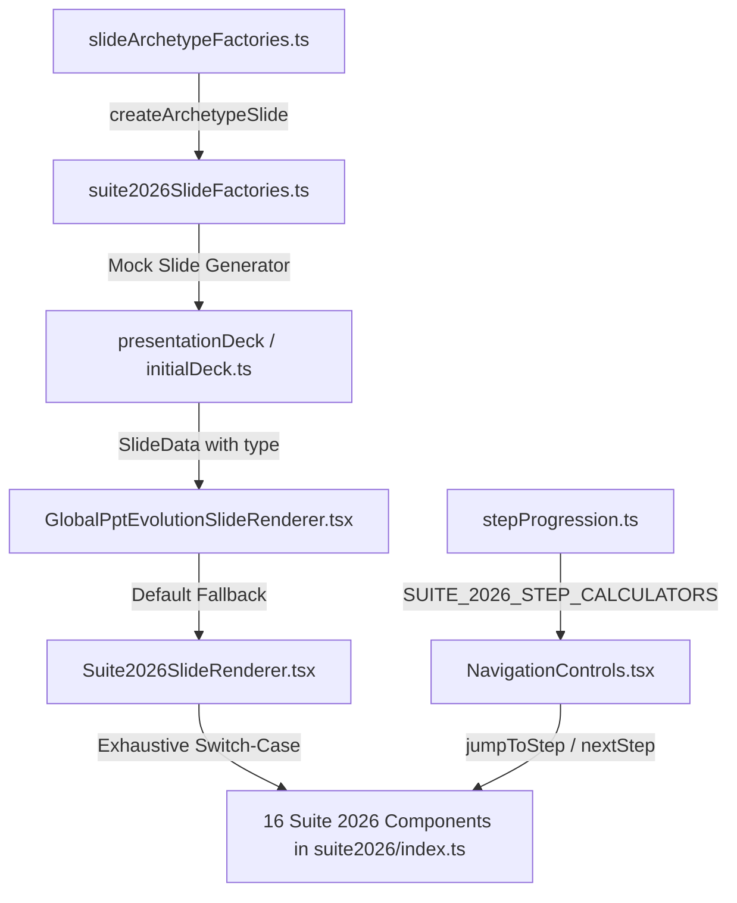

# Specification 02: Suite 2026 Slide Components & Runtime Architecture Specification

> **Specification Directory:** `02-spec/21-app/26-presentation-themes-animations-and-15-slide/`  
> **Specification File:** `02-spec/21-app/26-presentation-themes-animations-and-15-slide/02-component-spec.md`  
> **Parent Module:** `26-presentation-themes-animations-and-15-slide`  
> **Status:** APPROVED & BINDING ARCHITECTURAL SPECIFICATION  
> **Target Release:** `v2.5.0`  
> **Lead Architecture:** Alim Ul Karim, Chief Software Engineer  
> **Domain:** 16 Suite 2026 Enterprise Slide Archetypes, Runtime Dispatcher Chain, Step Progression Engine, Flat Sovereign vs Kinetic Multi-Step Lifecycle, Dynamic Theming Tokens, and Fluid DOM Typography

---

## 1. Executive Overview & Core Architectural Mandates

This specification establishes the official component architecture, data contracts, interactive step lifecycles, and runtime wiring for the **16 Suite 2026 Slide Archetypes** within the White Presentation Platform. These 16 slide archetypes represent high-authority enterprise boardroom presentation modules designed to bridge complex technical telemetry, financial governance, multi-region compliance, and platform network effects into crystal-clear visual narratives.

### 1.1 The 60/30/10 Spatial Balance Rule
Every slide layout strictly follows the mathematical spatial balance mandate on the native $1920 \times 1080$ virtual canvas:
* **60% Dominant Canvas Foundation (Plane 0):** Uncluttered base background (`var(--pres-bg)`), structural negative margins, subtle ambient radial gradient washes, and non-interactive framing.
* **30% Structural Hierarchy (Plane 1):** Semi-opaque raised cards (`var(--pres-bg-card)`), glassmorphic backdrops (`backdrop-filter: blur(16px)`), structural borders (`var(--pres-border)`), stage selector bars, and tabular grid partitions.
* **10% Intentional Focal Accent (Plane 2 & Plane 3):** High-luminance accent colors (`var(--pres-accent)`), active stage glowing halos (`box-shadow: 0 0 24px -2px var(--pres-accent)`), status pill badges, directional delta indicators, and interactive step highlights.

```
+-----------------------------------------------------------------------------------------+
|                                1920 x 1080 Native Canvas Bounds                         |
|  [Plane 0: 60% Canvas Foundation (Negative Space, Soft Gradients, Ambient Grid)]        |
|                                                                                         |
|      +---------------------------------------------------------------------------+      |
|      |  [Plane 1: 30% Structural Hierarchy (Cards, Grids, Rails, Data Tables)]   |      |
|      |                                                                           |      |
|      |      +-------------------------------------------------------------+      |      |
|      |      |  [Plane 2: 10% Focal Accent (Live Typography, Values, Halo)]|      |      |
|      |      |   Active Stage Halo: box-shadow: 0 0 24px var(--pres-accent) |      |      |
|      |      +-------------------------------------------------------------+      |      |
|      +---------------------------------------------------------------------------+      |
|                                                                                         |
|  [Plane 3: Presenter Overlay & HUD (Keyboard Shortcuts, Modal Lightbox, Zoom Inspect)]  |
+-----------------------------------------------------------------------------------------+
```

### 1.2 The 4-Plane Depth Hierarchy
To guarantee clear visual depth across all 25 light and dark themes without ad-hoc drop shadows:
* **Plane 0: Canvas Base ($Z=0$, `.plane-0-surface`):** Base canvas background, ambient radial gradients, and subtle noise or grid watermarks.
* **Plane 1: Structural Grid & Surface ($Z=10$, `.plane-1-raised`):** Interactive card containers, glass panels, 1px perimeter borders (`var(--pres-border)`), and data partitions.
* **Plane 2: Semantic Content & Active Elements ($Z=20$, `.plane-2-focus`):** Live DOM typography, SVG vector charts, active stage buttons with glowing halos, and KPI callouts.
* **Plane 3: Presenter Overlay & Modal HUD ($Z=30$, `.plane-3-overlay`):** Isolated presenter controls (`--chrome-*`), keyboard shortcut hints (`?`), and fullscreen zoom overlays.

### 1.3 Pure Live DOM Typography Mandate & Fluid Floor $\ge 14\text{px}$
* **Zero Rasterized Text:** Slide titles, tables, metrics, and labels must never be rendered as bitmap images or Canvas 2D raster buffers. All text is pure HTML elements (`<h1>`, `<p>`, `<span>`, `<div>`, `<code>`).
* **Fluid Typography Floor ($V_{\min} \ge 14\text{px}$):** Micro-copy must never fall below $14\text{px}$ on standard 1080p displays to prevent illegibility during boardroom projection:
  $$\text{font-size} = \text{clamp}(14\text{px}, 0.8\text{vw} + 6\text{px}, 18\text{px})$$
* **Typography Pairing Standards:**
  * **Headlines & Metric Callouts:** `Ubuntu` (`font-ubuntu`, weights 700 / 800).
  * **Interface Labels & Body Prose:** `Poppins` (`font-poppins`, weights 400 / 500 / 600).
  * **Technical Telemetry & Code:** `JetBrains Mono` / `Fira Code` (`font-mono`, weight 500 / 700).

### 1.4 Strict Positive Boolean Convention
In accordance with repository guidelines, all boolean properties in data contracts, component props, and state machines MUST be positively named (`is*`, `has*`). Negative flags such as `isNegative`, `hasNoBorder`, or `disabled` are strictly forbidden:
* ✅ `isPositive`, `hasAuditVerification`, `isRecommended`, `isCompliant`, `hasHardwareIsolation`
* ❌ `isNegative`, `hasNotAudited`, `unverified`, `isNotCompliant`

### 1.5 Strict Relative Paths Mandate
All file imports, component references, and documentation links must strictly utilize relative paths. Absolute filesystem paths (e.g. `C:\...` or `/home/...`) are strictly forbidden.

---

## 2. Catalog of 16 Suite 2026 Slide Archetypes

The 16 slide archetypes are partitioned into two architectural workflow modes:
1. **Kinetic Multi-Step Workflows (10 Archetypes):** 4 progressive steps with intra-slide step progression, direct step jumping (`onClick={() => jumpToStep(idx)}`), and 3-phase kinetic lifecycle styling (`active`, `completed`, `future`).
2. **Flat Sovereign Overviews (6 Archetypes):** Single-step (1 step) high-density panoramic telemetry, matrix, or boundary boards presenting complete operational domains without pagination or ghost steps.

### 2.1 Taxonomy Matrix

| # | Archetype Identifier | React Component Name | Mode | Steps | Domain Category | Key Value Realization |
|:---:|:---|:---|:---:|:---:|:---|:---|
| 01 | `executive-pnl-waterfall-table` | `ExecutivePnlWaterfallTableSlide` | Kinetic Step | 4 | Financial & P&L | Gross revenue to EBITDA waterfall bridge with audited line-item variance |
| 02 | `competitive-feature-heatmap` | `CompetitiveFeatureHeatmapSlide` | Flat Sovereign | 1 | Market Strategy | Deep-tech capability heatmap scoring vs legacy & hyperscaler rivals |
| 03 | `customer-persona-archetype-split` | `CustomerPersonaArchetypeSplitSlide` | Kinetic Step | 4 | Product & ICP | Comparative buying criteria between CTO and VP SecOps personas |
| 04 | `global-data-jurisdiction-boundary` | `GlobalDataJurisdictionBoundarySlide` | Flat Sovereign | 1 | Compliance & Data | Multi-region cryptographic data residency enclaves without cross-border bleed |
| 05 | `hardware-interface-blueprint` | `HardwareInterfaceBlueprintSlide` | Kinetic Step | 4 | Hardware & Edge | Edge compute SoC bus schematic, PCIe 5.0 x16, and isolated IO pinouts |
| 06 | `multi-horizon-value-realization-bridge` | `MultiHorizonValueRealizationBridgeSlide` | Kinetic Step | 4 | Strategic Scaling | 4-horizon capital allocation framework bridging $298.5M enterprise value |
| 07 | `two-sided-ecosystem-flywheel` | `TwoSidedEcosystemFlywheelSlide` | Kinetic Step | 4 | Platform Network | Developer supply ingress compounding enterprise liquidity and data gravity |
| 08 | `ishikawa-root-cause-fishbone` | `IshikawaRootCauseFishboneSlide` | Kinetic Step | 4 | Reliability & RCA | Systematic cause-and-effect fishbone isolating distributed latency anomalies |
| 09 | `modular-consumption-pricing-calculator` | `ModularConsumptionPricingCalculatorSlide` | Flat Sovereign | 1 | Pricing Architecture | Transparent consumption tiers with volume discounts and SLA metrics |
| 10 | `live-product-viewport-walkthrough` | `LiveProductViewportWalkthroughSlide` | Kinetic Step | 4 | Product Telemetry | Interactive browser viewport walkthrough across 4 mission-critical phases |
| 11 | `enterprise-risk-taxonomy-heatmap` | `EnterpriseRiskTaxonomyHeatmapSlide` | Flat Sovereign | 1 | Board Governance | 5x5 Likelihood vs Impact risk taxonomy with residual exposure controls |
| 12 | `global-partner-tiering-ladder` | `GlobalPartnerTieringLadderSlide` | Kinetic Step | 4 | Channel Alliances | Value-accretive 4-tier partner ladder driving revenue and technical certification |
| 13 | `talent-competency-gap-heatmap` | `TalentCompetencyGapHeatmapSlide` | Flat Sovereign | 1 | Human Capital | Engineering readiness heatmap across quantum cryptography and agentic systems |
| 14 | `slo-error-budget-burn-waterfall` | `SloErrorBudgetBurnWaterfallSlide` | Kinetic Step | 4 | Site Reliability | Four-nines SLO error budget burn rate tracking with automated rollbacks |
| 15 | `weighted-decision-tradeoff-matrix` | `WeightedDecisionTradeoffMatrixSlide` | Flat Sovereign | 1 | Architecture Strategy | Multi-criteria weighted decision matrix evaluating cloud vs bare-metal mesh |
| 16 | `customer-churn-intervention-ladder` | `CustomerChurnInterventionLadderSlide` | Kinetic Step | 4 | Customer Retention | Proactive 4-stage churn intervention ladder preserving $10.1M in ARR |

---

## 3. Detailed Component Specifications

### 3.1 Archetype 01: `executive-pnl-waterfall-table`
* **Component:** `ExecutivePnlWaterfallTableSlide`
* **File Location:** `src/components/slides/suite2026/ExecutivePnlWaterfallTableSlide.tsx`
* **Workflow Mode:** Kinetic Step (4 steps)
* **Data Contract:** `ExecutivePnlWaterfallTableSlideData` (`src/types/suite2026Archetypes.ts`)
  ```typescript
  export interface PnlWaterfallRowItem {
    id: string;
    label: string;
    category: string;
    amountMillions: number;
    variancePercent?: number;
    isPositive: boolean;
    isSubtotal: boolean;
    hasAuditVerification: boolean;
  }
  export interface ExecutivePnlWaterfallTableSlideData extends BaseSlide {
    type: 'executive-pnl-waterfall-table';
    fiscalPeriod: string;
    reportingCurrency: string;
    baselineRevenueMillions: number;
    netEbitdaMillions: number;
    stepHighlightRowIds?: string[];
    rows: PnlWaterfallRowItem[];
    hasAuditedFinancials: boolean;
  }
  ```
* **Step Progression Stages (4 Steps):**
  1. *Stage 1: Gross Revenue Ingress* (`range: ['r1', 'r2', 'r3']`): Gross Contract Revenue and Hosting COGS.
  2. *Stage 2: Core OpEx Allocation* (`range: ['r4']`): Research & Platform Engineering investment.
  3. *Stage 3: Go-to-Market Scale* (`range: ['r5', 'r6']`): Enterprise Sales, Marketing & G&A leverage.
  4. *Stage 4: Adjusted EBITDA Realization* (`range: ['r7']`): Audited operating cash flow delivery.
* **Layout & Depth:** Top header with period badge and EBITDA KPI pill; 4-column stage button rail; 12-column tabular waterfall grid in `plane-1-raised` container.
* **Theming Token Mapping:**
  * Background: `var(--pres-bg)`
  * Card Surface: `var(--pres-bg-card)`
  * Text Colors: `var(--pres-text)`, `var(--pres-text-muted)`
  * Row Highlight: `bg-[var(--pres-accent)]/15 border-[var(--pres-accent)] ring-1 ring-[var(--pres-accent)]`
  * Positive/Negative Delta: `text-emerald-500` / `text-rose-500`

### 3.2 Archetype 02: `competitive-feature-heatmap`
* **Component:** `CompetitiveFeatureHeatmapSlide`
* **File Location:** `src/components/slides/suite2026/CompetitiveFeatureHeatmapSlide.tsx`
* **Workflow Mode:** Flat Sovereign (1 step)
* **Data Contract:** `CompetitiveFeatureHeatmapSlideData` (`src/types/suite2026Archetypes.ts`)
  ```typescript
  export interface CompetitiveCapabilityItem {
    id: string;
    capabilityName: string;
    category: string;
    ourScore: number;
    competitorScores: Record<string, number>;
    hasCheckmark: boolean;
    isRecommended: boolean;
    isIndustryBenchmark: boolean;
  }
  export interface CompetitiveFeatureHeatmapSlideData extends BaseSlide {
    type: 'competitive-feature-heatmap';
    marketSegment: string;
    competitorNames: string[];
    capabilities: CompetitiveCapabilityItem[];
    winRateAdvantagePercent: number;
    hasThirdPartyValidation: boolean;
  }
  ```
* **Step Progression:** Pure Flat Sovereign. Evaluates strictly to 1 step. Displays full capability matrix without pagination.
* **Layout & Depth:** Top metadata header with market segment and win-rate badge (+48%); raised matrix table with category badges, capability descriptions, and comparative score cells (`Score/10` with gold star on our score).
* **Theming Token Mapping:**
  * Card Surface: `var(--pres-bg-card)`
  * Border: `var(--pres-border)`
  * Our Score Pill: `bg-[var(--pres-accent)]/20 text-white ring-1 ring-[var(--pres-accent)]`
  * Benchmark Score: `bg-emerald-500/15 text-emerald-400`

### 3.3 Archetype 03: `customer-persona-archetype-split`
* **Component:** `CustomerPersonaArchetypeSplitSlide`
* **File Location:** `src/components/slides/suite2026/CustomerPersonaArchetypeSplitSlide.tsx`
* **Workflow Mode:** Kinetic Step (4 steps)
* **Data Contract:** `CustomerPersonaArchetypeSplitSlideData` (`src/types/suite2026Archetypes.ts`)
  ```typescript
  export interface PersonaDimensionItem {
    id: string;
    dimensionName: string;
    primaryPersonaValue: string;
    secondaryPersonaValue: string;
    isPositive: boolean;
    isDifferentiator: boolean;
    hasQuantitativeMetric: boolean;
  }
  export interface CustomerPersonaArchetypeSplitSlideData extends BaseSlide {
    type: 'customer-persona-archetype-split';
    primaryPersonaTitle: string;
    secondaryPersonaTitle: string;
    marketShareSplit: string;
    dimensions: PersonaDimensionItem[];
    hasValidatedInterviews: boolean;
  }
  ```
* **Step Progression Stages (4 Steps):**
  1. *Stage 1: Mandate & Scope* (`index: 0`): Operational priorities and architectural expectations.
  2. *Stage 2: Budget & Authority* (`index: 1`): Discretionary funding capacity and approval thresholds.
  3. *Stage 3: Pain Point Triggers* (`index: 2`): Catalysts compelling urgent migration away from legacy.
  4. *Stage 4: Target KPI Alignment* (`index: 3`): Quantitative acceptance gates for contract renewal.
* **Layout & Depth:** Header with market share pill (65% / 35%); 4-stage button rail; dual-column persona cards (Primary Persona vs Secondary Persona) highlighting the active dimension with scale 1.02 and glowing accent border.

### 3.4 Archetype 04: `global-data-jurisdiction-boundary`
* **Component:** `GlobalDataJurisdictionBoundarySlide`
* **File Location:** `src/components/slides/suite2026/GlobalDataJurisdictionBoundarySlide.tsx`
* **Workflow Mode:** Flat Sovereign (1 step)
* **Data Contract:** `GlobalDataJurisdictionBoundarySlideData` (`src/types/suite2026Archetypes.ts`)
  ```typescript
  export interface DataEnclaveItem {
    id: string;
    enclaveName: string;
    geographicRegion: string;
    jurisdictionLaw: string;
    dataClassification: string;
    latencyTargetMs: number;
    isCompliant: boolean;
    hasActiveBoundary: boolean;
    hasHardwareIsolation: boolean;
  }
  export interface GlobalDataJurisdictionBoundarySlideData extends BaseSlide {
    type: 'global-data-jurisdiction-boundary';
    complianceFramework: string;
    globalCoveragePercent: number;
    enclaves: DataEnclaveItem[];
    hasZeroTrustBoundaryActive: boolean;
  }
  ```
* **Step Progression:** Pure Flat Sovereign (1 step).
* **Layout & Depth:** Header with compliance framework badge (ISO 27001 / FedRAMP / GDPR) and global coverage pill (100%); 2x2 grid of regional enclave cards (Americas, EU/EEA, APAC, Sovereign Gulf Cloud) with hardware isolation badges, latency targets, and compliance seals.

### 3.5 Archetype 05: `hardware-interface-blueprint`
* **Component:** `HardwareInterfaceBlueprintSlide`
* **File Location:** `src/components/slides/suite2026/HardwareInterfaceBlueprintSlide.tsx`
* **Workflow Mode:** Kinetic Step (4 steps)
* **Data Contract:** `HardwareInterfaceBlueprintSlideData` (`src/types/suite2026Archetypes.ts`)
  ```typescript
  export interface HardwarePinpointItem {
    id: string;
    interfaceName: string;
    pinoutStandard: string;
    bandwidthGigabits: number;
    operatingVoltage: string;
    isHighSpeed: boolean;
    hasOpticalIsolation: boolean;
    isProductionReady: boolean;
  }
  export interface HardwareInterfaceBlueprintSlideData extends BaseSlide {
    type: 'hardware-interface-blueprint';
    boardRevision: string;
    formFactor: string;
    pinpoints: HardwarePinpointItem[];
    hasThermalCertification: boolean;
  }
  ```
* **Step Progression Stages (4 Steps):**
  1. *Stage 1: Compute Core SoC* (`index: 0`): Ultra-high-speed PCIe Gen 5 host controller interface.
  2. *Stage 2: DDR5 Memory Bus* (`index: 1`): Zero-wait low-latency cache and buffer bus topology.
  3. *Stage 3: Industrial Sensor IO* (`index: 2`): Galvanically isolated CAN-FD & SPI sensor interfaces.
  4. *Stage 4: Network & Telemetry* (`index: 3`): Time-sensitive networking (TSN) & hardware PTP clock.
* **Layout & Depth:** Header with board revision badge (Rev 4.2 Production); 4-stage selector bar; interactive board diagram displaying pinout specifications, bandwidth indicators, operating voltages, and optical isolation status.

### 3.6 Archetype 06: `multi-horizon-value-realization-bridge`
* **Component:** `MultiHorizonValueRealizationBridgeSlide`
* **File Location:** `src/components/slides/suite2026/MultiHorizonValueRealizationBridgeSlide.tsx`
* **Workflow Mode:** Kinetic Step (4 steps)
* **Data Contract:** `MultiHorizonValueRealizationBridgeSlideData` (`src/types/suite2026Archetypes.ts`)
  ```typescript
  export interface ValueHorizonItem {
    id: string;
    horizonIndex: number;
    horizonLabel: string;
    targetTimeline: string;
    realizedValueMillions: number;
    strategicObjective: string;
    isUnlocked: boolean;
    isPositive: boolean;
    hasExecutiveSignoff: boolean;
  }
  export interface MultiHorizonValueRealizationBridgeSlideData extends BaseSlide {
    type: 'multi-horizon-value-realization-bridge';
    programHorizonTitle: string;
    cumulativeValueTargetMillions: number;
    horizons: ValueHorizonItem[];
    hasBoardApproval: boolean;
  }
  ```
* **Step Progression Stages (4 Steps):**
  - Steps 1–4 correspond to Horizon 1 (Core Optimization), Horizon 2 (Market Expansion), Horizon 3 (Autonomous Platform), and Horizon 4 (Sovereign Hegemony).
  - Clicking any horizon card invokes `jumpToStep(idx)`, dynamically triggering the 3-phase kinetic styling.
* **Layout & Depth:** 4-column card layout where each column represents an escalating horizon with cumulative value delivery, timeline, lock/unlock badge, and executive signoff status.

### 3.7 Archetype 07: `two-sided-ecosystem-flywheel`
* **Component:** `TwoSidedEcosystemFlywheelSlide`
* **File Location:** `src/components/slides/suite2026/TwoSidedEcosystemFlywheelSlide.tsx`
* **Workflow Mode:** Kinetic Step (4 steps)
* **Data Contract:** `TwoSidedEcosystemFlywheelSlideData` (`src/types/suite2026Archetypes.ts`)
  ```typescript
  export interface FlywheelStageItem {
    id: string;
    stageIndex: number;
    stageTitle: string;
    metricLabel: string;
    velocityMultiplier: number;
    isSelfReinforcing: boolean;
    hasActiveSynergy: boolean;
    isPositive: boolean;
  }
  export interface TwoSidedEcosystemFlywheelSlideData extends BaseSlide {
    type: 'two-sided-ecosystem-flywheel';
    flywheelTheme: string;
    supplySideLabel: string;
    demandSideLabel: string;
    supplyStages: FlywheelStageItem[];
    demandStages: FlywheelStageItem[];
    isFlywheelAccelerating: boolean;
  }
  ```
* **Step Progression Stages (4 Steps):**
  1. *Stage 1: Liquidity Ignition*: Developer tooling supply matches early enterprise demand.
  2. *Stage 2: Density & Volume Surge*: Pre-built modules attract high-frequency transaction volume.
  3. *Stage 3: Data Gravity Compounding*: Contextual memory makes platform switching prohibitive.
  4. *Stage 4: Sovereign Scale & Deflation*: High scale lowers unit compute cost, establishing an insurmountable moat.
* **Layout & Depth:** Header with velocity factor badge (5.2x); 4-stage navigation buttons; dual-track layout displaying Supply-Side stages on the left and Demand-Side stages on the right, connected by interactive SVG energy arcs.

### 3.8 Archetype 08: `ishikawa-root-cause-fishbone`
* **Component:** `IshikawaRootCauseFishboneSlide`
* **File Location:** `src/components/slides/suite2026/IshikawaRootCauseFishboneSlide.tsx`
* **Workflow Mode:** Kinetic Step (4 steps)
* **Data Contract:** `IshikawaRootCauseFishboneSlideData` (`src/types/suite2026Archetypes.ts`)
  ```typescript
  export interface FishboneSpineItem {
    id: string;
    spineCategory: string;
    primaryCause: string;
    contributingFactors: string[];
    severityRating: number;
    isCriticalPath: boolean;
    hasRemediationPlan: boolean;
    isPositive: boolean;
  }
  export interface IshikawaRootCauseFishboneSlideData extends BaseSlide {
    type: 'ishikawa-root-cause-fishbone';
    incidentProblemStatement: string;
    incidentSeverityLevel: string;
    spines: FishboneSpineItem[];
    hasRootCauseIdentified: boolean;
  }
  ```
* **Step Progression Stages (4 Steps):**
  1. *Stage 1: Machine / Compute*: Heap memory and GC pressure under high-frequency ingress.
  2. *Stage 2: Deployment Process*: Canary rollout thresholds and distributed simulation gaps.
  3. *Stage 3: Measurement Signals*: Scrape cadence aliasing and P99 monitoring deficiencies.
  4. *Stage 4: Permanent Remediation*: Zero-allocation CRDT buffers and eBPF kernel isolation.
* **Layout & Depth:** Incident problem statement banner; 4-stage button rail; central fishbone spine with diagonal rib branches isolating contributory vectors down to verified code fixes.

### 3.9 Archetype 09: `modular-consumption-pricing-calculator`
* **Component:** `ModularConsumptionPricingCalculatorSlide`
* **File Location:** `src/components/slides/suite2026/ModularConsumptionPricingCalculatorSlide.tsx`
* **Workflow Mode:** Flat Sovereign (1 step)
* **Data Contract:** `ModularConsumptionPricingCalculatorSlideData` (`src/types/suite2026Archetypes.ts`)
  ```typescript
  export interface ConsumptionPricingTierItem {
    id: string;
    tierName: string;
    unitMetricName: string;
    costPerUnitUsd: number;
    minimumCommitment: number;
    isRecommended: boolean;
    isSubtotal: boolean;
    hasVolumeDiscount: boolean;
  }
  export interface ModularConsumptionPricingCalculatorSlideData extends BaseSlide {
    type: 'modular-consumption-pricing-calculator';
    currencyCode: string;
    billingFrequency: string;
    estimatedMonthlyUsage: number;
    tiers: ConsumptionPricingTierItem[];
    hasCustomEnterpriseContract: boolean;
  }
  ```
* **Step Progression:** Pure Flat Sovereign. Evaluates strictly to 1 step. Displays full tiering structure with transparent pricing models.
* **Layout & Depth:** 4-tier horizontal cards (Starter Ingestion, Pro Compute Stream, Enterprise AI Inference, Sovereign Private Fabric) showing unit metrics, monthly volume discount thresholds, and SLA guarantees.

### 3.10 Archetype 10: `live-product-viewport-walkthrough`
* **Component:** `LiveProductViewportWalkthroughSlide`
* **File Location:** `src/components/slides/suite2026/LiveProductViewportWalkthroughSlide.tsx`
* **Workflow Mode:** Kinetic Step (4 steps)
* **Data Contract:** `LiveProductViewportWalkthroughSlideData` (`src/types/suite2026Archetypes.ts`)
  ```typescript
  export interface ProductWalkthroughStepItem {
    id: string;
    stepIndex: number;
    screenTitle: string;
    interactionDescription: string;
    elementSelector: string;
    isCompleted: boolean;
    hasCheckmark: boolean;
    isPositive: boolean;
  }
  export interface LiveProductViewportWalkthroughSlideData extends BaseSlide {
    type: 'live-product-viewport-walkthrough';
    productVersionName: string;
    walkthroughPersona: string;
    steps: ProductWalkthroughStepItem[];
    hasInteractiveDemoEnabled: boolean;
  }
  ```
* **Step Progression Stages (4 Steps):**
  1. *Stage 1: Unified Fleet Telemetry*: Real-time telemetry streaming from 4,096 distributed cluster nodes.
  2. *Stage 2: Cryptographic Policy Gate*: Hardware-verified SPIFFE/SPIRE mutual TLS attestation.
  3. *Stage 3: Canary Deployment Pipeline*: Progressive 5% blue-green canary traffic ramp.
  4. *Stage 4: Automated Rollback Ledger*: Deterministic zero-downtime rollback triggered under 180ms.
* **Layout & Depth:** Mock enterprise browser viewport window with traffic lights; left-hand interactive step list and right-hand active screen viewport console.

### 3.11 Archetype 11: `enterprise-risk-taxonomy-heatmap`
* **Component:** `EnterpriseRiskTaxonomyHeatmapSlide`
* **File Location:** `src/components/slides/suite2026/EnterpriseRiskTaxonomyHeatmapSlide.tsx`
* **Workflow Mode:** Flat Sovereign (1 step)
* **Data Contract:** `EnterpriseRiskTaxonomyHeatmapSlideData` (`src/types/suite2026Archetypes.ts`)
  ```typescript
  export interface EnterpriseRiskTaxonomyItem {
    id: string;
    riskName: string;
    taxonomyCategory: string;
    likelihoodScore: number;
    impactScore: number;
    mitigationControl: string;
    isResidualRiskAcceptable: boolean;
    isBoardEscalated: boolean;
    hasAuditProof: boolean;
  }
  export interface EnterpriseRiskTaxonomyHeatmapSlideData extends BaseSlide {
    type: 'enterprise-risk-taxonomy-heatmap';
    auditYear: string;
    governanceCommittee: string;
    risks: EnterpriseRiskTaxonomyItem[];
    hasExecutiveReviewCompleted: boolean;
  }
  ```
* **Step Progression:** Flat Sovereign (1 step). Evaluates to 1 step in stepProgression.
* **Layout & Depth:** 5x5 Likelihood vs Impact risk matrix grid with risk markers plotted, paired with an executive risk register detailing active mitigation controls, board escalation status, and residual acceptability.

### 3.12 Archetype 12: `global-partner-tiering-ladder`
* **Component:** `GlobalPartnerTieringLadderSlide`
* **File Location:** `src/components/slides/suite2026/GlobalPartnerTieringLadderSlide.tsx`
* **Workflow Mode:** Kinetic Step (4 steps)
* **Data Contract:** `GlobalPartnerTieringLadderSlideData` (`src/types/suite2026Archetypes.ts`)
  ```typescript
  export interface GlobalPartnerTierItem {
    id: string;
    tierName: string;
    revenueCommitmentMillions: number;
    rebatePercent: number;
    technicalCertificationCount: number;
    isRecommended: boolean;
    hasDedicatedPartnerManager: boolean;
    hasExecutiveAccess: boolean;
  }
  export interface GlobalPartnerTieringLadderSlideData extends BaseSlide {
    type: 'global-partner-tiering-ladder';
    ecosystemProgramName: string;
    partnerCountGlobal: number;
    tiers: GlobalPartnerTierItem[];
    hasChannelIncentiveActive: boolean;
  }
  ```
* **Step Progression Stages (4 Steps):**
  1. *Stage 1: Silver Certified*: $1.0M revenue commitment, 8% rebate, 2 technical certifications.
  2. *Stage 2: Gold Strategic*: $5.0M revenue commitment, 15% rebate, 8 certifications, dedicated partner manager.
  3. *Stage 3: Platinum Alliance*: $20.0M commitment, 24% rebate, 25 certifications, executive access.
  4. *Stage 4: Diamond Sovereign Global*: $50.0M commitment, 32% rebate, 60 certifications, board access.
* **Layout & Depth:** Stepped ascending ladder layout with 4 tier cards ascending in height, highlighted with glowing borders and badge indicators.

### 3.13 Archetype 13: `talent-competency-gap-heatmap`
* **Component:** `TalentCompetencyGapHeatmapSlide`
* **File Location:** `src/components/slides/suite2026/TalentCompetencyGapHeatmapSlide.tsx`
* **Workflow Mode:** Flat Sovereign (1 step)
* **Data Contract:** `TalentCompetencyGapHeatmapSlideData` (`src/types/suite2026Archetypes.ts`)
  ```typescript
  export interface TalentCompetencyDomainItem {
    id: string;
    domainName: string;
    targetHeadcount: number;
    actualHeadcount: number;
    proficiencyScore: number;
    isCriticalCompetency: boolean;
    hasUpskillingProgramActive: boolean;
    isPositive: boolean;
  }
  export interface TalentCompetencyGapHeatmapSlideData extends BaseSlide {
    type: 'talent-competency-gap-heatmap';
    workforcePlanningCycle: string;
    businessUnitName: string;
    domains: TalentCompetencyDomainItem[];
    hasRetentionStrategyActive: boolean;
  }
  ```
* **Step Progression:** Pure Flat Sovereign. Evaluates to 1 step in stepProgression.
* **Layout & Depth:** Workforce readiness dashboard featuring 4 core competency domains, displaying target vs actual headcount progress bars, proficiency gauges, and upskilling status tags.

### 3.14 Archetype 14: `slo-error-budget-burn-waterfall`
* **Component:** `SloErrorBudgetBurnWaterfallSlide`
* **File Location:** `src/components/slides/suite2026/SloErrorBudgetBurnWaterfallSlide.tsx`
* **Workflow Mode:** Kinetic Step (4 steps)
* **Data Contract:** `SloErrorBudgetBurnWaterfallSlideData` (`src/types/suite2026Archetypes.ts`)
  ```typescript
  export interface SloBurnIncidentItem {
    id: string;
    incidentTitle: string;
    serviceImpacted: string;
    burnRateMultiplier: number;
    budgetDepletedPercent: number;
    durationMinutes: number;
    isBudgetExhausted: boolean;
    hasAutomaticRollbackExecuted: boolean;
    isPositive: boolean;
  }
  export interface SloErrorBudgetBurnWaterfallSlideData extends BaseSlide {
    type: 'slo-error-budget-burn-waterfall';
    serviceLevelObjectiveName: string;
    targetReliabilityPercent: number;
    remainingBudgetPercent: number;
    incidents: SloBurnIncidentItem[];
    hasBreachedSloTarget: boolean;
  }
  ```
* **Step Progression Stages (4 Steps):**
  1. *Stage 1: Edge Ingress Handshake Expiry*: 12.5x burn rate, 24% budget depleted, automatic rollback.
  2. *Stage 2: Shard Consensus Deadlock*: 22.0x burn rate, 34% budget depleted, circuit breaker tripped.
  3. *Stage 3: CDN Origin Cache Poisoning*: 5.4x burn rate, 12% budget depleted, origin purged.
  4. *Stage 4: Error Budget Stabilized Baseline*: Post-incident recovery, 30% remaining budget guarded.
* **Layout & Depth:** Top gauges for target reliability (99.99%) and remaining budget; 4-stage waterfall timeline with burn rate multiplier badges and automated mitigation logs.

### 3.15 Archetype 15: `weighted-decision-tradeoff-matrix`
* **Component:** `WeightedDecisionTradeoffMatrixSlide`
* **File Location:** `src/components/slides/suite2026/WeightedDecisionTradeoffMatrixSlide.tsx`
* **Workflow Mode:** Flat Sovereign (1 step)
* **Data Contract:** `WeightedDecisionTradeoffMatrixSlideData` (`src/types/suite2026Archetypes.ts`)
  ```typescript
  export interface DecisionCriterionItem {
    id: string;
    criterionName: string;
    weightPercent: number;
    isMandatoryCriterion: boolean;
  }
  export interface DecisionOptionScoreItem {
    optionName: string;
    scores: Record<string, number>;
    totalWeightedScore: number;
    isRecommended: boolean;
    hasExecutiveSponsor: boolean;
  }
  export interface WeightedDecisionTradeoffMatrixSlideData extends BaseSlide {
    type: 'weighted-decision-tradeoff-matrix';
    evaluationContext: string;
    selectedDecisionOutcome: string;
    criteria: DecisionCriterionItem[];
    options: DecisionOptionScoreItem[];
    hasConsensusReached: boolean;
  }
  ```
* **Step Progression:** Pure Flat Sovereign. Evaluates to 1 step in stepProgression.
* **Layout & Depth:** Weighted criteria breakdown headers with weight percentages; comparative options scoring table with weighted totals and recommended outcome highlight card.

### 3.16 Archetype 16: `customer-churn-intervention-ladder`
* **Component:** `CustomerChurnInterventionLadderSlide`
* **File Location:** `src/components/slides/suite2026/CustomerChurnInterventionLadderSlide.tsx`
* **Workflow Mode:** Kinetic Step (4 steps)
* **Data Contract:** `CustomerChurnInterventionLadderSlideData` (`src/types/suite2026Archetypes.ts`)
  ```typescript
  export interface ChurnInterventionStageItem {
    id: string;
    stageIndex: number;
    stageName: string;
    healthScoreThreshold: number;
    interventionTrigger: string;
    annualRecurringRevenuePreserved: number;
    isPositive: boolean;
    hasCustomerSuccessEscalation: boolean;
    hasCheckmark: boolean;
  }
  export interface CustomerChurnInterventionLadderSlideData extends BaseSlide {
    type: 'customer-churn-intervention-ladder';
    customerSegmentName: string;
    netRevenueRetentionTarget: number;
    stages: ChurnInterventionStageItem[];
    hasPredictiveModelActive: boolean;
  }
  ```
* **Step Progression Stages (4 Steps):**
  1. *Stage 1: Early Health Drift Detection* (Health Score 80): Telemetry drop > 15%, $4.2M ARR preserved.
  2. *Stage 2: Proactive Workflow Advisory* (Health Score 65): Key champion turnover, $2.8M ARR preserved.
  3. *Stage 3: Executive Sponsor Intervention* (Health Score 45): QBR delayed > 30 days, $1.9M ARR preserved.
  4. *Stage 4: Critical Re-Contracting Playbook* (Health Score 30): Competing RFP initiated, $1.2M ARR preserved.
* **Layout & Depth:** NRR Target badge (128%); 4-step descending intervention ladder cards with health score threshold thermometers, automated triggers, and ARR preserved callouts.

---

## 4. Flat Sovereign vs Kinetic Multi-Step Lifecycle Engine

### 4.1 Zero Phantom Steps Principle
In legacy slide frameworks, slides with sub-items often yielded "phantom steps"—empty clicks where no visual element changed, confusing presenters. The Suite 2026 architecture guarantees **Zero Phantom Steps**:
* **Flat Sovereign slides** (such as `competitive-feature-heatmap`, `global-data-jurisdiction-boundary`, `modular-consumption-pricing-calculator`, `enterprise-risk-taxonomy-heatmap`, `talent-competency-gap-heatmap`, and `weighted-decision-tradeoff-matrix`) are registered in `SUITE_2026_STEP_CALCULATORS` to evaluate to **exactly 1 step**. Advancing the presentation from a flat slide immediately moves to the next slide in the deck.
* **Kinetic Multi-Step slides** evaluate strictly to their declared stage count (typically 4 steps). Every step index from $0$ to $\text{maxSteps} - 1$ corresponds to an active visual state transition.

### 4.2 3-Phase Kinetic Lifecycle States
For all Kinetic Multi-Step slides, every stage or item renders in one of three mutually exclusive lifecycle phases:
1. **Active Phase (`phase === 'active'`):**
   * Opacity: `1.0`
   * Transform: `scale(1.02) translateZ(24px)`
   * Glow Halo: `box-shadow: 0 0 24px -2px var(--pres-accent)`
   * Border: `border-[var(--pres-accent)] ring-2 ring-[var(--pres-accent)]`
   * Z-Index: `20`
   * Transition: `all 0.4s cubic-bezier(0.22, 1, 0.36, 1)`
2. **Completed Phase (`phase === 'completed'`):**
   * Opacity: `0.75`
   * Transform: `scale(1.00) translateZ(8px)`
   * Filter: `none`
   * Border: `border-emerald-500/40 bg-emerald-500/10`
   * Badge: Shows checkmark `✓`
   * Z-Index: `1`
3. **Future Phase (`phase === 'future'`):**
   * Opacity: `0.40`
   * Transform: `scale(0.98) translateZ(8px)`
   * Filter: `blur(1.25px)`
   * Pointer Events: `none`
   * Z-Index: `0`

### 4.3 Click-to-Jump Step Progression
Every stage button, timeline node, or horizon card binds directly to `jumpToStep(idx)` from `useDeckStore()`. Clicking any stage:
* Updates `activeStep` instantaneously.
* Smoothly transitions the active, completed, and future elements using GPU-accelerated spring physics.
* Triggers the appropriate harmonic audio feedback cue via the audio engine.

---

## 5. Runtime Wiring Pipeline Architecture

The complete wiring pipeline connects the 16 slide components to the active presentation runtime through six core touchpoints:



### 5.1 Barrel Export: `src/components/slides/suite2026/index.ts`
All 16 slide components must be exported cleanly from a single barrel index:
```typescript
export { ExecutivePnlWaterfallTableSlide } from './ExecutivePnlWaterfallTableSlide';
export { CompetitiveFeatureHeatmapSlide } from './CompetitiveFeatureHeatmapSlide';
export { CustomerPersonaArchetypeSplitSlide } from './CustomerPersonaArchetypeSplitSlide';
export { GlobalDataJurisdictionBoundarySlide } from './GlobalDataJurisdictionBoundarySlide';
export { HardwareInterfaceBlueprintSlide } from './HardwareInterfaceBlueprintSlide';
export { MultiHorizonValueRealizationBridgeSlide } from './MultiHorizonValueRealizationBridgeSlide';
export { TwoSidedEcosystemFlywheelSlide } from './TwoSidedEcosystemFlywheelSlide';
export { IshikawaRootCauseFishboneSlide } from './IshikawaRootCauseFishboneSlide';
export { ModularConsumptionPricingCalculatorSlide } from './ModularConsumptionPricingCalculatorSlide';
export { LiveProductViewportWalkthroughSlide } from './LiveProductViewportWalkthroughSlide';
export { EnterpriseRiskTaxonomyHeatmapSlide } from './EnterpriseRiskTaxonomyHeatmapSlide';
export { GlobalPartnerTieringLadderSlide } from './GlobalPartnerTieringLadderSlide';
export { TalentCompetencyGapHeatmapSlide } from './TalentCompetencyGapHeatmapSlide';
export { SloErrorBudgetBurnWaterfallSlide } from './SloErrorBudgetBurnWaterfallSlide';
export { WeightedDecisionTradeoffMatrixSlide } from './WeightedDecisionTradeoffMatrixSlide';
export { CustomerChurnInterventionLadderSlide } from './CustomerChurnInterventionLadderSlide';
```

### 5.2 Dispatcher Router: `src/components/slides/Suite2026SlideRenderer.tsx`
A dedicated switch router component that accepts `{ slide: SlideData }` and dispatches to the corresponding slide component:
```typescript
import React from 'react';
import type { SlideData } from '../../types/presentation';
import { WhiteMasterSlide } from './WhiteMasterSlide';
import * as S from './suite2026';

export const Suite2026SlideRenderer: React.FC<{ slide: SlideData }> = ({ slide }) => {
  switch (slide.type) {
    case 'executive-pnl-waterfall-table':
      return <S.ExecutivePnlWaterfallTableSlide slide={slide as any} />;
    case 'competitive-feature-heatmap':
      return <S.CompetitiveFeatureHeatmapSlide slide={slide as any} />;
    case 'customer-persona-archetype-split':
      return <S.CustomerPersonaArchetypeSplitSlide slide={slide as any} />;
    case 'global-data-jurisdiction-boundary':
      return <S.GlobalDataJurisdictionBoundarySlide slide={slide as any} />;
    case 'hardware-interface-blueprint':
      return <S.HardwareInterfaceBlueprintSlide slide={slide as any} />;
    case 'multi-horizon-value-realization-bridge':
      return <S.MultiHorizonValueRealizationBridgeSlide slide={slide as any} />;
    case 'two-sided-ecosystem-flywheel':
      return <S.TwoSidedEcosystemFlywheelSlide slide={slide as any} />;
    case 'ishikawa-root-cause-fishbone':
      return <S.IshikawaRootCauseFishboneSlide slide={slide as any} />;
    case 'modular-consumption-pricing-calculator':
      return <S.ModularConsumptionPricingCalculatorSlide slide={slide as any} />;
    case 'live-product-viewport-walkthrough':
      return <S.LiveProductViewportWalkthroughSlide slide={slide as any} />;
    case 'enterprise-risk-taxonomy-heatmap':
      return <S.EnterpriseRiskTaxonomyHeatmapSlide slide={slide as any} />;
    case 'global-partner-tiering-ladder':
      return <S.GlobalPartnerTieringLadderSlide slide={slide as any} />;
    case 'talent-competency-gap-heatmap':
      return <S.TalentCompetencyGapHeatmapSlide slide={slide as any} />;
    case 'slo-error-budget-burn-waterfall':
      return <S.SloErrorBudgetBurnWaterfallSlide slide={slide as any} />;
    case 'weighted-decision-tradeoff-matrix':
      return <S.WeightedDecisionTradeoffMatrixSlide slide={slide as any} />;
    case 'customer-churn-intervention-ladder':
      return <S.CustomerChurnInterventionLadderSlide slide={slide as any} />;
    default:
      return <WhiteMasterSlide slide={slide as any} />;
  }
};
```

### 5.3 Delegation from `GlobalPptEvolutionSlideRenderer.tsx`
In `GlobalPptEvolutionSlideRenderer.tsx`, unhandled slide types (or explicitly when `isSuite2026Slide(slide)`) delegate directly to `Suite2026SlideRenderer`:
```typescript
import { Suite2026SlideRenderer } from './Suite2026SlideRenderer';
// In switch-case default:
default:
  return <Suite2026SlideRenderer slide={slide} />;
```

### 5.4 Factory Registry: `src/utils/suite2026SlideFactories.ts`
Provides authentic, boardroom-grade mock factory functions for all 16 slide types:
* `createExecutivePnlWaterfallTableSlide(id: string)`
* `createCompetitiveFeatureHeatmapSlide(id: string)`
* `createCustomerPersonaArchetypeSplitSlide(id: string)`
* `createGlobalDataJurisdictionBoundarySlide(id: string)`
* `createHardwareInterfaceBlueprintSlide(id: string)`
* `createMultiHorizonValueRealizationBridgeSlide(id: string)`
* `createTwoSidedEcosystemFlywheelSlide(id: string)`
* `createIshikawaRootCauseFishboneSlide(id: string)`
* `createModularConsumptionPricingCalculatorSlide(id: string)`
* `createLiveProductViewportWalkthroughSlide(id: string)`
* `createEnterpriseRiskTaxonomyHeatmapSlide(id: string)`
* `createGlobalPartnerTieringLadderSlide(id: string)`
* `createTalentCompetencyGapHeatmapSlide(id: string)`
* `createSloErrorBudgetBurnWaterfallSlide(id: string)`
* `createWeightedDecisionTradeoffMatrixSlide(id: string)`
* `createCustomerChurnInterventionLadderSlide(id: string)`

### 5.5 Global Archetype Registration: `src/utils/slideArchetypeFactories.ts`
Registers the Suite 2026 factories in `SUITE_2026_FACTORIES` and exposes options in `SUITE_2026_ARCHETYPE_OPTIONS`. Integrates into `createArchetypeSlide(type, id)` so newly added slides in creator modals instantly construct authentic instances.

### 5.6 Seeding in `src/stores/initialDeck.ts`
The demo keynote deck includes curated instances of Suite 2026 slides, allowing instant out-of-the-box presentation and verification across all 25 themes.

---

## 6. Dynamic Theming & Variable Token System

### 6.1 Elimination of Hardcoded Slate Values
Components must never use hardcoded Tailwind slate colors (e.g. `bg-slate-800`, `text-slate-200`, `border-slate-700`) as they violate contrast on light themes. Components must strictly use CSS variables:
* Surface background: `var(--pres-bg)`
* Raised card container: `var(--pres-bg-card)`
* Primary typography: `var(--pres-text)`
* Muted/secondary typography: `var(--pres-text-muted)`
* Structural border: `var(--pres-border)`
* Primary brand accent: `var(--pres-accent)`
* Accent text glow: `var(--pres-accent-glow)`

### 6.2 Semantic Status Ramps
Status indicators (e.g. success, warning, alert) must use semantic variables:
* Success: `text-emerald-500 bg-emerald-500/10 border-emerald-500/20`
* Warning: `text-amber-500 bg-amber-500/10 border-amber-500/20`
* Alert/Error: `text-rose-500 bg-rose-500/10 border-rose-500/20`
* Information: `text-sky-500 bg-sky-500/10 border-sky-500/20`

---

## 7. Verification & Quality Gates

To pass quality verification, all 16 components and runtime wiring files must satisfy:
1. **Zero Lint Violations:** Max file size constraints strictly observed.
2. **Relative Path Hygiene:** 100% relative imports. No absolute paths.
3. **Fluid Typography Floor:** All font sizes $\ge 14\text{px}$.
4. **Positive Booleans:** 100% compliance with `is*` and `has*` positive naming.
5. **Zero Phantom Steps:** All 6 flat slides evaluate to 1 step; all 10 kinetic slides advance predictably across 4 steps.
6. **Harmonic Spring Transitions:** Smooth transitions with zero layout shift during step advancement.
