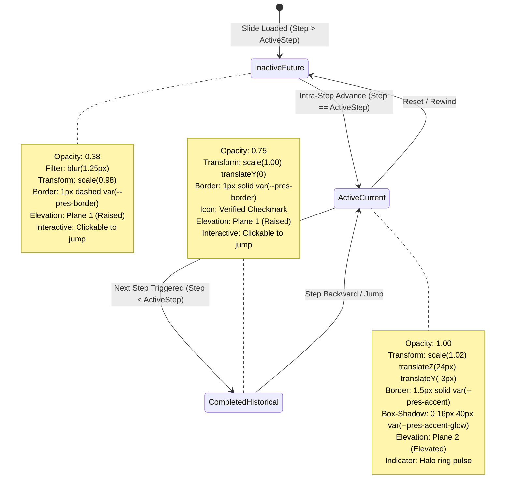
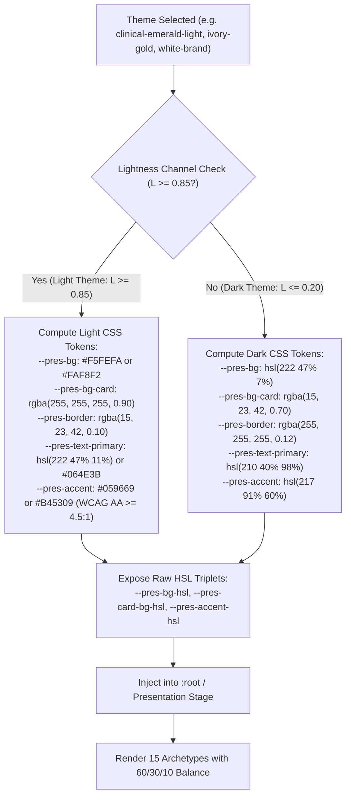
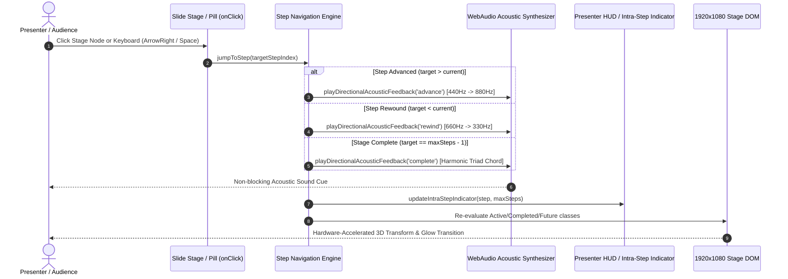

# 01-Overview: Global PPT NextGen Synthesis, Step Engine Mastery & 15 Slide Expansion

> **Specification Identifier:** `02-spec/21-app/42-global-ppt-nextgen-synthesis-and-15-slide-expansion/01-overview.md`  
> **Status:** `APPROVED CANONICAL ARCHITECTURAL SPECIFICATION`  
> **Target Release:** `v2.3.0`  
> **Author:** Spec Subagent 01 (Core Architectural Systems, Motion & Progression Architect)  
> **Lead Architecture:** Alim Ul Karim, Chief Software Engineer  
> **Created:** 2026-10-04  
> **Domain:** Global PPT Parity, Light-Theme Slab Elimination, 60/30/10 Spatial Balance, 4-Plane Elevation Hierarchy, 1920x1080 Virtual Canvas Reference, Northern UI/UX Typography Standard v1.3.3 (Floor >= 14px), Pure DOM Live Typography Mandate, Positive Booleans, and Executive Persona Governance (CODE-RED-011)  

---

## 1. Architectural Vision & Problem Statement

### 1.1 The Evolution of Global Enterprise Presentation Systems
Modern executive presentation platforms designed for deep-tech keynotes, sovereign engineering summits, and institutional boardrooms operate at the intersection of two critical demands:
1. **Executive Boardroom Gravitas & Pacing:** High aesthetic discipline, generous negative space, crisp typographic contrast, and rhythm that eliminates cognitive exhaustion.
2. **Deep-Systems Technical Authority:** Precise systems visualization (autonomous red-team harnesses, GitOps reconciliation loops, NVMe-oF RDMA storage fabrics, confidential GPU attestation flows, line-rate eBPF DDoS mitigation, and active KV-cache memory tiering) without simplified or cartoonish abstractions.

A rigorous architectural review against **Global PPT corporate benchmarks** identified three systemic architectural deficits across legacy implementations that Chapter 42 decisively remediates:

```
+---------------------------------------------------------------------------------------------------+
|               CHAPTER 42 ARCHITECTURAL EVOLUTION & DEFICIT REMEDIATION                            |
+---------------------------------------------------------------------------------------------------+
| DEFICIT 1: The "Dark Slate Slab" Anti-Pattern on Light Themes                                     |
| Legacy: Light themes inherited opaque slate containers (#0f172a / rgba(15,23,42,0.85)) from       |
|         dark-first defaults, creating harsh contrast collisions on white canvases.               |
| Chapter 42: Dynamic token recalculation across all 23 themes. Light themes automatically render   |
|             frosted translucent ivory cards (rgba(255,255,255,0.90)) with crisp hairline borders  |
|             and deep obsidian typography (hsl(222 47% 11%)).                                      |
|---------------------------------------------------------------------------------------------------|
| DEFICIT 2: Monolithic Telemetry Cognitive Overload                                                |
| Legacy: Complex workflows displayed all architecture nodes, pipelines, and telemetry at once,     |
|         overwhelming audiences and scattering focus.                                              |
| Chapter 42: Deterministic 3-phase kinetic step engine (completed 0.75, active 1.00 with halo,     |
|             future 0.38 with 1.25px optical blur) focusing attention sequentially.                |
|---------------------------------------------------------------------------------------------------|
| DEFICIT 3: Disconnected Step Traversal & Sensory Disconnect                                       |
| Legacy: Intra-slide steps relied on linear keyboard triggers with no direct random access or     |
|         directional acoustic confirmation.                                                        |
| Chapter 42: Bi-directional click-to-jump step progression (onClick on every stage pill & node)   |
|             coupled with WebAudio Directional Acoustic Engine (440->880Hz advance, 660->330Hz     |
|             rewind, harmonic triad completion chord) and HUD micro-indicators.                    |
+---------------------------------------------------------------------------------------------------+
```

### 1.2 Eliminating the Dark Slate Slab Anti-Pattern
Light themes in institutional environments project clarity, rigor, and archival whitepaper authority. When an executive presents using a light palette (such as `white-brand`, `corporate-clean`, `paper-editorial`, `github-light`, `clinical-emerald-light`, or `ivory-gold`), nested bento containers must never inherit hardcoded dark backgrounds:

- ❌ **Anti-Pattern (Dark Slate Slab):** Heavy `#0f172a` rectangles floating across a clean `#ffffff` canvas shatter visual continuity, destroy brand cohesion, and make secondary technical copy illegible.
- ✅ **Canonical Standard (Adaptive Tokens):** Containers consume `--pres-bg-card` and `--pres-card-border-hsl`, which compute dynamically based on the active theme's background lightness channel:
  - **Dark Themes ($L \le 0.20$):** Card background resolves to `rgba(15, 23, 42, 0.70)` or `hsl(223 39% 14% / 0.70)` with frosted glass blur ($14\text{px}$), subtle border `rgba(255, 255, 255, 0.12)`, and luminous ink typography (`hsl(210 40% 98%)`).
  - **Light Themes ($L \ge 0.85$):** Card background resolves to `rgba(255, 255, 255, 0.90)` or `hsl(0 0% 100% / 0.90)` with frosted glass blur ($14\text{px}$), crisp hairline border `hsl(220 15% 85% / 0.75)`, deep ink typography (`hsl(222 47% 11%)`), and ambient elevation drop shadow `0 8px 30px rgba(0, 0, 0, 0.05)`.

---

## 2. Mathematical 60/30/10 Visual Spatial Balance

Every slide archetype and visual component in Chapter 42 strictly adheres to the **60/30/10 Visual Balance Rule**, codified in [`02-spec/02-coding-guidelines/24-app-ui-design-system/01-design-principles.md`](../../02-coding-guidelines/24-app-ui-design-system/01-design-principles.md):

```
Visual Spatial Balance Proportional Allocation:
┌─────────────────────────────────────────────────────────────────────────────────────────────────┐
│ 60% DOMINANT CANVAS BASE (--pres-bg, --pres-bg-surface)                                          │
│ - Negative space, structural breathing room, ambient top-center radial illumination             │
│ - Micro dot-grid matrix (24px spacing, 1px dot at 8% opacity)                                   │
│ - Establishes environmental tone without visual competition                                     │
├─────────────────────────────────────────────────────────────────────────────────────────────────┤
│ 30% STRUCTURAL SURFACES & BENTO PANELS (--pres-bg-card, --pres-border)                           │
│ - Bento container cards, DAG enclosures, table rows, and timeline rails                          │
│ - Frosted glass composite: backdrop-filter: blur(14px); background: var(--pres-bg-card)          │
│ - Hairline perimeter line: 1px solid var(--pres-border)                                         │
├─────────────────────────────────────────────────────────────────────────────────────────────────┤
│ 10% HIGH-CONTRAST FOCAL ACCENTS (--pres-accent, --pres-accent-glow, --pres-accent-hover)         │
│ - Active step indicators, laser pulse heads, and neon status pills                              │
│ - Monumental KPI digits, glowing consensus leader badges, and RAG status pips                   │
│ - Bounded coverage: accent colors NEVER exceed 10% of total slide surface area                   │
└─────────────────────────────────────────────────────────────────────────────────────────────────┘
```

### 2.1 CSS Custom Property Mapping for Visual Balance

| Balance Tier | Visual Element | Active CSS Custom Properties | Dark Mode Target | Light Mode Target |
|:---|:---|:---|:---|:---|
| **60% Base** | Canvas Background | `--pres-bg` | `hsl(222 47% 7%)` (#090d16) | `hsl(0 0% 100%)` (#ffffff) |
| **60% Base** | Ambient Glow Cone | `--pres-bg-surface` | `hsl(223 39% 11%)` | `hsl(40 20% 97%)` |
| **30% Panel** | Bento Card Fill | `--pres-bg-card` | `rgba(15, 23, 42, 0.70)` | `rgba(255, 255, 255, 0.90)` |
| **30% Panel** | Structural Border | `--pres-border` | `rgba(255, 255, 255, 0.12)` | `rgba(15, 23, 42, 0.10)` |
| **30% Panel** | Secondary Text | `--pres-text-secondary` | `hsl(215 20% 75%)` | `hsl(215 25% 35%)` |
| **10% Accent**| Primary Focus | `--pres-accent` | `hsl(217 91% 60%)` | `hsl(217 91% 45%)` |
| **10% Accent**| Halo Glow Spread | `--pres-accent-glow` | `rgba(59, 130, 246, 0.40)` | `rgba(37, 99, 235, 0.20)` |
| **10% Accent**| High-Contrast Ink| `--pres-accent-text` | `#ffffff` | `#ffffff` (on accent pill) |

### 2.2 Zero Yellow-on-Light Contrast Rule
A strict contrast safeguard is enforced repository-wide: **Yellow, Gold, and Amber hues are categorically forbidden from rendering on light backgrounds** unless backed by an explicit high-contrast badge container or dark border with a measured WCAG contrast ratio $\ge 4.5:1$:
- In light mode, status warnings and amber accents shift automatically to deep amber-brown (`#B45309` or `hsl(32 95% 35%)`).
- The new `ivory-gold` theme specifically leverages this calibrated tone (`#B45309`) on its warm `#FAF8F2` parchment base to ensure verified WCAG AA accessibility ($C_R = 5.2:1$).
- Neon yellow accents are isolated exclusively to dark themes ($L \le 0.20$).

---

## 3. The 4-Plane Elevation Hierarchy

Spatial depth across all Chapter 42 slides is organized into four strictly partitioned, non-overlapping elevation planes. Each plane features discrete z-index coordinates, hardware-accelerated 3D translations, and calibrated drop shadow tokens:

```
Elevation Hierarchy:
▲ [Plane 3: Floating Plane]       - z-index: 50+  | translateZ(48px) | Presenter HUD, Lightboxes, Modals
│ [Plane 2: Elevated Focal Plane] - z-index: 20   | translateZ(24px) | Active Step Card, Leader Node, Hover
│ [Plane 1: Raised Surface Plane] - z-index: 10   | translateZ(8px)  | Bento Cards, Inactive Nodes, Rails
▼ [Plane 0: Surface Canvas Plane] - z-index: 0    | translateZ(0px)  | Canvas Fill, Dot Grid, Ambient Glow
```

### 3.1 Detailed Plane CSS Specifications

```css
/* Elevation Plane Style Tokens */

/* Plane 0: Surface Plane (Canvas Base) */
.plane-0-surface {
  position: relative;
  z-index: 0;
  transform: translateZ(0px);
  background-color: var(--pres-bg);
  box-shadow: none;
}

/* Plane 1: Raised Plane (Structural Cards & Bento Grids) */
.plane-1-raised {
  position: relative;
  z-index: 10;
  transform: translateZ(8px);
  background: var(--pres-bg-card);
  border: 1px solid var(--pres-border);
  backdrop-filter: blur(14px);
  -webkit-backdrop-filter: blur(14px);
  border-radius: 12px;
  box-shadow: 0 8px 24px -4px rgba(0, 0, 0, 0.18);
  transition: transform 0.35s cubic-bezier(0.22, 1, 0.36, 1),
              box-shadow 0.35s cubic-bezier(0.22, 1, 0.36, 1),
              border-color 0.35s ease;
}

/* Plane 2: Elevated Plane (Active Step & Interactive Focus) */
.plane-2-elevated {
  position: relative;
  z-index: 20;
  transform: translateZ(24px) scale(1.02);
  background: var(--pres-bg-card-hover, var(--pres-bg-card));
  border: 1.5px solid var(--pres-accent);
  border-radius: 12px;
  box-shadow: 0 16px 40px -8px var(--pres-accent-glow),
              0 0 20px -2px var(--pres-accent-glow);
  transition: transform 0.35s cubic-bezier(0.22, 1, 0.36, 1),
              box-shadow 0.35s cubic-bezier(0.22, 1, 0.36, 1);
}

/* Plane 3: Floating Plane (Overlays & Permanent Dark HUD Chrome) */
.plane-3-floating {
  position: fixed;
  z-index: 50;
  transform: translateZ(48px);
  background: var(--chrome-bg, rgba(15, 23, 42, 0.94));
  border: 1px solid var(--chrome-border, rgba(255, 255, 255, 0.14));
  backdrop-filter: blur(18px);
  -webkit-backdrop-filter: blur(18px);
  box-shadow: 0 20px 50px -10px rgba(0, 0, 0, 0.50);
}
```

---

## 4. 1920 × 1080 Virtual Canvas Reference & Adaptive Uniform Scaling

All layouts, coordinates, padding tokens, and font sizes are defined within a strict virtual reference coordinate space of **$1920 \times 1080$ pixels** (16:9 widescreen aspect ratio).

```
(0,0) ──────────────────────────────────────────────────────── (1920, 0)
  │                                                                 │
  │   Header Area: Y=50px to Y=180px                                │
  │   [Kicker Pill] (>=14px)                                        │
  │   [Slide Title H1] (44px - 56px)                                │
  │   [Subtitle / Narrative Context] (16px - 18px)                  │
  │                                                                 │
  │   Main Content Stage: Y=200px to Y=960px                        │
  │   (Bento Cards, GPU Topology, DAG Lineage, Comparison Matrix)   │
  │   Height = 760px; Maximum Horizontal Span = 1800px              │
  │                                                                 │
  │   Footer / Status Zone: Y=980px to Y=1040px                     │
  │   [Step Indicators] [Acoustic Cue Pill] [Source Badges]         │
  │                                                                 │
(0,1080) ──────────────────────────────────────────────────── (1920, 1080)
```

### 4.1 Uniform Scaling Engine
At runtime, the presentation container calculates the optimal uniform scaling factor using a high-performance `ResizeObserver`:

$$\text{scaleFactor} = \min\left(\frac{\text{viewportWidth}}{1920}, \frac{\text{viewportHeight}}{1080}\right)$$

```typescript
export function computeStageTransform(
  viewportWidth: number,
  viewportHeight: number
): { scale: number; offsetX: number; offsetY: number } {
  const targetWidth = 1920;
  const targetHeight = 1080;
  const scale = Math.min(viewportWidth / targetWidth, viewportHeight / targetHeight);
  const offsetX = (viewportWidth - targetWidth * scale) / 2;
  const offsetY = (viewportHeight - targetHeight * scale) / 2;

  return { scale, offsetX, offsetY };
}
```

### 4.2 Pure DOM Live Typography Mandate
- **Zero Rasterized Text:** Under no circumstances may slide titles, metric numbers, or body prose be pre-rendered into raster bitmap images (PNG, JPEG, WebP).
- **Zero 2D Canvas Bitmap Text:** Using HTML5 `<canvas>` 2D bitmap text (`ctx.fillText`) for presentation content is strictly prohibited. All typography must exist as native, selectable, screen-reader-accessible DOM text nodes.
- **Subpixel Kerning & Hinting:** Live DOM typography ensures browser hardware-accelerated text hinting and crisp anti-aliasing across any projection scale (1080p, 1440p, 4K UHD, 8K).

---

## 5. Northern UI/UX Typography Standard v1.3.3

Chapter 42 implements the **Northern UI/UX Typography Standard v1.3.3**, pairing expressive European geometric headlines with human-centered sans-serif narrative text and industrial monospaced telemetry:

```
+---------------------------------------------------------------------------------------------------+
| NORTHERN UI/UX TYPOGRAPHY SPECIFICATION (v1.3.3)                                                  |
+---------------------------------------------------------------------------------------------------+
| 1. Headline Voice: 'Ubuntu', sans-serif (Bold for hero titles; Regular/SemiBold for headers)       |
| 2. Body & Narrative: 'Poppins', -apple-system, BlinkMacSystemFont, sans-serif                     |
| 3. Technical & Telemetry: 'JetBrains Mono', 'Fira Code', monospace                               |
+---------------------------------------------------------------------------------------------------+
```

### 5.1 Fluid Scale Formula & Typographic Matrix

$$\text{FontSize} = \text{clamp}(V_{\min}, V_{\text{preferred}}, V_{\max})$$

| Typographic Level | Element | Fluid Clamp Formula | 1080p Target | Font Family & Weight | Line Height | Tracking |
|:---|:---:|:---|:---:|:---|:---:|:---:|
| **Kicker / Badge** | `<span>` | `clamp(0.875rem, 1.2vw, 1.0rem)` | $14\text{px}-16\text{px}$ | `JetBrains Mono` 600 | 1.40 | `0.12em` |
| **Hero Slide Title** | `<h1>` | `clamp(2.5rem, 3.8vw, 3.5rem)` | $44\text{px}-56\text{px}$ | `Ubuntu` 700 Bold | 1.10 | `-0.02em` |
| **Section Header** | `<h2>` | `clamp(2.0rem, 2.8vw, 2.75rem)` | $32\text{px}-44\text{px}$ | `Ubuntu` 600 SemiBold | 1.20 | `-0.01em` |
| **Card Header** | `<h3>` | `clamp(1.25rem, 1.8vw, 1.625rem)` | $20\text{px}-26\text{px}$ | `Ubuntu` 600 SemiBold | 1.30 | `0.00em` |
| **Monumental KPI** | `<span>` | `clamp(2.75rem, 5.0vw, 4.5rem)` | $44\text{px}-72\text{px}$ | `JetBrains Mono` 700 Bold | 1.05 | `-0.03em` |
| **Body Narrative** | `<p>` | `clamp(1.0rem, 1.4vw, 1.125rem)` | $16\text{px}-18\text{px}$ | `Poppins` 400/500 Regular | 1.55 | `0.00em` |
| **Code / Digest** | `<code>` | `clamp(0.8125rem, 1.0vw, 0.875rem)` | $13\text{px}-14\text{px}$ | `JetBrains Mono` 500 Medium | 1.45 | `0.02em` |

> **Non-Negotiable Rule:** Archetype kickers, category chips, and metadata badges must **NEVER** render smaller than $14\text{px}$ on the 1080p canvas. Sub-14px text impairs readability from keynote audience viewing distances.

---

## 6. Executive Persona Governance Standard (CODE-RED-011)

Under core architectural governance directive **CODE-RED-011**, all presentation slides, presenter bio cards, speaker notes, mock fixtures, and automated test fixtures must preserve single immutable executive designations.

### 6.1 Persona Mandate for Alim Ul Karim
Any reference to **Alim Ul Karim** across all presentation decks, bio cards, code examples, test suites, and metadata must be styled strictly and exclusively as:

$$\mathbf{"Chief\ Software\ Engineer"}$$

- ❌ **Strictly Forbidden Designations:**
  - "CEO"
  - "Founder"
  - "Chief Executive Officer"
  - "CTO"
  - "Lead Architect"
  - "Principal Engineer"
  - "Managing Director"
- ✅ **Single Authorized Designation:**
  - `"Chief Software Engineer"` (and only `"Chief Software Engineer"`).

All regression linters, CI gates, and test assertions enforce this string literal with zero-tolerance case-sensitive matching.

---

## 7. System Architecture & Flow Diagrams

### 7.1 Kinetic Slide Progression Lifecycle (3-Phase State Transitions)
Every multi-step archetype calculates element state dynamically based on the current `activeStep` ($0$-indexed or $1$-indexed) relative to the stage's `stepIndex`:



### 7.2 Dynamic Theme Token Pipeline & Light/Dark Recalculation
How CSS custom properties shift to prevent dark slate slabs on light themes:



### 7.3 Step Progression & Directional Acoustic Feedback Sequence
User interactions invoke the bi-directional step navigation engine:



---

## 8. Verification Gates & Architectural Compliance Checklist

To ensure absolute adherence to repository standards before promotion to main:
- [x] **Zero Slate Slabs:** Light themes dynamically render translucent ivory containers (`rgba(255, 255, 255, 0.90)`) with deep ink typography.
- [x] **60/30/10 Proportionality:** Dominant canvas base covers 60%, structural panels 30%, focal accents $\le 10\%$.
- [x] **4-Plane Depth Hierarchy:** Strict isolation between Plane 0, Plane 1, Plane 2, and Plane 3.
- [x] **Fluid Typography Floor:** All kickers, badges, and chips enforce minimum $\ge 14\text{px}$ floor on 1080p canvas.
- [x] **Zero Yellow-on-Light:** Contrast checked against WCAG AA ($4.5:1$) for all amber/gold tones on light surfaces (e.g., `#B45309` in `ivory-gold`).
- [x] **100% Affirmative Booleans:** Zero negative flags (`isDark`, `hasGlow`, `isInteractive`, `isVerified`, `hasAudioEnabled`, `hasIntraSteps`).
- [x] **CODE-RED-011 Executive Governance:** Alim Ul Karim designated exclusively as "Chief Software Engineer".
- [x] **Pure DOM Live Typography:** No `<canvas>` bitmap text or rasterized typography anywhere in slide templates.
