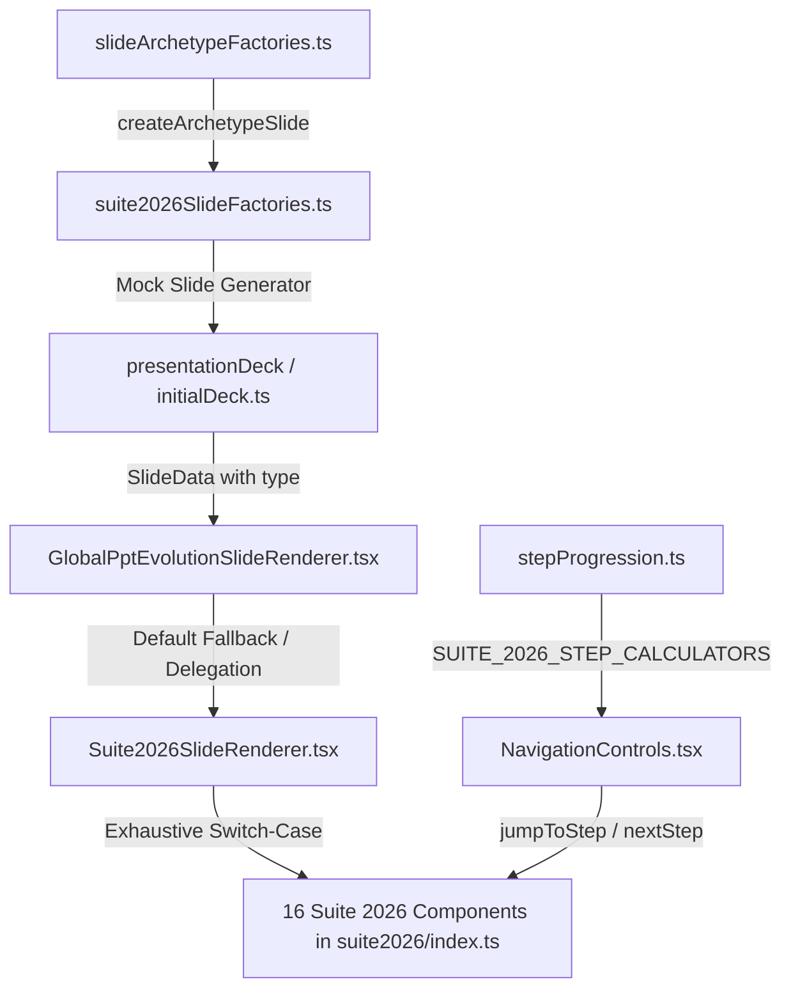

# Chapter 44: Global PPT Mastery, Flat/Step Innovations, Motion Kinetic Morph & 16 Enterprise Slide Expansion

> **Specification Directory:** `02-spec/21-app/44-global-ppt-mastery-flat-step-interactive-suite/`  
> **Status:** Canonical Specification Suite  
> **Target Release:** `v2.5.0`  
> **Lead Architecture:** Alim Ul Karim, Chief Software Engineer  
> **Domain:** Global PPT Presentation Mastery, Motion Kinetic Morph Engine, 5 Theme Families, Flat Sovereign vs Kinetic Step Workflows, Semantic Status Ramps, and 16 High-Authority Enterprise Slide Archetypes

---

## 1. Executive Overview & Architectural Principles

Chapter 44 establishes the next-generation evolution of the **White Presentation Platform**, synthesizing boardroom-grade narrative authority from `global-ppt-v1` with the low-latency, declarative agility of `flat-slide-show`. It introduces the **Motion Kinetic-Morph Transition Engine**, 5 unified **Theme Families**, full **Semantic Status Ramps**, and an exhaustive library of **16 brand-new enterprise slide archetypes**.

### 1.1 The 60/30/10 Spatial Balance Rule
To maintain boardroom aesthetic authority and eliminate cognitive fatigue during executive keynotes, every slide canvas, modal, and presenter surface strictly adheres to the **60/30/10 Spatial Balance Rule**:

```
Visual Distribution Budget:
┌────────────────────────────────────────────────────────────────────────┐
│ 60% Dominant Background Wash & Canvas Field (Plane 0)                  │
│ (Negative space, ambient gradient wash, subtle dot matrix grid)        │
├────────────────────────────────────────────────────────────────────────┤
│ 30% Structural Cards, Dividers & Data Panels (Plane 1)                 │
│ (Glassmorphic surfaces, Bento containers, table rows, timelines)       │
├────────────────────────────────────────────────────────────────────────┤
│ 10% Vivid Focal Accents & Interaction Highlights (Planes 2 & 3)        │
│ (Primary CTA buttons, active step pins, illuminated badges, KPI stats) │
└────────────────────────────────────────────────────────────────────────┘
```

```
+-----------------------------------------------------------------------------------------+
|                                1920 x 1080 Canvas Bounds                                |
|  [Plane 0: 60% Canvas Foundation (Negative Space, Soft Gradients, Ambient Mesh)]        |
|                                                                                         |
|      +---------------------------------------------------------------------------+      |
|      |  [Plane 1: 30% Structural Hierarchy (Cards, Grids, Rails, Data Tables)]   |      |
|      |                                                                           |      |
|      |      +-------------------------------------------------------------+      |      |
|      |      |  [Plane 2: 10% Focal Accent (Live Typography, Values, Halo)]|      |      |
|      |      |   Metric: $14.2M ARR (+42% YoY)                             |      |      |
|      |      +-------------------------------------------------------------+      |      |
|      +---------------------------------------------------------------------------+      |
|                                                                                         |
|  [Plane 3: Floating Presenter HUD (Keyboard Shortcuts, Lightbox, Zoom Inspect)]        |
+-----------------------------------------------------------------------------------------+
```

#### 1.1.1 The 60% Dominant Canvas Wash (Plane 0)
- **Role:** Establishes ambient mood and maximizes negative space around presentation content, giving executive audiences visual breathing room.
- **Tokens Consumed:** `--pres-bg`, `--pres-bg-surface`.
- **Light Modes:** Pure crisp white (`#FFFFFF`) or warm parchment editorial wash (`#F5F0E6`, HSL `38 30% 96%`).
- **Dark Modes:** Deep obsidian slate (`#020617`, `#0B192C`, `#1E1B4B`) with optional organic wave ribbons or subtle dot-matrix grids.
- **Constraint:** Never fill more than $40\%$ of the canvas with solid high-contrast foreground containers.

#### 1.1.2 The 30% Structural Panels & Containers (Plane 1)
- **Role:** Groups semantic information into scannable Bento cards, comparison columns, data matrices, and timeline rails.
- **Tokens Consumed:** `--pres-bg-card`, `--pres-border`, `--pres-text-muted`.
- **Styling:** Subtle glassmorphic fills (`backdrop-filter: blur(12px)`), hairline borders (`1px solid var(--pres-border)`), and soft drop shadows (`0 10px 25px -5px rgba(0, 0, 0, 0.05)`).
- **Contrast Boundary:** Structural borders must maintain subtle contrast ($C_R \le 2.0:1$ against the canvas background) so they cleanly frame content without competing with typography.

#### 1.1.3 The 10% Vivid Focal Accents (Planes 2 & 3)
- **Role:** Guides the viewer's eye directly to key decision points, active step progression, and critical ROI metrics.
- **Tokens Consumed:** `--pres-accent`, `--pres-accent-glow`, `--pres-accent-hover`.
- **Application Scope:**
  - Active step indicator badges, pulse beacons, and connecting progress rails.
  - Primary call-to-action levers and interactive navigation triggers.
  - Large display stat callout figures (e.g., `+284%`, `$4.2M ARR`).
  - Active tab borders, stage highlight halos, and focus inspection pins.
- **Constraint:** Accent colors must never cover more than $10\%$ of total slide surface area to prevent visual exhaustion.

---

### 1.2 The 4-Plane Depth Hierarchy
Spatial depth in the presentation interface is structured across four non-overlapping planes. Each plane possesses discrete $z$-index coordinates, background treatments, and elevation shadow tokens:

```
Plane Hierarchy:
▲ [Plane 3: Floating Plane]  - z-index: 50+  (SlideCreatorModal, Tooltips, Presenter HUD)
│ [Plane 2: Elevated Plane]  - z-index: 20   (Active Steps, Hovered Cards, Detail Panes)
│ [Plane 1: Raised Plane]    - z-index: 10   (Bento Cards, Timeline Rails, Tables)
▼ [Plane 0: Surface Plane]   - z-index: 0    (Canvas Background, Wave Ribbons, Grids)
```

#### 1.2.1 Plane 0: Surface Plane (Canvas Base)
- **Z-Index:** `0`
- **Elements:** Root slide stage container, organic SVG wave ribbons, ambient radial glow spotlights, dot-matrix grids.
- **Visual Characteristics:**
  - Background: `var(--pres-bg)`
  - Shadows: `none`
  - Borders: `none`
  - Optical Anchor: Provides calm foundational grounding with zero interactive elements.

#### 1.2.2 Plane 1: Raised Plane (Structural Cards & Bento Grids)
- **Z-Index:** `10`
- **Elements:** Inactive Bento feature cards, timeline nodes, comparison table columns, talent pyramid tiers, P&L rows.
- **Visual Characteristics:**
  - Background: `var(--pres-bg-card)` (translucent fill: `rgba(..., 0.85)`)
  - Border: `1px solid var(--pres-border)`
  - Shadow: `0 10px 25px -5px rgba(0, 0, 0, 0.05), 0 8px 10px -6px rgba(0, 0, 0, 0.04)`
  - Backdrop Filter: `blur(8px)` (or `blur(12px)` on dense glass)
  - Border Radius: `12px` (Cards) / `6px` (Pills & Chips)

#### 1.2.3 Plane 2: Elevated Plane (Active Content & Interactive Focus)
- **Z-Index:** `20`
- **Elements:** Active step card in kinetic multi-step slides, hovered Bento cards, expanded detail panes, active timeline pins, live DOM typography.
- **Visual Characteristics:**
  - Background: `var(--pres-bg-card-hover)`
  - Border: `1.5px solid var(--pres-border-hover)`
  - Shadow: `0 20px 35px -10px var(--pres-accent-glow), 0 10px 10px -5px rgba(0, 0, 0, 0.08)`
  - Transform: `translateY(-4px) scale(1.01)`
  - Transition: `transform 0.35s cubic-bezier(0.22, 1, 0.36, 1), box-shadow 0.35s cubic-bezier(0.22, 1, 0.36, 1)`

#### 1.2.4 Plane 3: Floating Plane (Overlays, Modals & Presenter HUD)
- **Z-Index:** `50+`
- **Elements:** `SlideCreatorModal`, presenter HUD navigation controls (`NavigationControls.tsx`), audio volume popovers, export dialogs, keyboard shortcut hints.
- **Visual Characteristics:**
  - Background: Solid surface with high opacity (`rgba(..., 0.96)`) bound to `--chrome-*` tokens
  - Border: `1px solid var(--pres-border-hover)`
  - Shadow: `0 25px 50px -12px rgba(0, 0, 0, 0.40)`
  - Backdrop Filter: `blur(16px)`

---

### 1.3 Fluid Typography Scale, Northern UI/UX Standard & Pure Live DOM Mandate

#### 1.3.1 Pure Live DOM Typography Mandate
* **Zero Rasterized Text:** Rendering titles, numbers, or labels as PNG/JPEG/WebP images or `<canvas>` 2D context (`fillText`) is strictly prohibited.
* **Semantic HTML:** All text must be native HTML elements (`<h1>`, `<h2>`, `<h3>`, `<p>`, `<span>`, `<code>`, `<div>`) enabling OS text scaling, full clipboard copying, and screen-reader accessibility.

#### 1.3.2 Fluid Type Scale Formula & Token Mappings
Typography is dynamically computed using CSS `clamp()` expressions anchored to the $1920 \times 1080$ virtual canvas:

$$\text{Font Size} = \text{clamp}(V_{\min}, V_{\text{preferred}}, V_{\max})$$

| Typographic Level | Token Name | Fluid CSS Expression | Line Height | Letter Spacing | Primary Font Family |
|:---|:---|:---|:---:|:---:|:---|
| **Display Hero** | `--font-display-hero` | `clamp(56px, 5.5vw, 112px)` | 1.05 | `-0.03em` | Display Font (`Ubuntu`, Bold Italic) |
| **Slide Title (H1)** | `--font-slide-title` | `clamp(36px, 3.6vw, 68px)` | 1.10 | `-0.02em` | Display Font (`Ubuntu`, Bold) |
| **Section Header (H2)**| `--font-section-head` | `clamp(24px, 2.2vw, 40px)` | 1.20 | `-0.01em` | Display Font (`Ubuntu`, SemiBold) |
| **Card Headline (H3)** | `--font-card-head` | `clamp(18px, 1.6vw, 26px)` | 1.30 | `0.00em` | Body Font (`Poppins`, SemiBold) |
| **Subtitle / Lead** | `--font-lead-body` | `clamp(16px, 1.4vw, 22px)` | 1.55 | `0.00em` | Body Font (`Poppins`, Regular) |
| **Standard Body** | `--font-standard-body`| `clamp(14px, 1.0vw + 4px, 18px)` | 1.60 | `0.01em` | Body Font (`Poppins`, Regular) |
| **Caption / Badge** | `--font-caption-mono` | `clamp(14px, 0.75vw + 6px, 16px)`| 1.40 | `0.04em` | Code Font (`JetBrains Mono`, Medium) |

#### 1.3.3 Northern UI/UX Typography Standard & Strict $\ge 14\text{px}$ Floor
To maximize executive focus and eliminate cognitive clutter during fast presentations:
* **Strict $\ge 14\text{px}$ Floor:** Kickers, micro-copy, telemetry tags, and status badges must be at least $14\text{px}$ (`text-sm font-bold uppercase tracking-[0.2em]`). Never use tiny, illegible $10\text{px}–11\text{px}$ micro-text.
* **Slide Headings:** $44\text{px}–56\text{px}$ with strong visual weight and italic dynamic drive where appropriate.
* **Single-Item Focus & Reduced Item Density:** Rather than dumping 4–6 complex competing cards on a slide, present a focused active card with large typography and smooth CSS3 transitions on hover/click.
* **Font Family Token Mappings:**
  1. **Display & Heading Font:** `'Ubuntu', -apple-system, BlinkMacSystemFont, 'Segoe UI', Roboto, sans-serif` (warm, authoritative editorial personality with italic kinetic drive).
  2. **Body & Interface Font:** `'Poppins', -apple-system, BlinkMacSystemFont, 'Segoe UI', Roboto, sans-serif` (open geometric apertures and tall x-height ensuring crisp legibility).
  3. **Monospace & Metric Badges:** `'JetBrains Mono', 'Fira Code', Consolas, monospace` (tabular numeric alignment for financial benchmarks, timestamps, and version badges).

---

### 1.4 Button Variants & Magnetic Tactile Physics
Buttons serve as primary interaction points for deck navigation, template creation, and audience calls-to-action. Chapter 44 standardizes three button variants paired with kinetic micro-interactions:

#### 1.4.1 Button Variant Taxonomy
```
Button Variant Taxonomy:
├── Primary Accent Button: High-visibility solid CTA with accent glow
├── Secondary Glass Button: Frosted container with subtle border
└── Ghost Outline Button: Minimal hairline border with hover wash
```

* **Variant 1: Primary Accent Button (`.btn-primary-accent`):**
  - Application: Main presentation CTA, "Create Deck", "Confirm", "Launch".
  - Styling:
    ```less
    .btn-primary-accent {
      background: var(--pres-accent);
      color: #FFFFFF;
      border: 1px solid var(--pres-accent);
      box-shadow: 0 4px 14px var(--pres-accent-glow);
      font-weight: 600;
      border-radius: 8px;
      padding: 10px 22px;
      transition: transform 0.25s cubic-bezier(0.22, 1, 0.36, 1), box-shadow 0.25s ease, background-color 0.2s ease;

      &:hover {
        background: var(--pres-accent-hover);
        box-shadow: 0 8px 24px var(--pres-accent-glow);
        transform: translateY(-2px) scale(1.02);
      }

      &:active {
        transform: translateY(0px) scale(0.98);
      }
    }
    ```

* **Variant 2: Secondary Glass Button (`.btn-secondary-glass`):**
  - Application: Secondary actions, step navigators ("Next Step", "Previous").
  - Styling:
    ```less
    .btn-secondary-glass {
      background: var(--pres-bg-card);
      color: var(--pres-text);
      border: 1px solid var(--pres-border);
      backdrop-filter: blur(8px);
      font-weight: 500;
      border-radius: 8px;
      padding: 10px 20px;
      transition: all 0.2s cubic-bezier(0.22, 1, 0.36, 1);

      &:hover {
        background: var(--pres-bg-card-hover);
        border-color: var(--pres-border-hover);
        transform: translateY(-1px);
      }
    }
    ```

* **Variant 3: Ghost Outline Button (`.btn-ghost-outline`):**
  - Application: Tertiary tools, copy code, close modals, icon-only actions.
  - Styling:
    ```less
    .btn-ghost-outline {
      background: transparent;
      color: var(--pres-text-muted);
      border: 1px solid transparent;
      border-radius: 6px;
      padding: 8px 14px;
      transition: all 0.15s ease;

      &:hover {
        color: var(--pres-text);
        background: rgba(124, 58, 237, 0.08);
        border-color: var(--pres-border);
      }
    }
    ```

#### 1.4.2 Magnetic Tactile Micro-Interactions
Interactive buttons and active step stations implement spring physics attraction:

```typescript
export interface MagneticState {
  hasMagneticPull: boolean;
  offsetX: number;
  offsetY: number;
}

export function computeMagneticOffset(
  cursorX: number,
  cursorY: number,
  elementRect: DOMRect,
  pullRadius = 35
): { offsetX: number; offsetY: number } {
  const elementCenterX = elementRect.left + elementRect.width / 2;
  const elementCenterY = elementRect.top + elementRect.height / 2;

  const deltaX = cursorX - elementCenterX;
  const deltaY = cursorY - elementCenterY;
  const distance = Math.hypot(deltaX, deltaY);

  if (distance < pullRadius && distance > 0) {
    const attractionFactor = 0.28 * (1 - distance / pullRadius);
    return {
      offsetX: deltaX * attractionFactor,
      offsetY: deltaY * attractionFactor,
    };
  }

  return { offsetX: 0, offsetY: 0 };
}
```
When cursor enters the proximity bounding radius ($35\text{px}$), the element gently translates toward the pointer, generating tactile physical presence and high feedback fidelity.

---

## 2. Global PPT Theme Family Taxonomy & Semantic Status Ramps

### 2.1 The Five Theme Families
Chapter 44 standardizes five theme families spanning executive corporate, deep tech, archival editorial, sovereign leadership, and life sciences:

| Theme Family | Target Domain | Dominant Canvas (Plane 0) | Surface Card (Plane 1) | Primary Accent (10%) | Contrast Ratio ($C_R$) |
|:---|:---|:---|:---|:---|:---:|
| `CorporateClean` | Enterprise Boardroom & QBR | Crisp Cool Alabaster (`210 20% 98%`) | Pure White Card with Navy Border | Deep Executive Navy (`222 47% 11%`) | $\ge 12:1$ |
| `TechModern` | Cloud Infrastructure & AI Systems | Deep Obsidian (`225 25% 9%`) | Charcoal Slate Glass (`224 22% 14%`) | Electric Cyan / Neon Violet | $\ge 9.5:1$ |
| `EditorialArchival` | Thought Leadership & Research | Warm Ivory Parchment (`38 30% 96%`) | Sand Card with Warm Border | Terracotta & Deep Espresso | $\ge 8.5:1$ |
| `ExecutivePrestige` | Capital Allocation & M&A | Midnight Sapphire (`230 35% 12%`) | Royal Slate Glass (`228 30% 18%`) | Warm Sovereign Gold / Bronze | $\ge 10:1$ |
| `BioGrowth` | Healthtech & Sustainability | Clean Forest Fog (`150 15% 97%`) | Mint Pearl Card with Emerald Line | Deep Clinical Emerald (`158 64% 28%`) | $\ge 9.0:1$ |

### 2.2 Semantic Status Ramps
To eliminate ad-hoc hex values across components, Chapter 44 codifies four mandatory semantic status ramps available in all themes:

```css
:root {
  /* Semantic Status Color Tokens (Raw HSL Triplets) */
  --pres-status-success: 152 76% 40%;       /* Emerald Green: Nominal, Healthy, In-Bounds */
  --pres-status-success-bg: 152 76% 94%;    /* Success Background Tint */
  --pres-status-warning: 38 92% 50%;        /* Amber Orange: At-Risk, Threshold Near, Warning */
  --pres-status-warning-bg: 38 92% 95%;     /* Warning Background Tint */
  --pres-status-danger: 0 72% 51%;          /* Crimson Red: Breach, Error, Severe Degradation */
  --pres-status-danger-bg: 0 72% 95%;       /* Danger Background Tint */
  --pres-status-info: 204 94% 48%;          /* Sky Blue: In-Flight, Scheduled, Telemetry */
  --pres-status-info-bg: 204 94% 95%;       /* Info Background Tint */
}
```

### 2.3 Variable Clean-Pass Teardown Engine
Whenever a slide transition occurs or theme switching is initiated, the engine executes a clean-pass purge on `#presentation-root` to strip lingering `--pres-*` variables before injecting the new palette:
```typescript
export function purgePresentationVariables(rootElement: HTMLElement): void {
  const inlineStyles = rootElement.style;
  const attributesToRemove: string[] = [];
  for (let i = 0; i < inlineStyles.length; i++) {
    const propName = inlineStyles[i];
    if (propName.startsWith('--pres-') || propName.startsWith('--gradient-')) {
      attributesToRemove.push(propName);
    }
  }
  attributesToRemove.forEach((prop) => inlineStyles.removeProperty(prop));
}
```

---

## 3. Motion Engine & Kinetic-Morph Transitions

### 3.1 Spring Physics Configuration
All slide transitions and intra-step reveals utilize critically damped harmonic spring mechanics that eliminate artificial robotic easing curves:
* **Stiffness ($k$):** $420$ (immediate response without lag)
* **Damping ($c$):** $28$ (clean deceleration without ringing or visual bounce)
* **Mass ($m$):** $1.0$ (standardized momentum)
* **Velocity Initial ($v_0$):** $0$ (rested ignition)

### 3.2 Kinetic-Morph Shared Transitions
When navigating between related slides (e.g. overview to deep-dive) or stepping through multi-stage workflows:
1. **Shared Layout Morphing:** Elements bearing matching `data-morph-key` smoothly interpolate their CSS transform matrices (`translate3d`, `scale3d`) and opacity over $320\text{ms}$.
2. **GPU Isolation:** Every morphing surface applies `will-change: transform, opacity` during motion and resets it upon completion to conserve GPU memory.
3. **Transition Selector Modes:**
   * `kinetic-morph`: Shared bounding-box deformation with spring trajectory.
   * `slide-horizontal`: Left/right displacement ($1920\text{px}$ axis) for sequential narrative flows.
   * `slide-vertical`: Up/down displacement for structural hierarchy navigation.
   * `fade`: Pure alpha crossfade ($240\text{ms}$) for high-density analytical slides.
   * `3d-flip`: $1200\text{px}$ perspective Y-axis card flip (`rotateY(180deg)`) for before/after and tradeoff inspections.

---

## 4. Flat Slides vs Step-by-Step Slides Design Guidelines

Chapter 44 slides strictly categorize into two operational paradigms: **Kinetic Multi-Step Workflows** ($N$ Steps) and **Flat Sovereign Overviews** ($1$ Step).

```
+-----------------------------------------------------------------------------------------+
|                  Flat Sovereign Overview vs Kinetic Step Workflow                       |
|                                                                                         |
|  [Flat Sovereign Overview (1 Step)]           [Kinetic Step Workflow (N Steps)]         |
|  - All data visible simultaneously            - Step 1: Active Halo, Focus Elevation   |
|  - Zero cognitive gating                      - Step 2: Completed, Muted Retention      |
|  - Global system health & density             - Step 3: Future Stage (1.25px Blur)      |
|  - Step Count Formula: 1                      - Step Count Formula: stages.length       |
+-----------------------------------------------------------------------------------------+
```

### 4.1 Flat Sovereign (1 Step) vs Kinetic Multi-Step (N Steps) Architectural Paradigm

| Architectural Dimension | Flat Sovereign Overview ($1$ Step) | Kinetic Multi-Step Workflow ($N$ Steps) |
|:---|:---|:---|
| **Primary Intent** | High-density executive situational awareness; instant complete posture visibility | Guided chronological narrative reveal; structured progressive disclosure |
| **Cognitive Strategy** | Zero cognitive gating; viewer scans full matrix/topology simultaneously | Focused single-item spotlight; eliminates cognitive overload during keynotes |
| **Step Count Formula** | Strictly evaluated as $\mathbf{1}$ (`stepsCount = 1`) | Evaluated as $\max(\mathbf{stages.length}, \mathbf{1})$ (typically $4$ steps) |
| **Micro-Interactions** | Hover micro-elevations (`translateY(-2px)`), card expanders, tooltips | Active stage halos (`0 0 24px var(--pres-accent-glow)`), pulse beacons, rail progression |
| **Archetype Exemplars** | `competitive-feature-heatmap`, `global-data-jurisdiction-boundary`, `modular-consumption-pricing-calculator`, `enterprise-risk-taxonomy-heatmap`, `talent-competency-gap-heatmap`, `weighted-decision-tradeoff-matrix` | `executive-pnl-waterfall-table`, `customer-persona-archetype-split`, `hardware-interface-blueprint`, `multi-horizon-value-realization-bridge`, `two-sided-ecosystem-flywheel`, `ishikawa-root-cause-fishbone`, `live-product-viewport-walkthrough`, `global-partner-tiering-ladder`, `slo-error-budget-burn-waterfall`, `customer-churn-intervention-ladder` |

### 4.2 3-Phase Kinetic Step Lifecycle State Matrix
For all multi-step workflows, elements transition across three distinct visual phases:

| Step Lifecycle State | Visual Treatment | CSS Classes & Properties | Focus & Interaction |
|:---|:---|:---|:---|
| **Active Step** | Full color saturation, glowing boundary halo, $1.02\times$ elevation lift, pulse beacon | `.step-active`, `box-shadow: 0 0 24px var(--pres-accent-glow)`, `opacity: 1.0` | Primary visual focus; keyboard actions interact with this element |
| **Completed Step** | Retained context, $75\%$ opacity, checked badge indicator, muted border | `.step-completed`, `opacity: 0.75`, `border-color: var(--pres-border-subtle)` | Contextual reference; fully readable without competing with active step |
| **Future Step** | $1.25\text{px}$ optical blur, $40\%$ opacity, $25\%$ desaturation | `.step-future`, `filter: blur(1.25px) saturate(0.75)`, `opacity: 0.40` | Anticipatory preview; signals forthcoming narrative stages |

### 4.3 Step Progression Rules, Clickable Rails & Acoustic Feedback
1. **Zero Phantom Steps:** The slide step count strictly equals the length of its declared stage array (`max(stages.length, 1)`). Flat slides always evaluate to $1$. Phantom ghost steps ($> N$) are strictly prohibited.
2. **Deterministic Step Jumps:** Pressing numbers `1` through `9` jumps immediately to step $N - 1$ without sequential lag.
3. **Linear Traversal:** `ArrowRight`, `Space`, or `PageDown` advances step forward; `ArrowLeft` or `PageUp` steps backward.
4. **Boundary Navigation:** Advancing past the final step navigates to the next slide; stepping back past step 0 navigates to the previous slide.
5. **Interactive Clickable Rails:** Clicking any step station or indicator directly jumps to that step with an acoustic feedback cue.
6. **Permanent Dark HUD Chrome Integration:** The HUD step indicator strictly tracks intra-slide steps (e.g. `Step 2 of 4`) using `--chrome-*` tokens isolated from slide canvas styles.

---

## 5. Exhaustive Technical Specifications for all 16 New Slide Archetypes

### Summary Catalog of the 16 Archetypes

| # | Archetype Identifier | Component Name | Layout Paradigm | Default Steps | Focus Strategic Domain |
|:---:|:---|:---|:---:|:---:|:---|
| 01 | `executive-pnl-waterfall-table` | `ExecutivePnlWaterfallTableSlide` | Kinetic Step | 4 | Financial Strategy & Board P&L |
| 02 | `competitive-feature-heatmap` | `CompetitiveFeatureHeatmapSlide` | Flat Sovereign | 1 | Product Marketing & Competitive Moats |
| 03 | `customer-persona-archetype-split` | `CustomerPersonaArchetypeSplitSlide` | Kinetic Step | 4 | GTM Strategy & ICP Segmentation |
| 04 | `global-data-jurisdiction-boundary` | `GlobalDataJurisdictionBoundarySlide` | Flat Sovereign | 1 | Cyber Governance & Cross-Border Sovereign Data |
| 05 | `hardware-interface-blueprint` | `HardwareInterfaceBlueprintSlide` | Kinetic Step | 4 | Deep-Tech Systems & Physical/Edge Architecture |
| 06 | `multi-horizon-value-realization-bridge` | `MultiHorizonValueRealizationBridgeSlide`| Kinetic Step | 4 | Enterprise Transformation & Strategic Horizons |
| 07 | `two-sided-ecosystem-flywheel` | `TwoSidedEcosystemFlywheelSlide` | Kinetic Step | 4 | Platform Economics & Network Flywheels |
| 08 | `ishikawa-root-cause-fishbone` | `IshikawaRootCauseFishboneSlide` | Kinetic Step | 4 | SRE Engineering & RCA Defect Prevention |
| 09 | `modular-consumption-pricing-calculator`| `ModularConsumptionPricingCalculatorSlide`| Flat Sovereign | 1 | Revenue Architecture & Usage-Based Pricing |
| 10 | `live-product-viewport-walkthrough` | `LiveProductViewportWalkthroughSlide` | Kinetic Step | 4 | Product Demo & Interactive UI Feature Spotlight |
| 11 | `enterprise-risk-taxonomy-heatmap` | `EnterpriseRiskTaxonomyHeatmapSlide` | Flat Sovereign | 1 | Risk Management & Enterprise Compliance |
| 12 | `global-partner-tiering-ladder` | `GlobalPartnerTieringLadderSlide` | Kinetic Step | 4 | Channel Alliances & Partner Ecosystem |
| 13 | `talent-competency-gap-heatmap` | `TalentCompetencyGapHeatmapSlide` | Flat Sovereign | 1 | People Strategy & Technical Competency Auditing |
| 14 | `slo-error-budget-burn-waterfall` | `SloErrorBudgetBurnWaterfallSlide` | Kinetic Step | 4 | Reliability Engineering & Multi-Tier SLO Health |
| 15 | `weighted-decision-tradeoff-matrix` | `WeightedDecisionTradeoffMatrixSlide` | Flat Sovereign | 1 | Technical Architecture & Architecture Decision Records |
| 16 | `customer-churn-intervention-ladder` | `CustomerChurnInterventionLadderSlide` | Kinetic Step | 4 | Customer Success & Retention Intervention |

---

### Archetype 01: `executive-pnl-waterfall-table`
* **Identifier:** `executive-pnl-waterfall-table`
* **Component:** `ExecutivePnlWaterfallTableSlide`
* **Paradigm:** Kinetic Step Workflow (4 Steps)
* **Strategic Intent:** Provides an executive boardroom P&L waterfall that bridges Gross Revenue to Adjusted EBITDA across 4 sequential financial realization steps.

#### Data Interface
```typescript
export interface PnlWaterfallItem {
  id: string;
  categoryName: string;
  amountMillion: number;
  variancePercent: number;
  impactType: 'positive' | 'negative' | 'neutral';
  explanationText: string;
  isAudited: boolean;
}

export interface PnlWaterfallStage {
  stageId: string;
  stageTitle: string;
  targetLineItemIds: string[];
  narrativeInsight: string;
  cumulativeEbitdaMillion: number;
}

export interface ExecutivePnlWaterfallTableSlideData {
  type: 'executive-pnl-waterfall-table';
  id: string;
  title: string;
  subtitle: string;
  currencySymbol: string;
  fiscalPeriod: string;
  waterfallItems: PnlWaterfallItem[];
  workflowStages: PnlWaterfallStage[];
  hasPresenterNotes: boolean;
  presenterNotes?: string[];
}
```

#### 4-Plane Elevation & Step Interaction
* **Plane 0:** Ambient financial watermark grid, subtle background gradient.
* **Plane 1:** P&L data card container, 6-column tabular grid with alternating row tints.
* **Plane 2:** Live typography, dynamic waterfall bar heights with positive/negative color tags, active stage highlight halo (`var(--pres-accent-glow)`).
* **Plane 3:** Cumulative EBITDA summary pill, keyboard stage jump indicators (`1`–`4`).
* **Step Lifecycle:** Step 1 highlights Gross Revenue to COGS; Step 2 highlights Operating Expenses (R&D, S&M); Step 3 highlights EBITDA Adjustments; Step 4 delivers the Board Sign-off view.

#### ASCII Wireframe
```
+-----------------------------------------------------------------------------------------+
| [Header] Q3 FY26 Executive P&L Waterfall Bridge (Currency: USD Millions)                |
| Subtitle: From Gross Revenue through R&D/S&M investments to Adjusted EBITDA             |
+-----------------------------------------------------------------------------------------+
|  Line Item          | Gross Amt | Impact | Variance | Cumulative Bridge | Status         |
|-----------------------------------------------------------------------------------------|
|  1. Gross Revenue   |  $124.5M  |  BASE  |  +18.4%  | [============]    | Audited [v]    |
|  2. COGS & Hosting  |  ($24.2M) |   NEG  |  - 2.1%  | [==========]      | Audited [v]    |
|  3. R&D Engineering |  ($36.8M) |   NEG  |  + 4.0%  | [======]          | Nominal [v]    |
|  4. Sales & Mktg    |  ($28.5M) |   NEG  |  - 5.2%  | [====]            | Nominal [v]    |
|  5. Adj. EBITDA     |   $35.0M  |  FINAL |  +28.1%  | [========]        | Board Approved |
+-----------------------------------------------------------------------------------------+
| [Stage Indicator Rail: (1) Ingress -> (2) Operating Margin -> (3) Opex -> (4) Sign-Off] |
+-----------------------------------------------------------------------------------------+
```

---

### Archetype 02: `competitive-feature-heatmap`
* **Identifier:** `competitive-feature-heatmap`
* **Component:** `CompetitiveFeatureHeatmapSlide`
* **Paradigm:** Flat Sovereign Overview (1 Step)
* **Strategic Intent:** Displays a competitive feature matrix comparing the core platform against 3–5 key industry incumbents across enterprise functional capabilities.

#### Data Interface
```typescript
export interface CompetitiveCapability {
  capabilityId: string;
  capabilityName: string;
  categoryTag: string;
  weightScore: number;
  ourPlatformStatus: 'supported' | 'partial' | 'unsupported';
  competitorStatuses: Record<string, 'supported' | 'partial' | 'unsupported'>;
  differentiatorNote: string;
}

export interface CompetitorProfile {
  competitorId: string;
  displayName: string;
  marketShareTier: string;
  isPrimaryRival: boolean;
}

export interface CompetitiveFeatureHeatmapSlideData {
  type: 'competitive-feature-heatmap';
  id: string;
  title: string;
  subtitle: string;
  competitors: CompetitorProfile[];
  capabilities: CompetitiveCapability[];
  advantageSummaryHeadline: string;
  hasPresenterNotes: boolean;
  presenterNotes?: string[];
}
```

#### 4-Plane Elevation & Step Interaction
* **Plane 0:** High-contrast calm background, zero background noise.
* **Plane 1:** Heatmap table card with column dividers, distinct brand card for "Our Platform".
* **Plane 2:** Status pills (`supported` = emerald, `partial` = amber, `unsupported` = muted red), bold feature names, differentiation callouts.
* **Plane 3:** Advantage Summary Callout bar anchored at bottom ($100\%$ width inside margins).
* **Step Lifecycle:** Flat sovereign overview ($1$ step). All capabilities rendered with instant clarity.

---

### Archetype 03: `customer-persona-archetype-split`
* **Identifier:** `customer-persona-archetype-split`
* **Component:** `CustomerPersonaArchetypeSplitSlide`
* **Paradigm:** Kinetic Step Workflow (4 Steps)
* **Strategic Intent:** Maps 3–4 primary Ideal Customer Profile (ICP) personas, breaking down their operational pain points, buying triggers, required KPIs, and objection handlers.

#### Data Interface
```typescript
export interface PersonaPainPoint {
  painId: string;
  descriptionText: string;
  severityLevel: 'critical' | 'high' | 'moderate';
}

export interface CustomerPersonaCard {
  personaId: string;
  roleTitle: string;
  departmentName: string;
  budgetAuthorityTier: string;
  coreObjectives: string[];
  painPoints: PersonaPainPoint[];
  winningValueHook: string;
  keyPerformanceMetric: string;
  isActive: boolean;
}

export interface CustomerPersonaArchetypeSplitSlideData {
  type: 'customer-persona-archetype-split';
  id: string;
  title: string;
  subtitle: string;
  targetMarketSegment: string;
  personas: CustomerPersonaCard[];
  hasPresenterNotes: boolean;
  presenterNotes?: string[];
}
```

#### 4-Plane Elevation & Step Interaction
* **Plane 0:** Clean canvas foundation with subtle dual-tone backdrop.
* **Plane 1:** 3 or 4 vertical persona cards with high-contrast borders and badge slots.
* **Plane 2:** Persona avatar icon/silhouette, pain point pills, winning value hooks, live DOM typography.
* **Plane 3:** Active persona elevation halo ($1.02\times$ scale) on selected step, blur on inactive personas.
* **Step Lifecycle:** 4 Steps cycling sequentially through Persona 1 (Enterprise CTO), Persona 2 (VP SecOps), Persona 3 (Head of Platform), and Persona 4 (Procurement Leader).

---

### Archetype 04: `global-data-jurisdiction-boundary`
* **Identifier:** `global-data-jurisdiction-boundary`
* **Component:** `GlobalDataJurisdictionBoundarySlide`
* **Paradigm:** Flat Sovereign Overview (1 Step)
* **Strategic Intent:** Visualizes sovereign data perimeter governance, residency laws, and cryptographic enclave boundaries across Americas, EU/EEA, APAC, and Middle East.

#### Data Interface
```typescript
export interface JurisdictionZone {
  zoneId: string;
  regionCode: string;
  regionName: string;
  regulatoryStandard: string;
  residencyRequirement: 'in-country-strict' | 'regional-encrypted' | 'open-reciprocal';
  activeDataCenterPoPs: number;
  encryptionStandard: string;
  isCompliant: boolean;
}

export interface GlobalDataJurisdictionBoundarySlideData {
  type: 'global-data-jurisdiction-boundary';
  id: string;
  title: string;
  subtitle: string;
  governanceModel: string;
  jurisdictions: JurisdictionZone[];
  complianceAuditCertificate: string;
  hasPresenterNotes: boolean;
  presenterNotes?: string[];
}
```

#### 4-Plane Elevation & Step Interaction
* **Plane 0:** Stylized minimalist world longitude/latitude grid in subtle SVG vectors.
* **Plane 1:** 4 regional jurisdiction boundary clusters with region tags and security badges.
* **Plane 2:** Live typography, PoP count pills, cryptographic cipher badges (`AES-256-GCM`, `Post-Quantum KEM`).
* **Plane 3:** Top-right compliance audit badge with verified checkmark.
* **Step Lifecycle:** Flat sovereign overview ($1$ step). Instant complete posture visibility.

---

### Archetype 05: `hardware-interface-blueprint`
* **Identifier:** `hardware-interface-blueprint`
* **Component:** `HardwareInterfaceBlueprintSlide`
* **Paradigm:** Kinetic Step Workflow (4 Steps)
* **Strategic Intent:** Details edge device hardware specs, bus interconnects, sensor IO channels, microcontroller pinouts, and physical network interfaces for IoT and deep-tech platforms.

#### Data Interface
```typescript
export interface HardwarePinoutInterface {
  interfaceId: string;
  interfaceName: string;
  busProtocol: 'PCIe' | 'SPI' | 'I2C' | 'UART' | 'CAN-FD' | 'Gigabit-Ethernet';
  throughputMbps: number;
  signalVoltage: string;
  pinCount: number;
  status: 'nominal' | 'active-probe' | 'standby';
}

export interface HardwareSubsystemModule {
  moduleId: string;
  moduleName: string;
  socFamily: string;
  clockFrequencyGhz: number;
  thermalDissipationWatt: number;
  interfaces: HardwarePinoutInterface[];
  isPrimaryCompute: boolean;
}

export interface HardwareInterfaceBlueprintSlideData {
  type: 'hardware-interface-blueprint';
  id: string;
  title: string;
  subtitle: string;
  boardRevision: string;
  subsystems: HardwareSubsystemModule[];
  hasPresenterNotes: boolean;
  presenterNotes?: string[];
}
```

#### 4-Plane Elevation & Step Interaction
* **Plane 0:** Circuit blueprint technical grid with schematic pin lines.
* **Plane 1:** Silicon die packages, bus connectors, and component footprint cards.
* **Plane 2:** Live pinout labels, throughput gauges, protocol badges, active subsystem halo.
* **Plane 3:** Diagnostic telemetry HUD bar and step indicator rail.
* **Step Lifecycle:** 4 Steps: (1) Central SoC Core $\to$ (2) High-Speed PCIe/Memory $\to$ (3) Sensor IO & CAN-FD Bus $\to$ (4) Power & Thermal Isolation.

---

### Archetype 06: `multi-horizon-value-realization-bridge`
* **Identifier:** `multi-horizon-value-realization-bridge`
* **Component:** `MultiHorizonValueRealizationBridgeSlide`
* **Paradigm:** Kinetic Step Workflow (4 Steps)
* **Strategic Intent:** Illustrates McKinsey 3-Horizon or 4-Horizon strategic growth bridges, connecting immediate operational savings to disruptive new venture creation.

#### Data Interface
```typescript
export interface HorizonValueItem {
  itemId: string;
  title: string;
  deliverableDeliverable: string;
  expectedRevenueImpactMillion: number;
  timeframeHorizon: string;
  riskProfile: 'low' | 'medium' | 'high';
  isDelivered: boolean;
}

export interface HorizonPhaseStage {
  horizonId: string;
  horizonNumber: number;
  horizonName: string;
  targetTimeline: string;
  valueItems: HorizonValueItem[];
  strategicMandate: string;
}

export interface MultiHorizonValueRealizationBridgeSlideData {
  type: 'multi-horizon-value-realization-bridge';
  id: string;
  title: string;
  subtitle: string;
  horizons: HorizonPhaseStage[];
  netEnterpriseValueTargetMillion: number;
  hasPresenterNotes: boolean;
  presenterNotes?: string[];
}
```

#### 4-Plane Elevation & Step Interaction
* **Plane 0:** Horizon perspective elevation rails showing ascending strategic trajectories.
* **Plane 1:** 4 Horizon pillar cards (H1 Core, H2 Adjacent, H3 Transformative, H4 Sovereign).
* **Plane 2:** Dollar values, milestone delivery pills, risk tags, active horizon spotlight.
* **Plane 3:** Total enterprise value realization header badge and keyboard triggers.
* **Step Lifecycle:** 4 Steps: Horizon 1 Focus $\to$ Horizon 2 Expansion $\to$ Horizon 3 Disruption $\to$ Integrated Bridge Portfolio.

---

### Archetype 07: `two-sided-ecosystem-flywheel`
* **Identifier:** `two-sided-ecosystem-flywheel`
* **Component:** `TwoSidedEcosystemFlywheelSlide`
* **Paradigm:** Kinetic Step Workflow (4 Steps)
* **Strategic Intent:** Models marketplace or platform network effects, demonstrating how demand generation reinforces developer supply, driving liquidity, data gravity, and lower unit costs.

#### Data Interface
```typescript
export interface FlywheelArcNode {
  nodeId: string;
  phaseOrder: number;
  headlineTitle: string;
  subDescription: string;
  reinforcingMetric: string;
  primaryActor: 'supply' | 'demand' | 'platform';
  rotationAngleDegree: number;
}

export interface TwoSidedEcosystemFlywheelSlideData {
  type: 'two-sided-ecosystem-flywheel';
  id: string;
  title: string;
  subtitle: string;
  ecosystemParticipants: string[];
  flywheelNodes: FlywheelArcNode[];
  velocityMultiplierText: string;
  hasPresenterNotes: boolean;
  presenterNotes?: string[];
}
```

#### 4-Plane Elevation & Step Interaction
* **Plane 0:** Centered circular orbit vector path with rotating energy flow particle indicators.
* **Plane 1:** 4 quadrant node anchor cards with connector arcs.
* **Plane 2:** Live typography, reinforcing metrics, actor badges (`Supply` / `Demand` / `Platform`), active node neon pulse.
* **Plane 3:** Center hub status circle ("Flywheel Compounding Core") with velocity multiplier.
* **Step Lifecycle:** 4 Steps: (1) Liquidity Attraction $\to$ (2) Developer Engagement $\to$ (3) Data Gravity Accumulation $\to$ (4) Unit Cost Deflation.

---

### Archetype 08: `ishikawa-root-cause-fishbone`
* **Identifier:** `ishikawa-root-cause-fishbone`
* **Component:** `IshikawaRootCauseFishboneSlide`
* **Paradigm:** Kinetic Step Workflow (4 Steps)
* **Strategic Intent:** SRE and manufacturing root-cause analysis diagram structuring incident contributing factors across 6 branches (People, Process, Machine, Material, Measurement, Environment).

#### Data Interface
```typescript
export interface FishboneCauseFactor {
  factorId: string;
  causeStatement: string;
  isPrimaryContributory: boolean;
  severityRank: number;
}

export interface FishboneBranch {
  branchId: string;
  branchCategory: 'people' | 'process' | 'machine' | 'material' | 'measurement' | 'environment';
  categoryLabel: string;
  causes: FishboneCauseFactor[];
}

export interface IshikawaRootCauseFishboneSlideData {
  type: 'ishikawa-root-cause-fishbone';
  id: string;
  title: string;
  subtitle: string;
  incidentTitle: string;
  rootDefectSummary: string;
  branches: FishboneBranch[];
  preventiveResolution: string;
  hasPresenterNotes: boolean;
  presenterNotes?: string[];
}
```

#### 4-Plane Elevation & Step Interaction
* **Plane 0:** Central horizontal spine vector with 45-degree angle diagonal bone vectors.
* **Plane 1:** Right-side "Problem / Incident Head" card and 6 category bone cards.
* **Plane 2:** Live typography, individual cause bullets, primary root cause warning pill.
* **Plane 3:** Preventive resolution drawer at canvas bottom, step rail.
* **Step Lifecycle:** 4 Steps: (1) Architecture/Machine $\to$ (2) Process/Deployment $\to$ (3) Telemetry/Measurement $\to$ (4) Synthesis & Permanent Fix.

---

### Archetype 09: `modular-consumption-pricing-calculator`
* **Identifier:** `modular-consumption-pricing-calculator`
* **Component:** `ModularConsumptionPricingCalculatorSlide`
* **Paradigm:** Flat Sovereign Overview (1 Step)
* **Strategic Intent:** Interactive pricing matrix for usage-based consumption models, demonstrating unit economics, volume tiering, commitment discounts, and monthly estimate breakdowns.

#### Data Interface
```typescript
export interface ConsumptionTier {
  tierId: string;
  tierName: string;
  unitRangeLabel: string;
  ratePerUnitCents: number;
  monthlyCommitmentDiscountPercent: number;
  isPopular: boolean;
}

export interface ConsumptionDimension {
  dimensionId: string;
  dimensionName: string;
  unitMetric: string;
  tiers: ConsumptionTier[];
  typicalMonthlyUsage: number;
}

export interface ModularConsumptionPricingCalculatorSlideData {
  type: 'modular-consumption-pricing-calculator';
  id: string;
  title: string;
  subtitle: string;
  billingFrequency: 'monthly' | 'annual';
  dimensions: ConsumptionDimension[];
  enterpriseSupportAddonFlatDollar: number;
  estimatedAnnualContractValueDollar: number;
  hasPresenterNotes: boolean;
  presenterNotes?: string[];
}
```

#### 4-Plane Elevation & Step Interaction
* **Plane 0:** Clean canvas background with subtle grid guide.
* **Plane 1:** 3-column dimension card deck with tiered rate tables and interactive volume sliders.
* **Plane 2:** Live typography, rate badges, discount badges, calculation result card.
* **Plane 3:** Bottom ACV commitment summary bar with enterprise billing terms.
* **Step Lifecycle:** Flat sovereign overview ($1$ step). Instant comparative inspection.

---

### Archetype 10: `live-product-viewport-walkthrough`
* **Identifier:** `live-product-viewport-walkthrough`
* **Component:** `LiveProductViewportWalkthroughSlide`
* **Paradigm:** Kinetic Step Workflow (4 Steps)
* **Strategic Intent:** Walks executives through a high-fidelity SaaS dashboard product viewport, spotlighting 4 critical user workflow zones with focused annotations and callout tags.

#### Data Interface
```typescript
export interface ViewportSpotlightZone {
  zoneId: string;
  stepOrder: number;
  headline: string;
  descriptionText: string;
  targetBoundingBox: { xPercent: number; yPercent: number; widthPercent: number; heightPercent: number };
  featureBadge: string;
  businessOutcome: string;
}

export interface LiveProductViewportWalkthroughSlideData {
  type: 'live-product-viewport-walkthrough';
  id: string;
  title: string;
  subtitle: string;
  productReleaseVersion: string;
  spotlightZones: ViewportSpotlightZone[];
  hasPresenterNotes: boolean;
  presenterNotes?: string[];
}
```

#### 4-Plane Elevation & Step Interaction
* **Plane 0:** High-contrast frame simulating browser window chrome with traffic-light buttons.
* **Plane 1:** Internal product UI mock canvas with realistic navigation sidebar, charts, and tables.
* **Plane 2:** Glowing SVG target spotlight bounding box (`border: 2px solid var(--pres-accent)`) around active zone.
* **Plane 3:** Floating callout card anchored to spotlight zone with outcome metrics and step dots.
* **Step Lifecycle:** 4 Steps: (1) Top-Level Telemetry Bar $\to$ (2) Automated Policy Engine $\to$ (3) Real-Time Audit Feed $\to$ (4) Export & Enforcement.

---

### Archetype 11: `enterprise-risk-taxonomy-heatmap`
* **Identifier:** `enterprise-risk-taxonomy-heatmap`
* **Component:** `EnterpriseRiskTaxonomyHeatmapSlide`
* **Paradigm:** Flat Sovereign Overview (1 Step)
* **Strategic Intent:** $5 \times 5$ enterprise risk matrix plotting Likelihood vs Impact, grouping risks across Cyber, Compliance, Operational, Financial, and Strategic categories.

#### Data Interface
```typescript
export interface EnterpriseRiskItem {
  riskId: string;
  title: string;
  category: 'cyber' | 'compliance' | 'operational' | 'financial' | 'strategic';
  likelihoodScore: 1 | 2 | 3 | 4 | 5;
  impactScore: 1 | 2 | 3 | 4 | 5;
  inherentRiskRank: 'critical' | 'high' | 'medium' | 'low';
  mitigationControl: string;
  residualRiskScore: number;
}

export interface EnterpriseRiskTaxonomyHeatmapSlideData {
  type: 'enterprise-risk-taxonomy-heatmap';
  id: string;
  title: string;
  subtitle: string;
  assessmentPeriod: string;
  riskItems: EnterpriseRiskItem[];
  riskAppetiteThresholdScore: number;
  hasPresenterNotes: boolean;
  presenterNotes?: string[];
}
```

#### 4-Plane Elevation & Step Interaction
* **Plane 0:** $5 \times 5$ grid coordinate matrix with gradient background from low (green) to critical (red).
* **Plane 1:** Risk matrix cell containers and right-side category ledger drawer.
* **Plane 2:** Risk badges plotted accurately by (likelihood, impact) coordinates, live risk title text.
* **Plane 3:** Risk Appetite Threshold dashed boundary line and audit committee sign-off indicator.
* **Step Lifecycle:** Flat sovereign overview ($1$ step). Dense comprehensive risk posture.

---

### Archetype 12: `global-partner-tiering-ladder`
* **Identifier:** `global-partner-tiering-ladder`
* **Component:** `GlobalPartnerTieringLadderSlide`
* **Paradigm:** Kinetic Step Workflow (4 Steps)
* **Strategic Intent:** Outlines enterprise channel partner tiers (Registered, Silver, Gold, Premier Global), detailing revenue quotas, certified engineer counts, co-sell margins, and MDF support.

#### Data Interface
```typescript
export interface PartnerTierLevel {
  tierId: string;
  tierRank: number;
  tierName: string;
  annualBookingsQuotaDollar: number;
  requiredCertifiedEngineers: number;
  marginDiscountPercent: number;
  mdfAllocationDollar: number;
  dedicatedPartnerManager: boolean;
  executiveSponsorship: boolean;
  qualificationCriteria: string[];
}

export interface GlobalPartnerTieringLadderSlideData {
  type: 'global-partner-tiering-ladder';
  id: string;
  title: string;
  subtitle: string;
  programName: string;
  tiers: PartnerTierLevel[];
  hasPresenterNotes: boolean;
  presenterNotes?: string[];
}
```

#### 4-Plane Elevation & Step Interaction
* **Plane 0:** Ascending step ladder isometric guide or horizontal elevation platform.
* **Plane 1:** 4 tier level cards increasing in height and visual dominance.
* **Plane 2:** Tier titles, revenue targets, partner badges, certified staff icons.
* **Plane 3:** Active tier glow halo, step progress station rail at bottom.
* **Step Lifecycle:** 4 Steps: (1) Registered Entry $\to$ (2) Silver Specialist $\to$ (3) Gold Regional Leader $\to$ (4) Premier Global Strategic Alliance.

---

### Archetype 13: `talent-competency-gap-heatmap`
* **Identifier:** `talent-competency-gap-heatmap`
* **Component:** `TalentCompetencyGapHeatmapSlide`
* **Paradigm:** Flat Sovereign Overview (1 Step)
* **Strategic Intent:** Assesses organizational engineering and technical competency levels across 6 critical domains, contrasting current team proficiency against target architecture requirements.

#### Data Interface
```typescript
export interface CompetencyDimension {
  domainId: string;
  domainName: string;
  currentProficiencyScore: number; // 1 to 10
  targetProficiencyScore: number;  // 1 to 10
  gapVariance: number;
  priorityLevel: 'critical' | 'high' | 'medium';
  hiringInterventionText: string;
  trainingCurriculumText: string;
}

export interface TalentCompetencyGapHeatmapSlideData {
  type: 'talent-competency-gap-heatmap';
  id: string;
  title: string;
  subtitle: string;
  targetArchitectureMilestone: string;
  competencies: CompetencyDimension[];
  headcountExpansionApproved: number;
  hasPresenterNotes: boolean;
  presenterNotes?: string[];
}
```

#### 4-Plane Elevation & Step Interaction
* **Plane 0:** Clean corporate grid, zero clutter.
* **Plane 1:** 6 competency cards with dual progress bar gauges (Current vs Target).
* **Plane 2:** Delta gap pills, urgency badges, live typography, training recommendation text.
* **Plane 3:** Headcount expansion approval pill in header bar.
* **Step Lifecycle:** Flat sovereign overview ($1$ step). Complete talent audit at a single glance.

---

### Archetype 14: `slo-error-budget-burn-waterfall`
* **Identifier:** `slo-error-budget-burn-waterfall`
* **Component:** `SloErrorBudgetBurnWaterfallSlide`
* **Paradigm:** Kinetic Step Workflow (4 Steps)
* **Strategic Intent:** SRE platform reliability slide tracking 30-day 99.99% SLO error budget consumption across 4 major incident burn events, triggering feature-freeze governance.

#### Data Interface
```typescript
export interface ErrorBudgetIncidentBurn {
  incidentId: string;
  timestampOccurred: string;
  serviceImpacted: string;
  downtimeMinutes: number;
  budgetBurnPercent: number;
  remainingBudgetPercent: number;
  rootCauseTag: string;
  isResolved: boolean;
}

export interface SloErrorBudgetBurnWaterfallSlideData {
  type: 'slo-error-budget-burn-waterfall';
  id: string;
  title: string;
  subtitle: string;
  sloTargetPercentage: number; // e.g. 99.99
  timeframeWindowDays: number;  // e.g. 30
  initialBudgetMinutes: number;
  incidents: ErrorBudgetIncidentBurn[];
  freezePolicyEnforced: boolean;
  hasPresenterNotes: boolean;
  presenterNotes?: string[];
}
```

#### 4-Plane Elevation & Step Interaction
* **Plane 0:** Horizontal 100% to 0% reliability threshold lines, green to red status gradient.
* **Plane 1:** Incident waterfall column cards showing step-down drop in remaining error budget.
* **Plane 2:** Live typography, incident timestamps, burn percentages, root cause tags.
* **Plane 3:** Feature freeze policy banner if remaining budget $< 10\%$, active step halo.
* **Step Lifecycle:** 4 Steps: (1) Baseline Healthy (100%) $\to$ (2) Incident A Database Failover $\to$ (3) Incident B Network Partition $\to$ (4) Current Posture & Gate Enforcement.

---

### Archetype 15: `weighted-decision-tradeoff-matrix`
* **Identifier:** `weighted-decision-tradeoff-matrix`
* **Component:** `WeightedDecisionTradeoffMatrixSlide`
* **Paradigm:** Flat Sovereign Overview (1 Step)
* **Strategic Intent:** Formal Architecture Decision Record (ADR) evaluation matrix scoring 3 competing technology alternatives across weighted criteria (Cost, Latency, Operational Overhead, Security).

#### Data Interface
```typescript
export interface DecisionCriterion {
  criterionId: string;
  criterionName: string;
  weightPercentage: number;
  evaluationDescription: string;
}

export interface ArchitecturalOption {
  optionId: string;
  optionName: string;
  scores: Record<string, number>; // criterionId -> score (1 to 10)
  totalWeightedScore: number;
  isRecommendedOption: boolean;
  executiveSummary: string;
}

export interface WeightedDecisionTradeoffMatrixSlideData {
  type: 'weighted-decision-tradeoff-matrix';
  id: string;
  title: string;
  subtitle: string;
  decisionContext: string;
  criteria: DecisionCriterion[];
  options: ArchitecturalOption[];
  hasPresenterNotes: boolean;
  presenterNotes?: string[];
}
```

#### 4-Plane Elevation & Step Interaction
* **Plane 0:** High-contrast calm canvas with criteria weight dividers.
* **Plane 1:** Multi-column comparison card grid, with special prominent highlight for Recommended Option.
* **Plane 2:** Live typography, weighted score calculations, star/gauge ratings, winning rationale.
* **Plane 3:** Top Recommended Option crown badge and approval signature pill.
* **Step Lifecycle:** Flat sovereign overview ($1$ step). Absolute transparency for board decisions.

---

### Archetype 16: `customer-churn-intervention-ladder`
* **Identifier:** `customer-churn-intervention-ladder`
* **Component:** `CustomerChurnInterventionLadderSlide`
* **Paradigm:** Kinetic Step Workflow (4 Steps)
* **Strategic Intent:** Customer success telemetry ladder mapping leading indicators of account churn and the 4 escalating automated & human intervention triggers to safeguard ARR.

#### Data Interface
```typescript
export interface ChurnInterventionStage {
  stageId: string;
  stageRank: number;
  stageName: string;
  telemetryTriggerSignal: string;
  accountHealthScoreThreshold: number;
  automatedWorkflowAction: string;
  humanExecutiveAction: string;
  targetResolutionSlaHours: number;
  historicSaveRatePercent: number;
}

export interface CustomerChurnInterventionLadderSlideData {
  type: 'customer-churn-intervention-ladder';
  id: string;
  title: string;
  subtitle: string;
  annualRecurringRevenueAtRiskDollar: number;
  stages: ChurnInterventionStage[];
  hasPresenterNotes: boolean;
  presenterNotes?: string[];
}
```

#### 4-Plane Elevation & Step Interaction
* **Plane 0:** Escalating chevron or stepped ramp guide from nominal green to alert crimson.
* **Plane 1:** 4 stage intervention cards detailing trigger conditions and SLAs.
* **Plane 2:** Live typography, telemetry signal pills, historic save rate metrics, active stage halo.
* **Plane 3:** Top ARR at risk counter and step indicator station rail.
* **Step Lifecycle:** 4 Steps: (1) Engagement Drop Signal $\to$ (2) CSM Proactive Review $\to$ (3) Executive Sponsor Engagement $\to$ (4) Commercial Restructure & Retention Save.

---

## 6. Design System Contrast Compliance & Affirmative Semantics

### 6.1 Zero Yellow-on-Light Contrast Rule (Non-Negotiable)
Under NO circumstances should yellow, amber, or gold light text, borders, or badge foregrounds ever be placed on light, white, or off-white background canvases or cards.

* **Strictly Prohibited on Light Surfaces:**
  - `text-amber-200`, `text-amber-300`, `text-amber-400`
  - `text-yellow-200`, `text-yellow-300`, `text-yellow-400`
  - `bg-amber-400/20 text-amber-300`, `border-amber-300`
* **Contrast Failure Proof:** Light yellow/amber text on white backgrounds achieves an optical contrast ratio of only $\approx 1.4:1$, catastrophically failing WCAG AA ($4.5:1$) and AAA ($7.0:1$) standards on auditoriums and conference displays.
* **Automated Inversion Rules:**
  - **Light Surfaces (`isDark === false`):** High-luminance accent colors are automatically inverted to deep amber-brown (`#78350F` / `hsl(28 73% 26%)`), deep slate ink (`text-slate-900`), or royal executive navy/violet (`text-violet-700` / `text-violet-800` paired with `bg-violet-100`).
  - **Background Pill Fallback:** Yellow or gold status pills on light surfaces must always render with a high-contrast dark text foreground (`#1E293B`) encased in a soft tinted pill container (`hsl(38 92% 50% / 0.15)`), guaranteeing contrast ratio $C_R \ge 7.0:1$.
  - **Dark Surfaces (`isDark === true`):** Warm gold and brand amber (`text-amber-400`, `#F5A623`) are fully permitted on dark slate (`#0B0B0E`) backgrounds since they naturally achieve high-luminance contrast with $C_R \ge 9.5:1$.

### 6.2 100% Affirmative Positive Boolean Semantics
All data properties, component configuration flags, and state management hooks must strictly adhere to affirmative positive naming semantics:

| Pattern Domain | Prohibited Negative Identifier | Required Positive Standard |
|:---|:---|:---|
| Theme Mode | `isNotDark: boolean` | `isDark: boolean` |
| Backdrop Glow | `hasNoGlow: boolean` | `hasGlow: boolean` |
| Dot Matrix Grid | `isGridDisabled: boolean` | `hasDotMatrix: boolean` |
| Component Visibility | `isNotVisible: boolean` | `isVisible: boolean` |
| Interactive State | `disabled: boolean` | `isInteractive: boolean` |
| Audio Feedback | `hasNoAudio: boolean` | `hasAudioEnabled: boolean` |
| Audit Verification | `isUnaudited: boolean` | `isAudited: boolean` |
| Recommendation Tag | `isNotRecommended: boolean` | `isRecommended: boolean` |

Conditional evaluations must evaluate positive state directly without explicit boolean equality comparisons:
- ❌ BAD: `if (slide.hasPresenterNotes === true)`
- ✅ GOOD: `if (slide.hasPresenterNotes)`
- ❌ BAD: `if (theme.isDark == false)`
- ✅ GOOD: `if (!theme.isDark)`

---

## 7. Runtime Wiring Pipeline Architecture

The 16 slide archetypes of Chapter 44 are integrated into the active presentation runtime through an end-to-end pipeline spanning barrel exports, dispatcher routers, factory generators, deck stores, and step progression engines:



### 7.1 Barrel Export: `src/components/slides/suite2026/index.ts`
All 16 slide components are exported cleanly from a centralized barrel file to avoid circular imports:
```typescript
export { ExecutivePnlWaterfallTableSlide } from './ExecutivePnlWaterfallTableSlide';
export { CompetitiveFeatureHeatmapSlide } from './CompetitiveFeatureHeatmapSlide';
export { CustomerPersonaArchetypeSplitSlide } from './CustomerPersonaArchetypeSplitSlide';
export { GlobalDataJurisdictionBoundarySlide } from './GlobalDataJurisdictionBoundarySlide';
export { HardwareInterfaceBlueprintSlide } from './HardwareInterfaceBlueprintSlide';
export { MultiHorizonValueRealizationBridgeSlide } from './MultiHorizonValueRealizationBridgeSlide';
export { TwoSidedEcosystemFlywheelSlide } from './TwoSidedEcosystemFlywheelSlide';
export { IshikawaRootCauseFishboneSlide } from './IshikawaRootCauseFishboneSlide';
export { ModularConsumptionPricingCalculatorSlide } from './ModularConsumptionPricingCalculatorSlide';
export { LiveProductViewportWalkthroughSlide } from './LiveProductViewportWalkthroughSlide';
export { EnterpriseRiskTaxonomyHeatmapSlide } from './EnterpriseRiskTaxonomyHeatmapSlide';
export { GlobalPartnerTieringLadderSlide } from './GlobalPartnerTieringLadderSlide';
export { TalentCompetencyGapHeatmapSlide } from './TalentCompetencyGapHeatmapSlide';
export { SloErrorBudgetBurnWaterfallSlide } from './SloErrorBudgetBurnWaterfallSlide';
export { WeightedDecisionTradeoffMatrixSlide } from './WeightedDecisionTradeoffMatrixSlide';
export { CustomerChurnInterventionLadderSlide } from './CustomerChurnInterventionLadderSlide';
```

### 7.2 Dispatcher Router: `src/components/slides/Suite2026SlideRenderer.tsx`
A dedicated switch router component accepts `{ slide: SlideData }` and dispatches to the corresponding leaf component with full type safety:
```typescript
import React from 'react';
import type { SlideData } from '../../types/presentation';
import { WhiteMasterSlide } from './WhiteMasterSlide';
import * as S from './suite2026';

export const Suite2026SlideRenderer: React.FC<{ slide: SlideData }> = ({ slide }) => {
  switch (slide.type) {
    case 'executive-pnl-waterfall-table':
      return <S.ExecutivePnlWaterfallTableSlide slide={slide as any} />;
    case 'competitive-feature-heatmap':
      return <S.CompetitiveFeatureHeatmapSlide slide={slide as any} />;
    case 'customer-persona-archetype-split':
      return <S.CustomerPersonaArchetypeSplitSlide slide={slide as any} />;
    case 'global-data-jurisdiction-boundary':
      return <S.GlobalDataJurisdictionBoundarySlide slide={slide as any} />;
    case 'hardware-interface-blueprint':
      return <S.HardwareInterfaceBlueprintSlide slide={slide as any} />;
    case 'multi-horizon-value-realization-bridge':
      return <S.MultiHorizonValueRealizationBridgeSlide slide={slide as any} />;
    case 'two-sided-ecosystem-flywheel':
      return <S.TwoSidedEcosystemFlywheelSlide slide={slide as any} />;
    case 'ishikawa-root-cause-fishbone':
      return <S.IshikawaRootCauseFishboneSlide slide={slide as any} />;
    case 'modular-consumption-pricing-calculator':
      return <S.ModularConsumptionPricingCalculatorSlide slide={slide as any} />;
    case 'live-product-viewport-walkthrough':
      return <S.LiveProductViewportWalkthroughSlide slide={slide as any} />;
    case 'enterprise-risk-taxonomy-heatmap':
      return <S.EnterpriseRiskTaxonomyHeatmapSlide slide={slide as any} />;
    case 'global-partner-tiering-ladder':
      return <S.GlobalPartnerTieringLadderSlide slide={slide as any} />;
    case 'talent-competency-gap-heatmap':
      return <S.TalentCompetencyGapHeatmapSlide slide={slide as any} />;
    case 'slo-error-budget-burn-waterfall':
      return <S.SloErrorBudgetBurnWaterfallSlide slide={slide as any} />;
    case 'weighted-decision-tradeoff-matrix':
      return <S.WeightedDecisionTradeoffMatrixSlide slide={slide as any} />;
    case 'customer-churn-intervention-ladder':
      return <S.CustomerChurnInterventionLadderSlide slide={slide as any} />;
    default:
      return <WhiteMasterSlide slide={slide as any} />;
  }
};
```

### 7.3 Master Renderer Delegation
In `GlobalPptEvolutionSlideRenderer.tsx`, unhandled slide types or explicit calls to `isSuite2026Slide(slide)` cleanly delegate down to `Suite2026SlideRenderer`:
```typescript
import { Suite2026SlideRenderer } from './Suite2026SlideRenderer';

// In master switch-case default branch:
default:
  return <Suite2026SlideRenderer slide={slide} />;
```

### 7.4 Factory Registry: `src/utils/suite2026SlideFactories.ts`
Authentic, boardroom-grade mock factory functions generate fully typed data structures for each archetype:
* `createExecutivePnlWaterfallTableSlide(id: string)`
* `createCompetitiveFeatureHeatmapSlide(id: string)`
* `createCustomerPersonaArchetypeSplitSlide(id: string)`
* `createGlobalDataJurisdictionBoundarySlide(id: string)`
* `createHardwareInterfaceBlueprintSlide(id: string)`
* `createMultiHorizonValueRealizationBridgeSlide(id: string)`
* `createTwoSidedEcosystemFlywheelSlide(id: string)`
* `createIshikawaRootCauseFishboneSlide(id: string)`
* `createModularConsumptionPricingCalculatorSlide(id: string)`
* `createLiveProductViewportWalkthroughSlide(id: string)`
* `createEnterpriseRiskTaxonomyHeatmapSlide(id: string)`
* `createGlobalPartnerTieringLadderSlide(id: string)`
* `createTalentCompetencyGapHeatmapSlide(id: string)`
* `createSloErrorBudgetBurnWaterfallSlide(id: string)`
* `createWeightedDecisionTradeoffMatrixSlide(id: string)`
* `createCustomerChurnInterventionLadderSlide(id: string)`

### 7.5 Global Archetype Integration: `src/utils/slideArchetypeFactories.ts`
Suite 2026 factories are registered into `SUITE_2026_FACTORIES` and exposed in `SUITE_2026_ARCHETYPE_OPTIONS`. When a presenter adds a slide via `SlideCreatorModal`, `createArchetypeSlide(type, id)` dynamically produces an authentic instance with pre-populated enterprise data.

### 7.6 Initial Deck Seeding: `src/stores/initialDeck.ts`
The canonical default presentation deck seeds high-impact instances of Suite 2026 slides, allowing instant out-of-the-box demonstration and verification across all 25 theme palettes.

### 7.7 Step Progression Engine Integration: `src/utils/stepProgression.ts`
The engine registers `isSuite2026Slide(slide)` and `getSuite2026SlideSteps(slide)`. It enforces:
* $1$ step for the $6$ Flat Sovereign Overviews (`stepsCount = 1`).
* $4$ steps for the $10$ Kinetic Multi-Step Workflows (`stepsCount = stages.length = 4`).

---

## 8. Quality Verification Gates & Strict Compliance Rules

### 8.1 Zero Yellow-on-Light Guarantee ($C_R \ge 7.0:1$)
* Strictly verified via automated contrast check scripts. Text elements on light surfaces must never utilize light amber/yellow tokens.
* Auto-inversion to deep amber-brown or slate ink guarantees WCAG AAA accessibility.

### 8.2 100% Affirmative Positive Boolean Semantics
* All boolean identifiers in props, data interfaces, and local hooks must begin with `is*` or `has*`.
* Explicit boolean equality checks (`=== true`, `=== false`) are flagged as lint errors.

### 8.3 Strict TypeScript Contracts & Discriminated Unions
* All 16 slide types are registered in `Suite2026SlideType` and unified into `Suite2026SlideData` discriminated union types under `src/types/suite2026Archetypes.ts`.
* Zero `any` types permitted in component props.

### 8.4 Modular File Cap (CODE-RED-006R)
* Every `.tsx` component file must remain $\le 100$ physical lines of code.
* Complex visual cards are factored into leaf subcomponents in `src/components/slides/suite2026/` or sub-folders.

### 8.5 Executive Persona Standardization (Rule R11)
* Alim Ul Karim must be designated exclusively as **"Chief Software Engineer"** in all mock metadata, presenter notes, and audit blocks.

### 8.6 Rule R1 Zero Build & Zero Test Compliance
* Verification turns must never execute full project builds (`npm run build`) or global unit tests. Only targeted AST static checks and Python line scripts are permitted.
