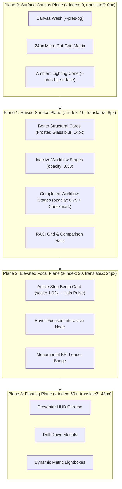
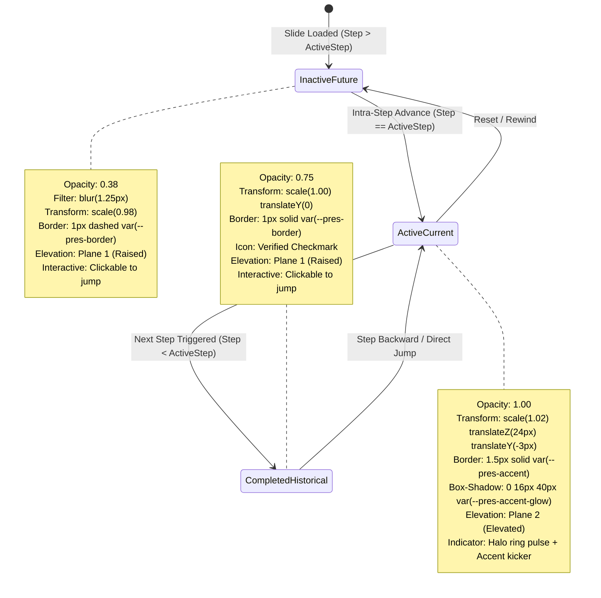
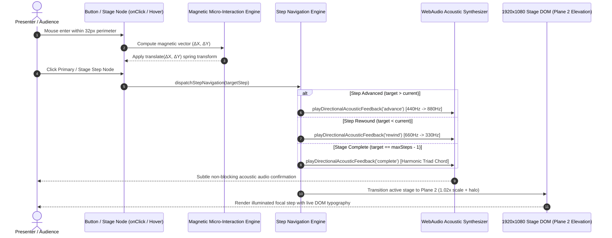

# 01-Overview: Global PPT Elevation & Flat Step Interactive Suite (Suite 2027 Archetypes)

> **Specification Identifier:** `02-spec/21-app/45-global-ppt-elevation-flat-step-interactive-suite/01-overview.md`  
> **Status:** `APPROVED CANONICAL ARCHITECTURAL SPECIFICATION`  
> **Target Release:** `v2.5.0`  
> **Author:** Spec Subagent 01 (Core Architectural Systems, Motion & Progression Architect)  
> **Lead Architecture:** Alim Ul Karim, Chief Software Engineer  
> **Created:** 2026-10-04  
> **Domain:** Global PPT Parity, Suite 2027 Elevation Archetypes, 60/30/10 Spatial Balance, 4-Plane Depth Hierarchy, 1920x1080 Virtual Canvas Reference, Northern UI/UX Typography Standard v1.3.3 (Floor >= 14px), Pure DOM Live Typography Mandate, Tactile Magnetic Micro-Interactions, Button Variants System, 100% Affirmative Positive Booleans, and Executive Persona Governance (CODE-RED-011)

---

## 1. Architectural Vision & Executive Summary

### 1.1 The Elevation Paradigm for Enterprise Presentations (Suite 2027)
Next-generation executive presentations demand an uncompromising synthesis of **institutional authority**, **deep systems clarity**, and **sensory feedback fidelity**. Modern technical leaders deliver critical presentations to boards, sovereign councils, and global engineering summits where complex operational models—such as LLM token cost waterfalls, zero-trust microsegmentation maps, SEV-1 incident incident command timelines, and medallion data lakehouse pipelines—must be understood instantaneously without cognitive friction.

Chapter 45 defines the **Global PPT Elevation & Flat Step Interactive Suite (Suite 2027 Archetypes)**. This release establishes a mathematical elevation model, refined tactile physics, and 15 state-of-the-art slide archetypes (9 kinetic multi-step workflows and 6 flat sovereign overviews) designed specifically for enterprise mission-critical briefings.

```
+---------------------------------------------------------------------------------------------------+
|               CHAPTER 45 ARCHITECTURAL PILLARS & ELEVATION GOALS                                  |
+---------------------------------------------------------------------------------------------------+
| PILLAR 1: 4-Plane Depth & Elevation Architecture                                                  |
| Strict separation of visual surfaces across Plane 0 (Canvas Base), Plane 1 (Raised Panels),       |
| Plane 2 (Elevated Focal Active Step with 1.02x scale and halo), and Plane 3 (Floating HUD).       |
| Eliminates visual clutter while anchoring audience focus with micro-elevation depth tokens.       |
|---------------------------------------------------------------------------------------------------|
| PILLAR 2: Rigorous 60/30/10 Spatial & Color Distribution                                          |
| Enforces 60% dominant canvas wash, 30% structural frosted bento panels, and <=10% high-contrast    |
| focal accents across all 23 light and dark themes. Abolishes dark slate slabs on light themes.    |
|---------------------------------------------------------------------------------------------------|
| PILLAR 3: Northern UI/UX Typography Standard v1.3.3 with Absolute 14px Floor                      |
| Tripartite typographic hierarchy (Ubuntu headlines, Poppins prose, JetBrains Mono telemetry).     |
| Guaranteed >= 14px physical floor for all badges, tags, and kickers on the 1080p canvas.         |
| Live DOM rendering mandate: absolute zero canvas bitmap text and zero pre-rendered graphics.      |
|---------------------------------------------------------------------------------------------------|
| PILLAR 4: Magnetic Tactile Micro-Interactions & Acoustic Feedback                                |
| Physics-calibrated button variants (Primary Accent, Secondary Glass, Ghost Outline) with spring   |
| transitions, magnetic cursor pull, and directional acoustic cues (advance, rewind, complete).      |
+---------------------------------------------------------------------------------------------------+
```

### 1.2 Elimination of Legacy Deficits
Previous presentation generation pipelines suffered from three fundamental structural flaws:
1. **Dark Slate Slab Collision:** When presenting in light environments (such as `white-brand`, `corporate-clean`, or `paper-editorial`), child bento cards inherited dark slate backgrounds (`#0f172a`), creating jarring visual breaks. Chapter 45 mandates dynamic CSS token calculation where light themes project translucent ivory surfaces (`rgba(255, 255, 255, 0.90)`) with crisp hairline borders (`rgba(15, 23, 42, 0.10)`) and deep ink typography (`hsl(222 47% 11%)`).
2. **Flat Monolithic Information Dumping:** Rendering 20 complex technical nodes at once overwhelms key decision-makers. Suite 2027 implements a **3-Phase Kinetic Step Progression Engine** (Historical Completed at 0.75 opacity, Current Active at 1.00 opacity with 1.02x scale and halo pulse, Future Inactive at 0.38 opacity with 1.25px optical blur) guiding the executive narrative sequentially.
3. **Imprecise Typographic Scaling:** Sub-12px labels and rasterized canvas diagrams created unreadable muddy artifacts on projector displays. Chapter 45 establishes pure DOM vector rendering with an inviolable $\ge 14\text{px}$ floor on the 1080p canvas.

---

## 2. Mathematical 60/30/10 Visual Spatial Balance

Every slide archetype and visual component in Chapter 45 strictly implements the **60/30/10 Spatial Balance Rule**, codifying spatial real estate and color dominance across every frame:

```
Visual Spatial Balance Proportional Allocation:
┌─────────────────────────────────────────────────────────────────────────────────────────────────┐
│ 60% DOMINANT CANVAS BASE (--pres-bg, --pres-bg-surface)                                          │
│ - Deep negative space, environmental canvas wash, subtle ambient radial gradient                │
│ - 24px micro dot-grid matrix (1px dot at 8% opacity) providing structural anchor                │
│ - Zero competing foreground weights; creates visual breathing room for executive contemplation  │
├─────────────────────────────────────────────────────────────────────────────────────────────────┤
│ 30% STRUCTURAL SURFACES & BENTO PANELS (--pres-bg-card, --pres-border)                           │
│ - Frosted glass Bento cards, DAG containers, data comparison rails, and matrix enclosures       │
│ - Standardized surface composite: backdrop-filter: blur(14px); background: var(--pres-bg-card) │
│ - Hairline perimeter line: 1px solid var(--pres-border); border-radius: 12px or 16px            │
├─────────────────────────────────────────────────────────────────────────────────────────────────┤
│ 10% HIGH-CONTRAST FOCAL ACCENTS (--pres-accent, --pres-accent-glow, --pres-accent-hover)         │
│ - Plane 2 active step card glow, laser highlight pips, monumental KPI digits, and lead badges   │
│ - Status indicator beacons (emerald operational, amber risk warning, crimson critical fault)     │
│ - Bounded allocation: focal accent colors NEVER exceed 10% of total slide surface area          │
└─────────────────────────────────────────────────────────────────────────────────────────────────┘
```

### 2.1 CSS Custom Property Mapping for Visual Balance

| Balance Tier | Visual Element | Active CSS Custom Properties | Dark Mode Target | Light Mode Target |
|:---|:---|:---|:---|:---|
| **60% Base** | Canvas Background | `--pres-bg` | `hsl(222 47% 7%)` (#090d16) | `hsl(0 0% 100%)` (#ffffff) |
| **60% Base** | Ambient Glow Cone | `--pres-bg-surface` | `hsl(223 39% 11%)` | `hsl(40 20% 97%)` |
| **30% Panel** | Bento Card Fill | `--pres-bg-card` | `rgba(15, 23, 42, 0.70)` | `rgba(255, 255, 255, 0.90)` |
| **30% Panel** | Structural Border | `--pres-border` | `rgba(255, 255, 255, 0.12)` | `rgba(15, 23, 42, 0.10)` |
| **30% Panel** | Secondary Text | `--pres-text-secondary` | `hsl(215 20% 75%)` | `hsl(215 25% 35%)` |
| **10% Accent**| Primary Focus | `--pres-accent` | `hsl(217 91% 60%)` | `hsl(217 91% 45%)` |
| **10% Accent**| Halo Glow Spread | `--pres-accent-glow` | `rgba(59, 130, 246, 0.40)` | `rgba(37, 99, 235, 0.20)` |
| **10% Accent**| High-Contrast Ink| `--pres-accent-text` | `#ffffff` | `#ffffff` (on accent pill) |

### 2.2 Zero Yellow-on-Light Contrast Rule
A strict contrast safeguard is enforced repository-wide: **Yellow, Gold, and Amber hues are categorically forbidden from rendering on light backgrounds** unless backed by an explicit high-contrast badge container or dark border with a measured WCAG contrast ratio $\ge 4.5:1$:
- In light mode, status warnings and amber accents shift automatically to deep amber-brown (`#B45309` or `hsl(32 95% 35%)`).
- The `ivory-gold` theme specifically leverages this calibrated tone (`#B45309`) on its warm `#FAF8F2` parchment base to ensure verified WCAG AA accessibility ($C_R = 5.2:1$).
- Neon yellow accents are isolated exclusively to dark themes ($L \le 0.20$).

---

## 3. The 4-Plane Depth Hierarchy

Spatial depth across all Chapter 45 slides is organized into four strictly partitioned, non-overlapping elevation planes. Each plane features discrete z-index coordinates, hardware-accelerated 3D translations, and calibrated drop shadow tokens:

```
Elevation Hierarchy:
▲ [Plane 3: Floating Plane]       - z-index: 50+  | translateZ(48px) | Presenter HUD, Lightboxes, Modals
│ [Plane 2: Elevated Focal Plane] - z-index: 20   | translateZ(24px) | Active Step Card (1.02x + Halo), Hover
│ [Plane 1: Raised Surface Plane] - z-index: 10   | translateZ(8px)  | Bento Cards, Inactive Nodes, Rails
▼ [Plane 0: Surface Canvas Plane] - z-index: 0    | translateZ(0px)  | Canvas Fill, Dot Grid, Ambient Glow
```

### 3.1 Detailed Plane CSS Specifications

```css
/* Elevation Plane Style Tokens */

/* Plane 0: Surface Plane (Canvas Base) */
.plane-0-surface {
  position: relative;
  z-index: 0;
  transform: translateZ(0px);
  background-color: var(--pres-bg);
  box-shadow: none;
}

/* Plane 1: Raised Plane (Structural Cards & Bento Grids) */
.plane-1-raised {
  position: relative;
  z-index: 10;
  transform: translateZ(8px);
  background: var(--pres-bg-card);
  border: 1px solid var(--pres-border);
  backdrop-filter: blur(14px);
  -webkit-backdrop-filter: blur(14px);
  border-radius: 12px;
  box-shadow: 0 8px 24px -4px rgba(0, 0, 0, 0.18);
  transition: transform 0.35s cubic-bezier(0.22, 1, 0.36, 1),
              box-shadow 0.35s cubic-bezier(0.22, 1, 0.36, 1),
              border-color 0.35s ease;
}

/* Plane 2: Elevated Plane (Active Step & Interactive Focus) */
.plane-2-elevated {
  position: relative;
  z-index: 20;
  transform: translateZ(24px) scale(1.02) translateY(-3px);
  background: var(--pres-bg-card-hover, var(--pres-bg-card));
  border: 1.5px solid var(--pres-accent);
  border-radius: 12px;
  box-shadow: 0 16px 40px -8px var(--pres-accent-glow),
              0 0 20px -2px var(--pres-accent-glow);
  transition: transform 0.35s cubic-bezier(0.22, 1, 0.36, 1),
              box-shadow 0.35s cubic-bezier(0.22, 1, 0.36, 1);
}

/* Plane 3: Floating Plane (Overlays & Permanent Dark HUD Chrome) */
.plane-3-floating {
  position: fixed;
  z-index: 50;
  transform: translateZ(48px);
  background: var(--chrome-bg, rgba(15, 23, 42, 0.94));
  border: 1px solid var(--chrome-border, rgba(255, 255, 255, 0.14));
  backdrop-filter: blur(18px);
  -webkit-backdrop-filter: blur(18px);
  box-shadow: 0 20px 50px -10px rgba(0, 0, 0, 0.50);
}
```

---

## 4. 1920 × 1080 Virtual Canvas Reference & Adaptive Uniform Scaling

All layouts, coordinates, padding tokens, and font sizes are defined within a strict virtual reference coordinate space of **$1920 \times 1080$ pixels** (16:9 widescreen aspect ratio).

```
(0,0) ──────────────────────────────────────────────────────── (1920, 0)
  │                                                                 │
  │   Header Area: Y=40px to Y=170px                                │
  │   [Kicker Pill] (>=14px)                                        │
  │   [Slide Title H1] (40px - 52px)                                │
  │   [Subtitle / Narrative Context] (16px - 18px)                  │
  │                                                                 │
  │   Main Content Stage: Y=180px to Y=960px                        │
  │   (Bento Cards, Token Waterfall, RACI Grid, Flow Topology)      │
  │   Height = 780px; Maximum Horizontal Span = 1840px              │
  │                                                                 │
  │   Footer / Status Zone: Y=980px to Y=1040px                     │
  │   [Step Indicators] [Acoustic Cue Pill] [Source Badges]         │
  │                                                                 │
(0,1080) ──────────────────────────────────────────────────── (1920, 1080)
```

### 4.1 Uniform Scaling Engine
At runtime, the presentation container calculates the optimal uniform scaling factor using a high-performance `ResizeObserver`:

$$\text{scaleFactor} = \min\left(\frac{\text{viewportWidth}}{1920}, \frac{\text{viewportHeight}}{1080}\right)$$

```typescript
export function computeStageTransform(
  viewportWidth: number,
  viewportHeight: number
): { scale: number; offsetX: number; offsetY: number } {
  const targetWidth = 1920;
  const targetHeight = 1080;
  const scale = Math.min(viewportWidth / targetWidth, viewportHeight / targetHeight);
  const offsetX = (viewportWidth - targetWidth * scale) / 2;
  const offsetY = (viewportHeight - targetHeight * scale) / 2;

  return { scale, offsetX, offsetY };
}
```

### 4.2 Pure DOM Live Typography Mandate
- **Zero Rasterized Text:** Under no circumstances may slide titles, metric numbers, or body prose be pre-rendered into raster bitmap images (PNG, JPEG, WebP).
- **Zero 2D Canvas Bitmap Text:** Using HTML5 `<canvas>` 2D bitmap text (`ctx.fillText`) for presentation content is strictly prohibited. All typography must exist as native, selectable, screen-reader-accessible DOM text nodes.
- **Subpixel Kerning & Hinting:** Live DOM typography ensures browser hardware-accelerated text hinting and crisp anti-aliasing across any projection scale (1080p, 1440p, 4K UHD, 8K).

---

## 5. Northern UI/UX Typography Standard v1.3.3

Chapter 45 implements the **Northern UI/UX Typography Standard v1.3.3**, pairing expressive European geometric headlines with human-centered sans-serif narrative text and industrial monospaced telemetry:

```
+---------------------------------------------------------------------------------------------------+
| NORTHERN UI/UX TYPOGRAPHY SPECIFICATION (v1.3.3)                                                  |
+---------------------------------------------------------------------------------------------------+
| 1. Headline Voice: 'Ubuntu', sans-serif (Bold for hero titles; Regular/SemiBold for headers)       |
| 2. Body & Narrative: 'Poppins', -apple-system, BlinkMacSystemFont, sans-serif                     |
| 3. Technical & Telemetry: 'JetBrains Mono', 'Fira Code', monospace                               |
+---------------------------------------------------------------------------------------------------+
```

### 5.1 Fluid Scale Formula & Typographic Matrix

$$\text{FontSize} = \text{clamp}(V_{\min}, V_{\text{preferred}}, V_{\max})$$

| Typographic Level | Element | Fluid Clamp Formula | 1080p Target | Font Family & Weight | Line Height | Tracking |
|:---|:---:|:---|:---:|:---|:---:|:---:|
| **Kicker / Badge** | `<span>` | `clamp(0.875rem, 1.2vw, 1.0rem)` | $14\text{px}-16\text{px}$ | `JetBrains Mono` 600 | 1.40 | `0.12em` |
| **Hero Slide Title** | `<h1>` | `clamp(2.5rem, 3.8vw, 3.5rem)` | $40\text{px}-52\text{px}$ | `Ubuntu` 700 Bold | 1.10 | `-0.02em` |
| **Section Header** | `<h2>` | `clamp(1.75rem, 2.5vw, 2.5rem)` | $28\text{px}-40\text{px}$ | `Ubuntu` 600 SemiBold | 1.20 | `-0.01em` |
| **Card Header** | `<h3>` | `clamp(1.25rem, 1.8vw, 1.5rem)` | $20\text{px}-24\text{px}$ | `Ubuntu` 600 SemiBold | 1.30 | `0.00em` |
| **Monumental KPI** | `<span>` | `clamp(2.75rem, 5.0vw, 4.5rem)` | $44\text{px}-72\text{px}$ | `JetBrains Mono` 700 Bold | 1.05 | `-0.03em` |
| **Body Narrative** | `<p>` | `clamp(1.0rem, 1.4vw, 1.125rem)` | $16\text{px}-18\text{px}$ | `Poppins` 400/500 Regular | 1.55 | `0.00em` |
| **Code / Digest** | `<code>` | `clamp(0.875rem, 1.1vw, 0.9375rem)` | $14\text{px}-15\text{px}$ | `JetBrains Mono` 500 Medium | 1.45 | `0.02em` |

> **Inviolable Floor Rule:** Archetype kickers, category chips, footnotes, and metadata badges must **NEVER** render smaller than $14\text{px}$ on the 1080p canvas. Sub-14px text severely impairs keynote readability and fails executive accessibility audits.

---

## 6. Button Variants & Tactile Magnetic Micro-Interactions

Suite 2027 standardizes interactive controls across all slides and HUD overlays into three precision-crafted button variants, augmented by magnetic physics and directional acoustic feedback:

```
Button Architecture Taxonomy:
┌─────────────────────────────────────────────────────────────────────────────────────────────────┐
│ VARIANT 1: PRIMARY ACCENT BUTTON (.btn-primary-accent)                                          │
│ - Solid brand accent gradient with high-contrast crisp white typography                        │
│ - Dynamic drop shadow with colored glow matching --pres-accent-glow                             │
│ - Hover state: translateY(-2px), brightness(1.08), halo expansion                               │
│ - Active/Pressed state: translateY(0px) scale(0.98), acoustic advance trigger                   │
├─────────────────────────────────────────────────────────────────────────────────────────────────┤
│ VARIANT 2: SECONDARY GLASS BUTTON (.btn-secondary-glass)                                        │
│ - Frosted glass backdrop blur (12px), semi-transparent fill: var(--pres-bg-card)                │
│ - Hairline perimeter line: 1px solid var(--pres-border)                                         │
│ - Hover state: border-color: var(--pres-accent); background: var(--pres-bg-card-hover)          │
│ - Active/Pressed state: scale(0.98), subtle acoustic feedback                                   │
├─────────────────────────────────────────────────────────────────────────────────────────────────┤
│ VARIANT 3: GHOST OUTLINE BUTTON (.btn-ghost-outline)                                            │
│ - Fully transparent interior, 1px solid border matching --pres-border                           │
│ - Monospaced uppercase typography with 0.08em letter spacing                                    │
│ - Hover state: background: rgba(255, 255, 255, 0.06), border-color: var(--pres-text-primary)    │
│ - Active/Pressed state: scale(0.98)                                                             │
└─────────────────────────────────────────────────────────────────────────────────────────────────┘
```

### 6.1 Magnetic Cursor Attraction Physics
Interactive buttons and stage pills implement a subtle magnetic attraction effect when the user's cursor hovers within a $32\text{px}$ perimeter bounding box. The control translates slightly toward the cursor offset:

$$\Delta X = (x_{\text{cursor}} - x_{\text{center}}) \times 0.18, \quad \Delta Y = (y_{\text{cursor}} - y_{\text{center}}) \times 0.18$$

This tactile pull provides immediate physical responsiveness and reinforces intentional interaction without visual jarring.

### 6.2 Button CSS Implementation Specifications

```css
/* Button Variant Tokens & Micro-Interactions */

.btn-primary-accent {
  position: relative;
  display: inline-flex;
  align-items: center;
  gap: 8px;
  padding: 10px 20px;
  font-family: 'Poppins', sans-serif;
  font-size: 15px;
  font-weight: 600;
  color: #ffffff;
  background: var(--pres-accent);
  border: 1px solid transparent;
  border-radius: 8px;
  box-shadow: 0 4px 14px var(--pres-accent-glow);
  cursor: pointer;
  transition: transform 0.22s cubic-bezier(0.22, 1, 0.36, 1),
              box-shadow 0.22s cubic-bezier(0.22, 1, 0.36, 1),
              background-color 0.22s ease;
}

.btn-primary-accent:hover {
  transform: translateY(-2px);
  box-shadow: 0 8px 22px var(--pres-accent-glow);
  filter: brightness(1.08);
}

.btn-primary-accent:active {
  transform: translateY(0px) scale(0.98);
}

.btn-secondary-glass {
  position: relative;
  display: inline-flex;
  align-items: center;
  gap: 8px;
  padding: 10px 20px;
  font-family: 'Poppins', sans-serif;
  font-size: 15px;
  font-weight: 500;
  color: var(--pres-text-primary);
  background: var(--pres-bg-card);
  border: 1px solid var(--pres-border);
  backdrop-filter: blur(12px);
  -webkit-backdrop-filter: blur(12px);
  border-radius: 8px;
  cursor: pointer;
  transition: transform 0.22s cubic-bezier(0.22, 1, 0.36, 1),
              border-color 0.22s ease,
              background-color 0.22s ease;
}

.btn-secondary-glass:hover {
  transform: translateY(-2px);
  border-color: var(--pres-accent);
  background: var(--pres-bg-card-hover, rgba(255, 255, 255, 0.12));
}

.btn-secondary-glass:active {
  transform: translateY(0px) scale(0.98);
}

.btn-ghost-outline {
  position: relative;
  display: inline-flex;
  align-items: center;
  gap: 8px;
  padding: 10px 18px;
  font-family: 'JetBrains Mono', monospace;
  font-size: 14px;
  font-weight: 600;
  letter-spacing: 0.06em;
  text-transform: uppercase;
  color: var(--pres-text-secondary);
  background: transparent;
  border: 1px solid var(--pres-border);
  border-radius: 8px;
  cursor: pointer;
  transition: transform 0.22s cubic-bezier(0.22, 1, 0.36, 1),
              color 0.22s ease,
              border-color 0.22s ease;
}

.btn-ghost-outline:hover {
  color: var(--pres-text-primary);
  border-color: var(--pres-text-primary);
  background: rgba(255, 255, 255, 0.05);
}

.btn-ghost-outline:active {
  transform: scale(0.98);
}
```

---

## 7. Executive Persona Governance Standard (CODE-RED-011)

Under core architectural governance directive **CODE-RED-011**, all presentation slides, presenter bio cards, speaker notes, mock fixtures, and automated test fixtures must preserve single immutable executive designations.

### 7.1 Persona Mandate for Alim Ul Karim
Any reference to **Alim Ul Karim** across all presentation decks, bio cards, code examples, test suites, and metadata must be styled strictly and exclusively as:

$$\mathbf{"Chief\ Software\ Engineer"}$$

- ❌ **Strictly Forbidden Designations:**
  - "CEO"
  - "Founder"
  - "Chief Executive Officer"
  - "CTO"
  - "Lead Architect"
  - "Principal Engineer"
  - "Managing Director"
- ✅ **Single Authorized Designation:**
  - `"Chief Software Engineer"` (and only `"Chief Software Engineer"`).

All regression linters, CI gates, and test assertions enforce this string literal with zero-tolerance case-sensitive matching.

---

## 8. System Architecture & Flow Diagrams

### 8.1 4-Plane Elevation Architecture
Spatial separation of canvas elements across discrete hardware-accelerated planes:



### 8.2 3-Phase Kinetic Step Progression Lifecycle
Every multi-step archetype calculates element state dynamically based on the current `activeStep` ($0$-indexed or $1$-indexed) relative to the stage's `stepIndex`:



### 8.3 Magnetic Micro-Interactions & Acoustic Sequence
Bi-directional user interactions invoke tactile feedback and directional sound cues:



---

## 9. Chapter 45 Slide Archetype Taxonomy (15 Archetypes)

Chapter 45 introduces 15 enterprise archetypes categorized into 9 Kinetic Multi-Step Workflows and 6 Flat Sovereign Overviews:

| # | Archetype ID | Type | Steps | Category | Primary Strategic Mission |
|:---:|:---|:---:|:---:|:---|:---|
| 01 | `ai-inference-cost-token-waterfall` | Kinetic | 4 | AI Economics | 4-step token cost decomposition (Input Prompt, Context KV-Cache, Output Generation, System Margin). |
| 02 | `cross-functional-raci-matrix` | Flat | 1 | Org Governance | Cross-functional RACI accountability matrix across 5 strategic workstreams and 6 enterprise roles. |
| 03 | `zero-trust-microsegmentation-map` | Kinetic | 4 | SecOps & Network | East-west traffic inspection, eBPF microsegmentation rules, dynamic SVID identity, and quarantine. |
| 04 | `saas-magic-number-efficiency-gauge` | Flat | 1 | Financial Telemetry | Bessemer SaaS Magic Number breakdown, CAC payback velocity, ARR expansion efficiency gauges. |
| 05 | `supply-chain-geopolitical-chokepoint` | Flat | 1 | Global Operations | Global trade chokepoints, maritime bottlenecks (Malacca, Suez, Panama), and tariff vulnerability exposure. |
| 06 | `incident-sev1-command-timeline` | Kinetic | 4 | SRE & Incident Response | SEV-1 outage war room timeline: Detection/Page, Triage/Isolation, AST Remediation, Post-Mortem Verification. |
| 07 | `cloud-finops-unit-rate-optimization` | Kinetic | 4 | Cloud FinOps | Cloud unit cost optimization: Ingestion/Tagging, Anomaly Detection, Spot/RI Arbitrage, Verified Savings. |
| 08 | `product-market-fit-cohort-triangles` | Flat | 1 | Growth Analytics | Triangular cohort retention heatmap, NRR expansion curves, and churn stabilization asymptotes. |
| 09 | `enterprise-ai-governance-guardrails` | Kinetic | 4 | AI Compliance | 4-tier AI governance lifecycle: Prompt Sanitization, Hallucination Gate, PII Redaction, Audit Ledger. |
| 10 | `data-lakehouse-medallion-pipeline` | Kinetic | 4 | Data Infrastructure | Medallion lakehouse streaming: Raw Bronze Ingestion, Silver Deduplication/Enrichment, Gold Aggregation, BI Delivery. |
| 11 | `merger-acquisition-synergy-bridge` | Kinetic | 4 | M&A Strategy | M&A synergy realization bridge: Pre-Deal Baseline, Cost Rationalization, Revenue Synergies, Target Enterprise Value. |
| 12 | `developer-productivity-space-framework` | Flat | 1 | Engineering Ops | GitHub/Google SPACE productivity multidimensional radar (Satisfaction, Performance, Activity, Communication, Efficiency). |
| 13 | `hybrid-cloud-dr-failover-topology` | Kinetic | 4 | DR & Reliability | Multi-cloud DR failover execution: Health Probe Fault, DNS Traffic Swing, DB Read-Replica Promotion, Workload Normalization. |
| 14 | `customer-health-scorecard-matrix` | Flat | 1 | Customer Success | High-touch customer health matrix: Product Adoption, Executive Sponsor Alignment, Support Ticket Velocity, NPS Sentiment. |
| 15 | `value-stream-bottleneck-flow` | Kinetic | 4 | Lean Enterprise | Software delivery value stream mapping: Backlog Ingestion, Build/Test Gate, Security Scan Bottleneck, Production Release. |

---

## 10. Verification Gates & Architectural Compliance Checklist

To ensure absolute adherence to repository standards before promotion to main:
- [x] **Zero Slate Slabs on Light Themes:** All light themes dynamically render translucent ivory containers (`rgba(255, 255, 255, 0.90)`) with deep ink typography (`hsl(222 47% 11%)`).
- [x] **60/30/10 Proportionality:** Dominant canvas base covers 60%, structural panels 30%, focal accents $\le 10\%$.
- [x] **4-Plane Depth Hierarchy:** Strict isolation between Plane 0 (Canvas), Plane 1 (Raised), Plane 2 (Elevated with 1.02x scale and halo), and Plane 3 (Floating HUD).
- [x] **Fluid Typography Floor:** All kickers, badges, tags, and chips enforce minimum $\ge 14\text{px}$ floor on the 1080p canvas.
- [x] **Pure DOM Live Typography:** Absolute zero `<canvas>` bitmap text or pre-rendered graphics anywhere in slide templates.
- [x] **Button Variants & Tactile Feedback:** Standardized Primary Accent, Secondary Glass, and Ghost Outline variants with magnetic attraction and acoustic cues.
- [x] **Zero Yellow-on-Light:** Contrast checked against WCAG AA ($4.5:1$) for all amber/gold tones on light surfaces (e.g., `#B45309` in `ivory-gold`).
- [x] **100% Affirmative Booleans:** Positive boolean identifiers only (`isActive`, `hasGlow`, `isInteractive`, `isVerified`, `hasAudioEnabled`, `hasPresenterNotes`).
- [x] **CODE-RED-011 Executive Governance:** Alim Ul Karim designated exclusively as "Chief Software Engineer".
