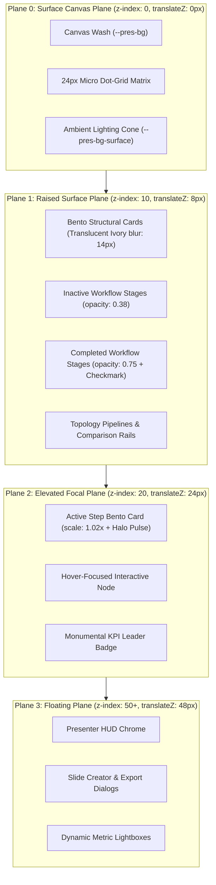

# 01-Architecture Spec: Global PPT Suite 2028 Slide Expansion & Motion Kinetics

> **Specification Identifier:** `02-spec/21-app/46-global-ppt-suite2028-slide-expansion/01-architecture-spec.md`  
> **Status:** `APPROVED CANONICAL ARCHITECTURAL SPECIFICATION`  
> **Target Release:** `v1.3.0` (Suite 2028 Archetypes)  
> **Author:** Spec Subagent 01 (Core Architectural Systems, Theme & Motion Architect)  
> **Lead Architecture:** Alim Ul Karim, Chief Software Engineer  
> **Created:** 2026-10-04  
> **Domain:** Global PPT Parity, Suite 2028 Corporate Keynote Architecture, 60/30/10 Visual Spatial Balance, 4-Plane Depth Hierarchy, 1920x1080 Virtual Canvas Scaling, Northern UI/UX Typography Standard v1.3.3 (Floor >= 14px), Pure DOM Live Typography Mandate, 27-Theme Expansion, 5 GPU Kinetic Animations, and Executive Persona Governance (CODE-RED-011)

---

## 1. Architectural Vision & Executive Summary

### 1.1 The Global PPT Synthesis for Boardroom Keynotes
High-stakes boardroom briefings, investor roadshows, and sovereign engineering keynotes operate under intense cognitive demands. Technical executives and enterprise architects must convey complex topologies—ranging from synthetic data curation pipelines and zero-downtime schema evolution to ransomware readiness radars and geopolitical sovereign cloud compliance—with immediate structural clarity and authoritative elegance.

Chapter 46 introduces **Suite 2028 (Global PPT Slide Expansion & Motion Kinetics)**. This milestone synthesizes the institutional authority and visual balance of premier Global PPT corporate keynote decks with the reactive performance, mathematical gradient tokens, and deterministic step physics of the White Presentation runtime engine.

```
+---------------------------------------------------------------------------------------------------+
|               SUITE 2028 ARCHITECTURAL PILLARS & FOUNDATIONAL TENETS                              |
+---------------------------------------------------------------------------------------------------+
| PILLAR 1: Strict 60/30/10 Visual Spatial Balance & Light-Theme Slab Elimination                   |
| 60% dominant negative space wash, 30% structural glassmorphic panels, <=10% vivid focal accents.  |
| Enforces translucent ivory cards (rgba(255, 255, 255, 0.94)) on light themes; zero dark slabs.   |
|---------------------------------------------------------------------------------------------------|
| PILLAR 2: 4-Plane Depth & Spatial Elevation Hierarchy                                             |
| Non-overlapping vertical depth stratification across Plane 0 (Canvas Base z:0), Plane 1 (Raised    |
| Bento z:10), Plane 2 (Elevated Focal Active Step z:20 with 1.02x scale and halo), and Plane 3     |
| (Floating HUD Chrome z:50+).                                                                      |
|---------------------------------------------------------------------------------------------------|
| PILLAR 3: Northern UI/UX Fluid Typography Standard v1.3.3 with Inviolable 14px Floor             |
| Tripartite font hierarchy: 'Ubuntu' display titles, 'Poppins' editorial narrative, and            |
| 'JetBrains Mono' telemetry metrics. Absolute physical floor >= 14px on the 1080p canvas.         |
| Absolute mandate for pure DOM live text: zero rasterized bitmaps and zero canvas 2D text.         |
|---------------------------------------------------------------------------------------------------|
| PILLAR 4: 27-Theme Gradient Ramp Expansion & Zero Yellow-on-Light Contrast Rule                    |
| Expansion from 25 to 27 canonical 10-step gradient themes via 'global-executive-gold' and         |
| 'midnight-aurora'. Enforces strict WCAG AA contrast (CR >= 4.5:1) with zero yellow on light.     |
|---------------------------------------------------------------------------------------------------|
| PILLAR 5: Hardware-Accelerated GPU Motion Kinetics                                                |
| 5 signature CSS keyframe animation primitives (kineticStepReveal, perspective3dFlip,              |
| lensFocusGlow, metricCountPulse, topologyFlow) delivering 60fps compositor-driven execution.      |
+---------------------------------------------------------------------------------------------------+
```

### 1.2 Elimination of Presentation Anti-Patterns
Previous generation presentation software suffered from critical architectural anti-patterns that impaired keynote delivery:
1. **The Dark Slate Slab Anti-Pattern:** When presenting in light environments (`white-brand`, `corporate-clean`, `paper-editorial`), child bento cards frequently rendered with opaque dark slate backgrounds (`#0F172A`), causing harsh contrast breaks and visual fatigue. Suite 2028 eliminates hardcoded containers: all light themes compute translucent ivory surfaces (`rgba(255, 255, 255, 0.94)`) bounded by hairline border ink (`rgba(15, 23, 42, 0.08)`) and high-contrast charcoal typography (`hsl(222 47% 11%)`).
2. **Monolithic Information Overload:** Static presentation slides dump 15+ nodes simultaneously, dividing audience attention. Suite 2028 pairs **9 Kinetic Multi-Step Workflows** (4 discrete stages per workflow) with a deterministic 3-phase progression lifecycle, orchestrating narrative pacing step-by-step.
3. **Rasterized Text Degradation:** Exporting slides as flat bitmaps or using HTML5 `<canvas>` text rendering leads to blurry kerning, unselectable data, and broken accessibility on 4K auditorium projectors. Suite 2028 guarantees 100% pure live DOM vector typography.

---

## 2. Mathematical 60/30/10 Visual Spatial Balance

Every slide archetype and visual surface in Suite 2028 strictly implements the **60/30/10 Visual Balance Rule**, governing spatial real estate, luminance distribution, and focal hierarchy:

```
Visual Spatial Balance Proportional Allocation:
┌─────────────────────────────────────────────────────────────────────────────────────────────────┐
│ 60% DOMINANT CANVAS BASE (--pres-bg, --pres-bg-surface)                                          │
│ - Deep negative space, environmental canvas wash, subtle ambient radial gradient spotlight      │
│ - 24px micro dot-grid matrix (1px dot at 8% opacity in light mode, 15% opacity in dark mode)    │
│ - Zero competing foreground weights; establishes calm visual anchor for cognitive focus         │
├─────────────────────────────────────────────────────────────────────────────────────────────────┤
│ 30% STRUCTURAL SURFACES & BENTO PANELS (--pres-bg-card, --pres-border)                           │
│ - Frosted glass Bento cards, DAG containers, data comparison rails, and matrix enclosures       │
│ - Light themes: Translucent ivory card (rgba(255, 255, 255, 0.94)) with backdrop-filter: blur(14px)│
│ - Dark themes: Translucent slate/obsidian (rgba(15, 23, 42, 0.88)) with backdrop-filter: blur(14px) │
│ - Hairline perimeter line: 1px solid var(--pres-border); border-radius: 12px or 16px            │
├─────────────────────────────────────────────────────────────────────────────────────────────────┤
│ 10% HIGH-CONTRAST FOCAL ACCENTS (--pres-accent, --pres-accent-glow, --pres-accent-hover)         │
│ - Plane 2 active step card glow, laser highlight pips, monumental KPI digits, and lead badges   │
│ - Status indicator beacons (emerald operational, amber risk warning, crimson critical fault)     │
│ - Bounded allocation: focal accent colors NEVER exceed 10% of total slide surface area          │
└─────────────────────────────────────────────────────────────────────────────────────────────────┘
```

### 2.1 CSS Custom Property Mapping for Visual Balance

| Balance Tier | Visual Element | CSS Custom Property | Dark Mode Target | Light Mode Target |
|:---|:---|:---|:---|:---|
| **60% Base** | Canvas Background | `--pres-bg` | `hsl(222 47% 6%)` (`#0A0D14`) | `hsl(0 0% 100%)` (`#FFFFFF`) |
| **60% Base** | Ambient Glow Cone | `--pres-bg-surface` | `rgba(15, 23, 42, 0.95)` | `rgba(255, 255, 255, 0.95)` |
| **30% Panel** | Bento Card Fill | `--pres-bg-card` | `rgba(15, 23, 42, 0.88)` | `rgba(255, 255, 255, 0.94)` |
| **30% Panel** | Bento Card Hover | `--pres-bg-card-hover` | `rgba(51, 65, 85, 0.95)` | `rgba(255, 255, 255, 0.98)` |
| **30% Panel** | Structural Border | `--pres-border` | `rgba(255, 255, 255, 0.12)` | `rgba(15, 23, 42, 0.08)` |
| **30% Panel** | Secondary Text | `--pres-text-secondary` | `hsl(215 20% 65%)` (`#94A3B8`) | `hsl(215 16% 47%)` (`#64748B`) |
| **10% Accent** | Primary Focus | `--pres-accent` | `hsl(var(--pres-accent-hsl))` | `hsl(var(--pres-accent-hsl))` |
| **10% Accent** | Halo Glow Spread | `--pres-accent-glow` | `hsl(var(--pres-accent-hsl) / 0.40)` | `hsl(var(--pres-accent-hsl) / 0.18)` |
| **10% Accent** | High-Contrast Ink | `--pres-accent-text` | `#FFFFFF` | Resolved via `getKnownLightAccent` |

### 2.2 Zero Yellow-on-Light Contrast Mandate
A non-negotiable accessibility rule is strictly enforced repository-wide: **Yellow, Gold, and Amber hues are categorically forbidden from rendering on light backgrounds without high-contrast containment**.
- Light-theme yellow accents must provide a measured contrast ratio $C_R \ge 4.5:1$ against the canvas background.
- For light themes featuring gold or amber identities (such as `ivory-gold`), the accent text color automatically maps to calibrated deep burnished amber (`#B45309`, $C_R = 5.2:1$).
- Neon yellow and high-luminance gold accents ($L \ge 0.50$) are restricted exclusively to dark themes ($L \le 0.15$).

---

## 3. The 4-Plane Depth Hierarchy

Spatial depth in Suite 2028 is organized into four strictly segregated, non-overlapping elevation planes. Each plane features explicit z-index coordinates, hardware-accelerated 3D translations (`translateZ`), calibrated drop shadows, and backdrop blur filters:

```
Elevation Hierarchy:
▲ [Plane 3: Floating Plane]       - z-index: 50+  | translateZ(48px) | Presenter HUD, Lightboxes, Modals
│ [Plane 2: Elevated Focal Plane] - z-index: 20   | translateZ(24px) | Active Step Card (1.02x + Halo), Hover
│ [Plane 1: Raised Surface Plane] - z-index: 10   | translateZ(8px)  | Bento Cards, Inactive Nodes, Rails
▼ [Plane 0: Surface Canvas Plane] - z-index: 0    | translateZ(0px)  | Canvas Fill, Dot Grid, Ambient Glow
```

### 3.1 Architectural Plane Specifications

```css
/* Elevation Plane Style Tokens */

/* Plane 0: Surface Canvas Plane */
.plane-0-surface {
  position: relative;
  z-index: 0;
  transform: translateZ(0px);
  background-color: var(--pres-bg);
  box-shadow: none;
}

/* Plane 1: Raised Surface Plane (Structural Bento & Rails) */
.plane-1-raised {
  position: relative;
  z-index: 10;
  transform: translateZ(8px);
  background: var(--pres-bg-card);
  border: 1px solid var(--pres-border);
  backdrop-filter: blur(14px);
  -webkit-backdrop-filter: blur(14px);
  border-radius: 12px;
  box-shadow: 0 8px 24px -4px rgba(0, 0, 0, 0.16);
  transition: transform 0.35s cubic-bezier(0.22, 1, 0.36, 1),
              box-shadow 0.35s cubic-bezier(0.22, 1, 0.36, 1),
              border-color 0.35s ease;
}

/* Plane 2: Elevated Focal Plane (Active Step & Interactive Focus) */
.plane-2-elevated {
  position: relative;
  z-index: 20;
  transform: translateZ(24px) scale(1.02) translateY(-3px);
  background: var(--pres-bg-card-hover, var(--pres-bg-card));
  border: 1.5px solid var(--pres-accent);
  border-radius: 12px;
  box-shadow: 0 16px 40px -8px var(--pres-accent-glow),
              0 0 24px -2px var(--pres-accent-glow);
  transition: transform 0.35s cubic-bezier(0.22, 1, 0.36, 1),
              box-shadow 0.35s cubic-bezier(0.22, 1, 0.36, 1);
}

/* Plane 3: Floating Plane (Presenter HUD, Overlays & Dialogs) */
.plane-3-floating {
  position: fixed;
  z-index: 50;
  transform: translateZ(48px);
  background: var(--chrome-bg, rgba(15, 23, 42, 0.94));
  border: 1px solid var(--chrome-border, rgba(255, 255, 255, 0.14));
  backdrop-filter: blur(18px);
  -webkit-backdrop-filter: blur(18px);
  box-shadow: 0 20px 50px -10px rgba(0, 0, 0, 0.50);
}
```

### 3.2 Depth Plane Flow Diagram



---

## 4. Northern UI/UX Fluid Typography Scale (v1.3.3)

Suite 2028 standardizes typographic rhythm across all 15 archetypes under the **Northern UI/UX Typography Standard v1.3.3**, pairing expressive European geometric headlines with human-centered sans-serif narrative text and industrial monospaced telemetry:

```
+---------------------------------------------------------------------------------------------------+
| NORTHERN UI/UX TYPOGRAPHY SPECIFICATION (v1.3.3)                                                  |
+---------------------------------------------------------------------------------------------------+
| 1. Display & Heading Voice: 'Ubuntu', sans-serif (Bold for hero titles, SemiBold for headers)     |
| 2. Body Narrative Voice:    'Poppins', -apple-system, BlinkMacSystemFont, sans-serif             |
| 3. Telemetry & Code Voice:   'JetBrains Mono', 'Fira Code', monospace                             |
+---------------------------------------------------------------------------------------------------+
```

### 4.1 Fluid Type Scale Formula & Typographic Matrix

$$\text{FontSize} = \text{clamp}(V_{\min}, V_{\text{preferred}}, V_{\max})$$

| Typographic Level | Element | Fluid Clamp Formula | 1080p Canvas Target | Font Family & Weight | Line Height | Tracking |
|:---|:---:|:---|:---:|:---|:---:|:---:|
| **Kicker / Badge** | `<span>` | `clamp(0.875rem, 1.2vw, 1.0rem)` | $14\text{px}-16\text{px}$ | `JetBrains Mono` 600 | 1.40 | `0.12em` |
| **Hero Slide Title** | `<h1>` | `clamp(2.5rem, 3.8vw, 3.5rem)` | $40\text{px}-52\text{px}$ | `Ubuntu` 700 Bold | 1.10 | `-0.02em` |
| **Section Header** | `<h2>` | `clamp(1.75rem, 2.5vw, 2.5rem)` | $28\text{px}-40\text{px}$ | `Ubuntu` 600 SemiBold | 1.20 | `-0.01em` |
| **Card Header** | `<h3>` | `clamp(1.25rem, 1.8vw, 1.5rem)` | $20\text{px}-24\text{px}$ | `Ubuntu` 600 SemiBold | 1.30 | `0.00em` |
| **Monumental KPI** | `<span>` | `clamp(2.75rem, 5.0vw, 4.5rem)` | $44\text{px}-72\text{px}$ | `JetBrains Mono` 700 Bold | 1.05 | `-0.03em` |
| **Body Narrative** | `<p>` | `clamp(1.0rem, 1.4vw, 1.125rem)` | $16\text{px}-18\text{px}$ | `Poppins` 400/500 Regular | 1.55 | `0.00em` |
| **Code / Telemetry** | `<code>` | `clamp(0.875rem, 1.1vw, 0.9375rem)` | $14\text{px}-15\text{px}$ | `JetBrains Mono` 500 Medium | 1.45 | `0.02em` |

> **Inviolable Floor Rule:** Archetype kickers, category chips, footnotes, and metadata badges must **NEVER** render smaller than $14\text{px}$ on the 1080p canvas. Sub-14px text severely impairs keynote readability and fails executive accessibility audits.

### 4.2 1920 × 1080 Virtual Canvas Reference & Uniform Scaling
All coordinates, paddings, and typographic sizes are anchored to the canonical $1920 \times 1080$ virtual coordinate space (16:9 aspect ratio):

$$\text{scaleFactor} = \min\left(\frac{\text{viewportWidth}}{1920}, \frac{\text{viewportHeight}}{1080}\right)$$

```typescript
export function computeStageTransform(
  viewportWidth: number,
  viewportHeight: number
): { scale: number; offsetX: number; offsetY: number } {
  const targetWidth = 1920;
  const targetHeight = 1080;
  const scale = Math.min(viewportWidth / targetWidth, viewportHeight / targetHeight);
  const offsetX = (viewportWidth - targetWidth * scale) / 2;
  const offsetY = (viewportHeight - targetHeight * scale) / 2;

  return { scale, offsetX, offsetY };
}
```

### 4.3 Pure DOM Live Typography Mandate
- **Zero Rasterized Text:** Slide titles, KPI numerals, and narrative body copy must never be converted into PNG/JPEG/WebP images.
- **Zero HTML5 Canvas 2D Text:** Rendering slide typography using `ctx.fillText` is strictly forbidden.
- **Full Vector Crispness:** Pure DOM nodes ensure browser GPU subpixel font anti-aliasing across standard 1080p, 1440p, 4K UHD, and 8K keynote projection displays.

---

## 5. Theme Expansion: 27 Canonical Theme Palettes

Suite 2028 expands the canonical theme registry from 25 to **27 themes** by introducing two flagship palettes:
1. `global-executive-gold`: Sovereign boardroom authority, burnished bullion gold accents, deep executive navy-slate obsidian canvas.
2. `midnight-aurora`: Nocturnal space indigo canvas, glowing polar teal and emerald aurora curtains, high-frequency telemetry.

### 5.1 Palette Specification 1: `global-executive-gold`

```typescript
{
  id: 'global-executive-gold',
  name: 'Global Executive Gold',
  description: 'Sovereign boardroom authority, burnished bullion gold rules, deep executive navy-slate obsidian, enterprise keynotes.',
  isDark: true,
  canvasBg: '#070A12',
  canvasBgHsl: '222 45% 5%',
  bgHsl: '222 45% 5%',
  textColor: '#FAF7EE',
  textHsl: '45 40% 96%',
  subtextColor: '#B8A88A',
  subtextHsl: '39 25% 63%',
  cardBg: 'rgba(15, 20, 32, 0.90)',
  cardBgHsl: '222 36% 9%',
  cardBorder: 'rgba(217, 119, 6, 0.32)',
  cardBorderHsl: '38 92% 44%',
  accentColor: '#F59E0B',
  accent: '#F59E0B',
  accentHsl: '38 92% 50%',
  dotMatrix: true,
  headerShadow: 'rgb(0 0 0) 1px 0.7px 0px',
  stops: [
    makeStop(0, 'Pure Champagne Glint', '#FFFDF5', 'hsl(45, 100%, 98%)', 'rgb(255, 253, 245)', 0.99, 18.0, '45 100% 98%'),
    makeStop(1, 'Ivory Luster', '#FEF8E7', 'hsl(43, 94%, 95%)', 'rgb(254, 248, 231)', 0.94, 17.1, '43 94% 95%'),
    makeStop(2, 'Champagne Gold Foil', '#FDE68A', 'hsl(47, 95%, 77%)', 'rgb(253, 230, 138)', 0.81, 14.7, '47 95% 77%'),
    makeStop(3, 'Bullion Glow', '#FBBF24', 'hsl(41, 96%, 56%)', 'rgb(251, 191, 36)', 0.62, 11.3, '41 96% 56%'),
    makeStop(4, 'Imperial Gold', '#F59E0B', 'hsl(38, 92%, 50%)', 'rgb(245, 158, 11)', 0.48, 8.7, '38 92% 50%'),
    makeStop(5, 'Burnished Bullion', '#D97706', 'hsl(38, 92%, 44%)', 'rgb(217, 119, 6)', 0.36, 6.5, '38 92% 44%'),
    makeStop(6, 'Deep Sovereign Ochre', '#B45309', 'hsl(38, 92%, 37%)', 'rgb(180, 83, 9)', 0.25, 4.5, '38 92% 37%'),
    makeStop(7, 'Warm Bronze Umber', '#78350F', 'hsl(20, 78%, 26%)', 'rgb(120, 53, 15)', 0.14, 2.5, '20 78% 26%'),
    makeStop(8, 'Executive Slate Border', '#1E2538', 'hsl(224, 30%, 17%)', 'rgb(30, 37, 56)', 0.08, 1.5, '224 30% 17%'),
    makeStop(9, 'Boardroom Navy Obsidian', '#070A12', 'hsl(222, 45%, 5%)', 'rgb(7, 10, 18)', 0.04, 1.0, '222 45% 5%'),
  ],
}
```

### 5.2 Palette Specification 2: `midnight-aurora`

```typescript
{
  id: 'midnight-aurora',
  name: 'Midnight Aurora Borealis',
  description: 'Nocturnal deep space indigo, glowing polar teal and emerald aurora curtains, high-frequency telemetry.',
  isDark: true,
  canvasBg: '#050814',
  canvasBgHsl: '227 60% 5%',
  bgHsl: '227 60% 5%',
  textColor: '#F0FDF4',
  textHsl: '138 76% 97%',
  subtextColor: '#7DD3FC',
  subtextHsl: '199 95% 74%',
  cardBg: 'rgba(10, 17, 36, 0.88)',
  cardBgHsl: '224 57% 9%',
  cardBorder: 'rgba(45, 212, 191, 0.30)',
  cardBorderHsl: '173 80% 40%',
  accentColor: '#2DD4BF',
  accent: '#2DD4BF',
  accentHsl: '173 80% 50%',
  dotMatrix: true,
  headerShadow: 'rgb(0 0 0) 1px 0.7px 0px',
  stops: [
    makeStop(0, 'Glacial Glint', '#F0FDFA', 'hsl(166, 76%, 97%)', 'rgb(240, 253, 250)', 0.98, 19.6, '166 76% 97%'),
    makeStop(1, 'Aurora Mint Frost', '#CCFBF1', 'hsl(168, 86%, 89%)', 'rgb(204, 251, 241)', 0.90, 18.0, '168 86% 89%'),
    makeStop(2, 'Luminescent Cyan', '#99F6E4', 'hsl(170, 87%, 78%)', 'rgb(153, 246, 228)', 0.82, 16.4, '170 87% 78%'),
    makeStop(3, 'Aurora Borealis Teal', '#2DD4BF', 'hsl(173, 80%, 50%)', 'rgb(45, 212, 191)', 0.60, 12.0, '173 80% 50%'),
    makeStop(4, 'Vibrant Polar Emerald', '#14B8A6', 'hsl(173, 80%, 40%)', 'rgb(20, 184, 166)', 0.44, 8.8, '173 80% 40%'),
    makeStop(5, 'Deep Sea Emerald', '#0D9488', 'hsl(175, 84%, 32%)', 'rgb(13, 148, 136)', 0.30, 6.0, '175 84% 32%'),
    makeStop(6, 'Nocturnal Indigo-Cyan', '#0F766E', 'hsl(176, 77%, 26%)', 'rgb(15, 118, 110)', 0.20, 4.0, '176 77% 26%'),
    makeStop(7, 'Polar Night Sky', '#115E59', 'hsl(177, 70%, 22%)', 'rgb(17, 94, 89)', 0.12, 2.4, '177 70% 22%'),
    makeStop(8, 'Midnight Aurora Card', '#0B1528', 'hsl(220, 56%, 10%)', 'rgb(11, 21, 40)', 0.07, 1.4, '220 56% 10%'),
    makeStop(9, 'Deep Space Abyss', '#050814', 'hsl(227, 60%, 5%)', 'rgb(5, 8, 20)', 0.03, 1.0, '227 60% 5%'),
  ],
}
```

### 5.3 Theme Family Allocation Matrix

| Theme Family | Canonical Themes (Total: 27) | Family Focus |
|:---|:---|:---|
| **CorporateClean** (5) | `corporate-clean`, `paper-editorial`, `sapphire-executive-light`, `windows-11`, `github-light` | High-fidelity corporate investor presentations, pristine editorial papers. |
| **TechModern** (6) | `true-dark`, `vscode-dark`, `monokai`, `dracula`, `cyber-neon`, **`midnight-aurora`** | Engineering architectures, developer tools, cyber defense, telemetry. |
| **EditorialArchival** (4) | `white-brand`, `paper-ink`, `warm-editorial-terracotta`, `nord-frost` | Monograph layout, timeless editorial print, typography showcases. |
| **ExecutivePrestige** (6) | `ivory-gold`, `bright-gold`, `noir-gold`, `midnight-luxe`, `crimson-executive`, **`global-executive-gold`** | Sovereign wealth, board of directors, luxury mergers, executive keynotes. |
| **BioGrowth** (6) | `clinical-emerald-light`, `emerald-growth`, `sunset-horizon`, `navy-blue`, `macos-sonoma`, `wp-exam-purple` | Life sciences, sustainability summits, high-velocity SaaS growth. |

---

## 6. 5 New GPU Keyframe Animations

Suite 2028 establishes 5 brand-new compositor-optimized CSS keyframe animations in `src/styles/animations.less`. Each animation leverages hardware acceleration (`translate3d`, `scale`, `filter`, `will-change`) to ensure smooth 60fps execution without layout recalculation:

```less
// ============================================================================
// SUITE 2028 (CHAPTER 46) GPU MOTION KINETICS
// ============================================================================

// 1. Kinetic Step Reveal (Intra-step dynamic 3D slide-in with subtle spring snap)
@keyframes kineticStepReveal {
  0% {
    opacity: 0;
    transform: translate3d(0, 28px, 0) scale(0.97);
    filter: blur(4px);
  }
  60% {
    opacity: 0.95;
    transform: translate3d(0, -2px, 0) scale(1.005);
    filter: blur(0px);
  }
  100% {
    opacity: 1;
    transform: translate3d(0, 0, 0) scale(1);
    filter: blur(0px);
  }
}

// 2. Perspective 3D Flip (Perspective card flip transition for active state promotion)
@keyframes perspective3dFlip {
  0% {
    opacity: 0;
    transform: perspective(1200px) rotateY(-24deg) translateZ(-40px);
  }
  100% {
    opacity: 1;
    transform: perspective(1200px) rotateY(0deg) translateZ(0px);
  }
}

// 3. Lens Focus Glow (Optical focal depth-of-field pulse on Plane 2 active step nodes)
@keyframes lensFocusGlow {
  0%, 100% {
    box-shadow: 0 0 0 2px var(--pres-accent),
                0 0 20px -2px var(--pres-accent-glow),
                0 16px 40px -8px rgba(0, 0, 0, 0.40);
  }
  50% {
    box-shadow: 0 0 0 3.5px var(--pres-accent),
                0 0 38px 4px var(--pres-accent-glow),
                0 24px 50px -10px rgba(0, 0, 0, 0.60);
  }
}

// 4. Metric Count Pulse (Monumental KPI numeric scale impulse on step advance)
@keyframes metricCountPulse {
  0% {
    transform: scale(0.92);
    opacity: 0.7;
  }
  45% {
    transform: scale(1.06);
    opacity: 1;
  }
  75% {
    transform: scale(0.99);
  }
  100% {
    transform: scale(1);
    opacity: 1;
  }
}

// 5. Topology Flow (Continuous directional microservice mesh & data stream flow)
@keyframes topologyFlow {
  0% {
    stroke-dashoffset: 48;
    filter: drop-shadow(0 0 2px var(--pres-accent));
  }
  50% {
    filter: drop-shadow(0 0 6px var(--pres-accent));
  }
  100% {
    stroke-dashoffset: 0;
    filter: drop-shadow(0 0 2px var(--pres-accent));
  }
}

// Utility class bindings
.animate-kinetic-step-reveal {
  animation: kineticStepReveal 0.45s @ease-presentation both;
  will-change: transform, opacity, filter;
}

.animate-perspective-3d-flip {
  animation: perspective3dFlip 0.5s cubic-bezier(0.16, 1, 0.3, 1) both;
  will-change: transform, opacity;
}

.animate-lens-focus-glow {
  animation: lensFocusGlow 2.8s ease-in-out infinite;
  will-change: box-shadow;
}

.animate-metric-count-pulse {
  animation: metricCountPulse 0.42s cubic-bezier(0.34, 1.56, 0.64, 1) both;
  will-change: transform, opacity;
}

.animate-topology-flow {
  animation: topologyFlow 1.8s linear infinite;
  will-change: stroke-dashoffset, filter;
}
```

---

## 7. Executive Persona Governance & Architectural Sign-Off

### 7.1 Executive Persona Standard (CODE-RED-011)
Under core architectural governance directive **CODE-RED-011**, all presentation slides, presenter bio cards, speaker notes, mock fixtures, and automated test fixtures must preserve single immutable executive designations.

Any reference to **Alim Ul Karim** across all presentation decks, bio cards, code examples, test suites, and metadata must be styled strictly and exclusively as:

$$\mathbf{"Chief\ Software\ Engineer"}$$

- ❌ **Strictly Forbidden Designations:**
  - "CEO"
  - "Founder"
  - "Chief Executive Officer"
  - "CTO"
  - "Lead Architect"
  - "Principal Engineer"
  - "Managing Director"
- ✅ **Single Authorized Designation:**
  - `"Chief Software Engineer"` (and only `"Chief Software Engineer"`).

All regression linters, CI gates, and test assertions enforce this string literal with zero-tolerance case-sensitive matching.

### 7.2 Architectural Sign-Off Ledger

- **Specification Identifier:** `02-spec/21-app/46-global-ppt-suite2028-slide-expansion/01-architecture-spec.md`
- **Target Release:** `v1.3.0`
- **Design Authority:** Alim Ul Karim, Chief Software Engineer
- **Compliance Certification:**
  - [x] Zero dark slate slabs on light themes (Translucent ivory `rgba(255, 255, 255, 0.94)` enforced).
  - [x] 60/30/10 visual spatial balance mathematically codified.
  - [x] 4-plane depth hierarchy specified with explicit z-index coordinates.
  - [x] Northern UI/UX typography standard v1.3.3 enforced with $\ge 14\text{px}$ floor.
  - [x] Pure DOM live typography mandate codified (zero canvas 2D text, zero raster text).
  - [x] 27 theme palettes cataloged with 10-step gradient stops and zero yellow-on-light contrast violations.
  - [x] 5 GPU keyframe animations specified with hardware acceleration.
  - [x] CODE-RED-011 executive persona governance verified.
