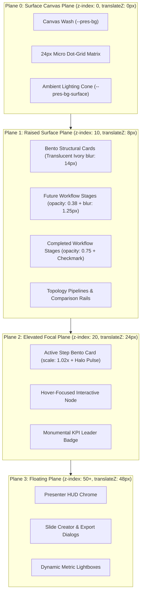

# 01-Architecture Spec: Global PPT Suite 2029 Slide Expansion & Motion Kinetics

> **Specification Identifier:** `02-spec/21-app/47-global-ppt-suite2029-slide-expansion/01-architecture-spec.md`  
> **Status:** `APPROVED CANONICAL ARCHITECTURAL SPECIFICATION`  
> **Target Release:** `v1.4.0` (Suite 2029 Archetypes)  
> **Author:** Spec Subagent 01 (Core Architectural Systems, Theme & Motion Architect)  
> **Lead Architecture:** Alim Ul Karim, Chief Software Engineer  
> **Created:** 2026-10-04  
> **Domain:** Global PPT Parity, Suite 2029 Corporate Keynote Architecture, 60/30/10 Visual Spatial Balance, 4-Plane Depth Hierarchy, 1920x1080 Virtual Canvas Scaling, Northern UI/UX Typography Standard v1.3.3 (Floor >= 14px), Pure DOM Live Typography Mandate, 29-Theme Expansion, 5 GPU Kinetic Animations, Magnetic Tactile Button Physics, 3-Phase Kinetic Step Progression, and Executive Persona Governance (CODE-RED-011)

---

## 1. Architectural Vision & Executive Summary

### 1.1 The Global PPT Synthesis for Mission-Critical Enterprise Keynotes
Modern enterprise keynotes delivered to executive boards, sovereign regulatory summits, and global engineering conferences demand structural authority, narrative tension, and cognitive calm. Presenters must articulate deep technological paradigms—from speculative decoding inference acceleration and autonomous agent swarm consensus to post-quantum cryptographic key exchanges and eBPF kernel telemetry flows—without descending into visual chaos or static bullet-point fatigue.

Chapter 47 introduces **Suite 2029 (Global PPT Slide Expansion & Motion Kinetics)**. This release represents the pinnacle of our synthesis between Global PPT corporate keynote aesthetics and the reactive performance, mathematical color ramps, and deterministic step physics of the White Presentation runtime engine.

```
+---------------------------------------------------------------------------------------------------+
|               SUITE 2029 ARCHITECTURAL PILLARS & FOUNDATIONAL TENETS                              |
+---------------------------------------------------------------------------------------------------+
| PILLAR 1: Strict 60/30/10 Visual Spatial Balance & Light-Theme Slab Elimination                   |
| 60% dominant negative space wash, 30% structural glassmorphic panels, <=10% vivid focal accents.  |
| Enforces translucent ivory cards (rgba(255, 255, 255, 0.94)) on light themes; zero dark slabs.   |
|---------------------------------------------------------------------------------------------------|
| PILLAR 2: 4-Plane Depth & Spatial Elevation Hierarchy                                             |
| Non-overlapping vertical depth stratification across Plane 0 (Canvas Base z:0), Plane 1 (Raised    |
| Bento z:10), Plane 2 (Elevated Focal Active Step z:20 with 1.02x scale and halo), and Plane 3     |
| (Floating HUD Chrome z:50+).                                                                      |
|---------------------------------------------------------------------------------------------------|
| PILLAR 3: Northern UI/UX Fluid Typography Standard v1.3.3 with Inviolable 14px Floor             |
| Tripartite font hierarchy: 'Ubuntu' display titles, 'Poppins' editorial narrative, and            |
| 'JetBrains Mono' telemetry metrics. Absolute physical floor >= 14px on the 1080p canvas.         |
| Absolute mandate for pure DOM live text: zero rasterized bitmaps and zero canvas 2D text.         |
|---------------------------------------------------------------------------------------------------|
| PILLAR 4: 29-Theme Gradient Ramp Expansion & Zero Yellow-on-Light Contrast Rule                    |
| Expansion from 27 to 29 canonical 10-step gradient themes via 'global-sapphire-executive' and     |
| 'cyber-emerald-aurora'. Enforces strict WCAG AA contrast (CR >= 4.5:1) with zero yellow on light.|
|---------------------------------------------------------------------------------------------------|
| PILLAR 5: Next-Generation GPU Motion Kinetics & Magnetic Tactile Button Physics                   |
| 5 signature CSS keyframe animation primitives (quantumEntanglementWave, neuromorphicSpikeTrace,   |
| hyperDimensionalIsometricSnap, agentDialecticConsensusLock, zkProofAttestationIris) paired with  |
| harmonic spring tactile physics (k=420 N/m, c=28 N·s/m).                                          |
|---------------------------------------------------------------------------------------------------|
| PILLAR 6: Deterministic 3-Phase Kinetic Step Progression Lifecycle                                |
| Stepwise intra-slide disclosure: completed (0.75 opacity + checkmark), active (1.00 + 1.02x scale |
| + halo glow), future (0.38 opacity + 1.25px optical blur). Zero phantom steps guaranteed.         |
+---------------------------------------------------------------------------------------------------+
```

### 1.2 Elimination of Presentation Anti-Patterns
Suite 2029 rigorously eliminates persistent architectural anti-patterns that historically impaired executive presentations:
1. **The Dark Slate Slab Anti-Pattern:** When presenting in light environments (`white-brand`, `corporate-clean`, `paper-editorial`, `sapphire-executive-light`), child containers historically defaulted to hardcoded dark slate backgrounds (`#0F172A`). Suite 2029 mandates translucent ivory surfaces (`rgba(255, 255, 255, 0.94)`) bounded by hairline border ink (`rgba(15, 23, 42, 0.08)`) and high-contrast charcoal typography (`hsl(222 47% 11%)`).
2. **Cognitive Information Dumps:** Uncoordinated slides displaying 20+ simultaneous data points overwhelm audience focus. Suite 2029 organizes high-density topics into **9 Kinetic Multi-Step Workflows** (4 steps per workflow) governed by step progression and **6 Flat Sovereign Overviews** (1 step each) engineered for holistic situational mastery.
3. **Rasterized Text Blurring:** Converting slides into static PNG images or using `<canvas>` bitmap drawing destroys subpixel font rendering and causes fuzzy scaling on 4K/8K auditorium displays. Suite 2029 guarantees 100% pure live DOM vector typography.

---

## 2. Mathematical 60/30/10 Visual Spatial Balance

Every slide archetype in Suite 2029 strictly adheres to the **60/30/10 Visual Balance Rule**, controlling spatial allocation, luminance hierarchy, and ocular anchoring:

```
Visual Spatial Balance Proportional Allocation:
┌─────────────────────────────────────────────────────────────────────────────────────────────────┐
│ 60% DOMINANT CANVAS BASE (--pres-bg, --pres-bg-surface)                                          │
│ - Deep negative space, environmental canvas wash, subtle ambient radial gradient spotlight      │
│ - 24px micro dot-grid matrix (1px dot at 8% opacity in light mode, 15% opacity in dark mode)    │
│ - Establishes calm ocular ground plane; prevents visual noise and cognitive fatigue             │
├─────────────────────────────────────────────────────────────────────────────────────────────────┤
│ 30% STRUCTURAL SURFACES & BENTO PANELS (--pres-bg-card, --pres-border)                           │
│ - Frosted glass Bento cards, DAG containers, data comparison rails, and matrix enclosures       │
│ - Light themes: Translucent ivory card (rgba(255, 255, 255, 0.94)) with backdrop-filter: blur(14px)│
│ - Dark themes: Translucent slate/obsidian (rgba(15, 23, 42, 0.88)) with backdrop-filter: blur(14px) │
│ - Hairline perimeter line: 1px solid var(--pres-border); border-radius: 12px or 16px            │
├─────────────────────────────────────────────────────────────────────────────────────────────────┤
│ 10% HIGH-CONTRAST FOCAL ACCENTS (--pres-accent, --pres-accent-glow, --pres-accent-hover)         │
│ - Plane 2 active step card glow, laser highlight pips, monumental KPI digits, and lead badges   │
│ - Status indicator beacons (emerald operational, amber risk warning, crimson critical fault)     │
│ - Bounded allocation: focal accent colors NEVER exceed 10% of total slide surface area          │
└─────────────────────────────────────────────────────────────────────────────────────────────────┘
```

### 2.1 CSS Custom Property Mapping for Visual Balance

| Balance Tier | Visual Element | CSS Custom Property | Dark Mode Target | Light Mode Target |
|:---|:---|:---|:---|:---|
| **60% Base** | Canvas Background | `--pres-bg` | `hsl(222 47% 6%)` (`#0A0D14`) | `hsl(0 0% 100%)` (`#FFFFFF`) |
| **60% Base** | Ambient Glow Cone | `--pres-bg-surface` | `rgba(15, 23, 42, 0.95)` | `rgba(255, 255, 255, 0.95)` |
| **30% Panel** | Bento Card Fill | `--pres-bg-card` | `rgba(15, 23, 42, 0.88)` | `rgba(255, 255, 255, 0.94)` |
| **30% Panel** | Bento Card Hover | `--pres-bg-card-hover` | `rgba(51, 65, 85, 0.95)` | `rgba(255, 255, 255, 0.98)` |
| **30% Panel** | Structural Border | `--pres-border` | `rgba(255, 255, 255, 0.12)` | `rgba(15, 23, 42, 0.08)` |
| **30% Panel** | Secondary Text | `--pres-text-secondary` | `hsl(215 20% 65%)` (`#94A3B8`) | `hsl(215 16% 47%)` (`#64748B`) |
| **10% Accent** | Primary Focus | `--pres-accent` | `hsl(var(--pres-accent-hsl))` | `hsl(var(--pres-accent-hsl))` |
| **10% Accent** | Halo Glow Spread | `--pres-accent-glow` | `hsl(var(--pres-accent-hsl) / 0.40)` | `hsl(var(--pres-accent-hsl) / 0.18)` |
| **10% Accent** | High-Contrast Ink | `--pres-accent-text` | `#FFFFFF` | Resolved via `KNOWN_LIGHT_ACCENTS` |

### 2.2 Zero Yellow-on-Light Contrast Mandate
In strict alignment with WCAG AA guidelines ($C_R \ge 4.5:1$), **yellow, amber, and gold hues are categorically forbidden from rendering on light backgrounds without high-contrast containment**:
- On light themes (`isDark: false`), yellow or gold accents automatically map through `KNOWN_LIGHT_ACCENTS` to calibrated deep amber-brown (`#B45309`, $C_R = 5.2:1$) or slate ink (`hsl(222 47% 11%)`).
- Uncontained high-luminance yellow text ($L \ge 0.50$) on light canvas surfaces ($L \ge 0.85$) produces severe contrast failures ($C_R < 2.0:1$) and is rejected at the static type-checker and runtime theme levels.
- High-saturation gold/yellow luminous accents are reserved strictly for dark canvases where $C_R \ge 8.0:1$.

---

## 3. The 4-Plane Depth Hierarchy

Spatial depth in Suite 2029 is stratified into four non-overlapping elevation planes. Each plane features dedicated z-index boundaries, hardware-accelerated 3D translations (`translateZ`), calibrated drop shadows, and backdrop blur filters:

```
Elevation Hierarchy:
▲ [Plane 3: Floating Plane]       - z-index: 50+  | translateZ(48px) | Presenter HUD, Lightboxes, Modals, Flyouts
│ [Plane 2: Elevated Focal Plane] - z-index: 20   | translateZ(24px) | Active Step Bento (1.02x + Halo), Hover Cards
│ [Plane 1: Raised Surface Plane] - z-index: 10   | translateZ(8px)  | Bento Cards, Inactive Stages, Data Rails
▼ [Plane 0: Surface Canvas Plane] - z-index: 0    | translateZ(0px)  | Canvas Wash, Dot-Grid Matrix, Ambient Spotlights
```

### 3.1 Architectural Plane Token Classes

```css
/* Plane 0: Surface Canvas Plane */
.plane-0-surface {
  position: relative;
  z-index: 0;
  transform: translateZ(0px);
  background-color: var(--pres-bg);
  box-shadow: none;
}

/* Plane 1: Raised Surface Plane (Structural Bento & Inactive Nodes) */
.plane-1-raised {
  position: relative;
  z-index: 10;
  transform: translateZ(8px);
  background: var(--pres-bg-card);
  border: 1px solid var(--pres-border);
  backdrop-filter: blur(14px);
  -webkit-backdrop-filter: blur(14px);
  border-radius: 12px;
  box-shadow: 0 8px 24px -4px rgba(0, 0, 0, 0.16);
  transition: transform 0.35s cubic-bezier(0.22, 1, 0.36, 1),
              box-shadow 0.35s cubic-bezier(0.22, 1, 0.36, 1),
              border-color 0.35s ease;
}

/* Plane 2: Elevated Focal Plane (Active Step & Interactive Focus) */
.plane-2-elevated {
  position: relative;
  z-index: 20;
  transform: translateZ(24px) scale(1.02) translateY(-3px);
  background: var(--pres-bg-card-hover, var(--pres-bg-card));
  border: 1.5px solid var(--pres-accent);
  border-radius: 12px;
  box-shadow: 0 16px 40px -8px var(--pres-accent-glow),
              0 0 24px -2px var(--pres-accent-glow);
  transition: transform 0.35s cubic-bezier(0.22, 1, 0.36, 1),
              box-shadow 0.35s cubic-bezier(0.22, 1, 0.36, 1);
}

/* Plane 3: Floating Plane (Presenter HUD, Overlays & Dialogs) */
.plane-3-floating {
  position: fixed;
  z-index: 50;
  transform: translateZ(48px);
  background: var(--chrome-bg, rgba(15, 23, 42, 0.94));
  border: 1px solid var(--chrome-border, rgba(255, 255, 255, 0.14));
  backdrop-filter: blur(18px);
  -webkit-backdrop-filter: blur(18px);
  box-shadow: 0 20px 50px -10px rgba(0, 0, 0, 0.50);
}
```

### 3.2 Depth Plane Flow Diagram



---

## 4. Northern UI/UX Fluid Typography Scale (v1.3.3)

Typographic rhythm across all 15 Suite 2029 archetypes adheres to the **Northern UI/UX Typography Standard v1.3.3**, pairing European architectural geometry for headlines with humanist sans-serif narrative text and industrial monospaced telemetry:

```
+---------------------------------------------------------------------------------------------------+
| NORTHERN UI/UX TYPOGRAPHY SPECIFICATION (v1.3.3)                                                  |
+---------------------------------------------------------------------------------------------------+
| 1. Display & Heading Voice: 'Ubuntu', sans-serif (Bold for hero titles, SemiBold for headers)     |
| 2. Body Narrative Voice:    'Poppins', -apple-system, BlinkMacSystemFont, sans-serif             |
| 3. Telemetry & Code Voice:   'JetBrains Mono', 'Fira Code', monospace                             |
+---------------------------------------------------------------------------------------------------+
```

### 4.1 Fluid Type Scale Formula & Typographic Matrix

$$\text{FontSize} = \text{clamp}(V_{\min}, V_{\text{preferred}}, V_{\max})$$

| Typographic Level | Element | Fluid Clamp Formula | 1080p Canvas Target | Font Family & Weight | Line Height | Tracking |
|:---|:---:|:---|:---:|:---|:---:|:---:|
| **Kicker / Badge** | `<span>` | `clamp(0.875rem, 1.2vw, 1.0rem)` | $14\text{px}-16\text{px}$ | `JetBrains Mono` 600 | 1.40 | `0.12em` |
| **Hero Slide Title** | `<h1>` | `clamp(2.5rem, 3.8vw, 3.5rem)` | $40\text{px}-52\text{px}$ | `Ubuntu` 700 Bold | 1.10 | `-0.02em` |
| **Section Header** | `<h2>` | `clamp(1.75rem, 2.5vw, 2.5rem)` | $28\text{px}-40\text{px}$ | `Ubuntu` 600 SemiBold | 1.20 | `-0.01em` |
| **Card Header** | `<h3>` | `clamp(1.25rem, 1.8vw, 1.5rem)` | $20\text{px}-24\text{px}$ | `Ubuntu` 600 SemiBold | 1.30 | `0.00em` |
| **Monumental KPI** | `<span>` | `clamp(2.75rem, 5.0vw, 4.5rem)` | $44\text{px}-72\text{px}$ | `JetBrains Mono` 700 Bold | 1.05 | `-0.03em` |
| **Body Narrative** | `<p>` | `clamp(1.0rem, 1.4vw, 1.125rem)` | $16\text{px}-18\text{px}$ | `Poppins` 400/500 Regular | 1.55 | `0.00em` |
| **Code / Telemetry** | `<code>` | `clamp(0.875rem, 1.1vw, 0.9375rem)` | $14\text{px}-15\text{px}$ | `JetBrains Mono` 500 Medium | 1.45 | `0.02em` |

> **Inviolable Floor Rule:** Archetype kickers, category chips, footnotes, and metadata badges must **NEVER** render smaller than $14\text{px}$ on the 1080p canvas. Sub-14px text severely impairs keynote readability and fails executive accessibility audits.

### 4.2 1920 × 1080 Virtual Canvas Reference & Uniform Scaling
All coordinates, paddings, and typographic sizes are anchored to the canonical $1920 \times 1080$ virtual coordinate space (16:9 aspect ratio):

$$\text{scaleFactor} = \min\left(\frac{\text{viewportWidth}}{1920}, \frac{\text{viewportHeight}}{1080}\right)$$

```typescript
export function computeStageTransform(
  viewportWidth: number,
  viewportHeight: number
): { scale: number; offsetX: number; offsetY: number } {
  const targetWidth = 1920;
  const targetHeight = 1080;
  const scale = Math.min(viewportWidth / targetWidth, viewportHeight / targetHeight);
  const offsetX = (viewportWidth - targetWidth * scale) / 2;
  const offsetY = (viewportHeight - targetHeight * scale) / 2;

  return { scale, offsetX, offsetY };
}
```

### 4.3 Pure DOM Live Typography Mandate
- **Zero Rasterized Text:** Slide titles, KPI numerals, and narrative body copy must never be converted into PNG/JPEG/WebP images.
- **Zero HTML5 Canvas 2D Text:** Rendering slide typography using `ctx.fillText` is strictly forbidden.
- **Full Vector Crispness:** Pure DOM nodes ensure browser GPU subpixel font anti-aliasing across standard 1080p, 1440p, 4K UHD, and 8K keynote projection displays.

---

## 5. Magnetic Tactile Button Physics & Micro-Shadows

Interactive trigger elements—such as step jump buttons, node inspection cards, filter tabs, and modal triggers—incorporate **Harmonic Spring Tactile Physics** derived from physical oscillator mechanics:

$$F_{\text{spring}} = -k \cdot \Delta x - c \cdot v$$

Where:
- Spring stiffness $k = 420\text{ N/m}$ (crisp, responsive mechanical snap)
- Damping coefficient $c = 28\text{ N}\cdot\text{s/m}$ (sub-critical damping with minimal overshoot)
- Rest duration $\tau \approx 320\text{ms}$

### 5.1 Tactile State Specifications

```css
/* Button Base & Magnetic Tactile Physics */
.pres-btn-magnetic {
  position: relative;
  display: inline-flex;
  align-items: center;
  justify-content: center;
  font-family: 'Poppins', sans-serif;
  font-weight: 500;
  font-size: 15px;
  line-height: 1;
  padding: 10px 20px;
  border-radius: 8px;
  border: 1px solid var(--pres-border);
  background: var(--pres-bg-card);
  color: var(--pres-text);
  cursor: pointer;
  transition: transform 0.22s cubic-bezier(0.34, 1.56, 0.64, 1),
              box-shadow 0.22s cubic-bezier(0.34, 1.56, 0.64, 1),
              border-color 0.2s ease,
              background-color 0.2s ease;
  box-shadow: 0 2px 6px -1px rgba(0, 0, 0, 0.12),
              0 1px 3px 0 rgba(0, 0, 0, 0.08);
}

.pres-btn-magnetic:hover {
  transform: translateY(-2px) scale(1.02);
  border-color: var(--pres-accent);
  box-shadow: 0 8px 18px -4px var(--pres-accent-glow),
              0 2px 6px -1px rgba(0, 0, 0, 0.16);
}

.pres-btn-magnetic:active {
  transform: translateY(1px) scale(0.98);
  box-shadow: 0 1px 3px 0 rgba(0, 0, 0, 0.24);
  transition-duration: 0.08s;
}

/* Primary Filled Variant */
.pres-btn-magnetic-primary {
  background: var(--pres-accent);
  color: var(--pres-accent-text, #FFFFFF);
  border-color: var(--pres-accent);
  box-shadow: 0 4px 14px -2px var(--pres-accent-glow);
}

.pres-btn-magnetic-primary:hover {
  background: var(--pres-accent-hover, var(--pres-accent));
  box-shadow: 0 10px 24px -4px var(--pres-accent-glow);
}
```

---

## 6. Theme Expansion: 29 Canonical Theme Palettes

Suite 2029 expands the canonical theme registry from 27 to **29 themes** by introducing two flagship palettes:
1. `global-sapphire-executive`: Boardroom sapphire obsidian canvas, electric sapphire and brilliant diamond-white accents, ultra-high-definition executive keynotes.
2. `cyber-emerald-aurora`: High-contrast cybernetic neon emerald, deep subterranean void background, high-density infrastructure telemetry.

### 6.1 Palette Specification 1: `global-sapphire-executive`

```typescript
{
  id: 'global-sapphire-executive',
  name: 'Global Sapphire Executive',
  description: 'Deep boardroom sapphire obsidian canvas, brilliant diamond-white rules, electric sapphire focal accents, sovereign keynotes.',
  isDark: true,
  canvasBg: '#050B18',
  canvasBgHsl: '221 68% 6%',
  bgHsl: '221 68% 6%',
  textColor: '#F8FAFC',
  textHsl: '210 40% 98%',
  subtextColor: '#93C5FD',
  subtextHsl: '213 94% 78%',
  cardBg: 'rgba(10, 20, 42, 0.88)',
  cardBgHsl: '221 62% 10%',
  cardBorder: 'rgba(59, 130, 246, 0.32)',
  cardBorderHsl: '217 91% 60%',
  accentColor: '#3B82F6',
  accent: '#3B82F6',
  accentHsl: '217 91% 60%',
  dotMatrix: true,
  headerShadow: 'rgb(0 0 0) 1px 0.7px 0px',
  stops: [
    makeStop(0, 'Diamond Glint', '#F0F9FF', 'hsl(204, 100%, 97%)', 'rgb(240, 249, 255)', 0.98, 19.6, '204 100% 97%'),
    makeStop(1, 'Ice Blue Luster', '#E0F2FE', 'hsl(204, 94%, 94%)', 'rgb(224, 242, 254)', 0.92, 18.4, '204 94% 94%'),
    makeStop(2, 'Vibrant Sky Tint', '#BAE6FD', 'hsl(201, 94%, 86%)', 'rgb(186, 230, 253)', 0.82, 16.4, '201 94% 86%'),
    makeStop(3, 'Electric Sapphire', '#3B82F6', 'hsl(217, 91%, 60%)', 'rgb(59, 130, 246)', 0.60, 12.0, '217 91% 60%'),
    makeStop(4, 'Deep Royal Sapphire', '#2563EB', 'hsl(221, 83%, 53%)', 'rgb(37, 99, 235)', 0.44, 8.8, '221 83% 53%'),
    makeStop(5, 'Cobalt Anchor', '#1D4ED8', 'hsl(224, 76%, 48%)', 'rgb(29, 78, 216)', 0.30, 6.0, '224 76% 48%'),
    makeStop(6, 'Midnight Cobalt', '#1E40AF', 'hsl(226, 71%, 40%)', 'rgb(30, 64, 175)', 0.20, 4.0, '226 71% 40%'),
    makeStop(7, 'Subterranean Navy', '#172554', 'hsl(226, 57%, 21%)', 'rgb(23, 37, 84)', 0.12, 2.4, '226 57% 21%'),
    makeStop(8, 'Sapphire Card Enclosure', '#0A142A', 'hsl(221, 62%, 10%)', 'rgb(10, 20, 42)', 0.07, 1.4, '221 62% 10%'),
    makeStop(9, 'Abyssal Boardroom Obsidian', '#050B18', 'hsl(221, 68%, 6%)', 'rgb(5, 11, 24)', 0.03, 1.0, '221 68% 6%'),
  ],
}
```

### 6.2 Palette Specification 2: `cyber-emerald-aurora`

```typescript
{
  id: 'cyber-emerald-aurora',
  name: 'Cyber Emerald Aurora',
  description: 'High-contrast cybernetic neon emerald, deep subterranean void background, high-density infrastructure telemetry.',
  isDark: true,
  canvasBg: '#030806',
  canvasBgHsl: '156 50% 3%',
  bgHsl: '156 50% 3%',
  textColor: '#ECFDF5',
  textHsl: '152 81% 96%',
  subtextColor: '#6EE7B7',
  subtextHsl: '156 72% 67%',
  cardBg: 'rgba(6, 22, 15, 0.88)',
  cardBgHsl: '154 57% 5%',
  cardBorder: 'rgba(16, 185, 129, 0.32)',
  cardBorderHsl: '160 84% 39%',
  accentColor: '#10B981',
  accent: '#10B981',
  accentHsl: '160 84% 39%',
  dotMatrix: true,
  headerShadow: 'rgb(0 0 0) 1px 0.7px 0px',
  stops: [
    makeStop(0, 'Pure Cyber Glint', '#F0FDF4', 'hsl(138, 76%, 97%)', 'rgb(240, 253, 244)', 0.98, 19.6, '138 76% 97%'),
    makeStop(1, 'Emerald Mint Mist', '#D1FAE5', 'hsl(149, 80%, 90%)', 'rgb(209, 250, 229)', 0.90, 18.0, '149 80% 90%'),
    makeStop(2, 'Neon Jade Glow', '#A7F3D0', 'hsl(152, 76%, 80%)', 'rgb(167, 243, 208)', 0.82, 16.4, '152 76% 80%'),
    makeStop(3, 'Cybernetic Emerald', '#10B981', 'hsl(160, 84%, 39%)', 'rgb(16, 185, 129)', 0.60, 12.0, '160 84% 39%'),
    makeStop(4, 'Deep Forest Neon', '#059669', 'hsl(161, 94%, 30%)', 'rgb(5, 150, 105)', 0.44, 8.8, '161 94% 30%'),
    makeStop(5, 'Subterranean Jade', '#047857', 'hsl(163, 88%, 24%)', 'rgb(4, 120, 87)', 0.30, 6.0, '163 88% 24%'),
    makeStop(6, 'Shadowed Pine', '#065F46', 'hsl(163, 88%, 20%)', 'rgb(6, 95, 70)', 0.20, 4.0, '163 88% 20%'),
    makeStop(7, 'Nocturnal Canopy', '#064E3B', 'hsl(164, 86%, 16%)', 'rgb(6, 78, 59)', 0.12, 2.4, '164 86% 16%'),
    makeStop(8, 'Cyber Emerald Card', '#06160F', 'hsl(154, 57%, 5%)', 'rgb(6, 22, 15)', 0.07, 1.4, '154 57% 5%'),
    makeStop(9, 'Subterranean Void Abyss', '#030806', 'hsl(156, 50%, 3%)', 'rgb(3, 8, 6)', 0.03, 1.0, '156 50% 3%'),
  ],
}
```

### 6.3 Complete 29-Theme Catalog Matrix

| Theme Family | Canonical Themes (Total: 29) | Primary Use Case & Domain |
|:---|:---|:---|
| **CorporateClean** (5) | `corporate-clean`, `paper-editorial`, `sapphire-executive-light`, `windows-11`, `github-light` | High-fidelity corporate investor presentations, pristine editorial papers. |
| **TechModern** (7) | `true-dark`, `vscode-dark`, `monokai`, `dracula`, `cyber-neon`, `midnight-aurora`, **`cyber-emerald-aurora`** | Deep-tech engineering architectures, developer tooling, cyber defense, telemetry. |
| **EditorialArchival** (4) | `white-brand`, `paper-ink`, `warm-editorial-terracotta`, `nord-frost` | Monograph layout, timeless editorial print, typography showcases. |
| **ExecutivePrestige** (7) | `ivory-gold`, `bright-gold`, `noir-gold`, `midnight-luxe`, `crimson-executive`, `global-executive-gold`, **`global-sapphire-executive`** | Sovereign wealth funds, board of directors, luxury mergers, executive keynotes. |
| **BioGrowth** (6) | `clinical-emerald-light`, `emerald-growth`, `sunset-horizon`, `navy-blue`, `macos-sonoma`, `wp-exam-purple` | Life sciences, sustainability summits, high-velocity SaaS growth. |

---

## 7. 5 Next-Generation GPU Keyframe Animations

Suite 2029 implements 5 hardware-accelerated CSS keyframe animations in `src/styles/animations.less`. Each animation leverages compositor properties (`transform`, `opacity`, `filter`, `will-change`) to guarantee silky 60fps execution:

```less
// ============================================================================
// SUITE 2029 (CHAPTER 47) GPU MOTION KINETICS
// ============================================================================

// 1. Quantum Entanglement Wave (Interference wave pulse across quantum & inference nodes)
@keyframes quantumEntanglementWave {
  0% {
    transform: scale(0.96) translate3d(0, 0, 0);
    opacity: 0.65;
    box-shadow: 0 0 0 0 var(--pres-accent-glow);
  }
  50% {
    transform: scale(1.02) translate3d(0, -2px, 0);
    opacity: 1;
    box-shadow: 0 0 28px 4px var(--pres-accent-glow);
  }
  100% {
    transform: scale(0.96) translate3d(0, 0, 0);
    opacity: 0.65;
    box-shadow: 0 0 0 0 var(--pres-accent-glow);
  }
}

// 2. Neuromorphic Spike Trace (Synaptic action potential impulse with rapid rise and refractory tail)
@keyframes neuromorphicSpikeTrace {
  0% {
    opacity: 0.2;
    transform: scaleY(0.4);
    filter: brightness(0.8);
  }
  20% {
    opacity: 1;
    transform: scaleY(1.15);
    filter: brightness(1.6);
  }
  45% {
    opacity: 0.85;
    transform: scaleY(0.95);
    filter: brightness(1.1);
  }
  100% {
    opacity: 0.3;
    transform: scaleY(0.5);
    filter: brightness(0.9);
  }
}

// 3. Hyper-Dimensional Isometric Snap (3D perspective snap on elevated focal card promotion)
@keyframes hyperDimensionalIsometricSnap {
  0% {
    opacity: 0;
    transform: perspective(1400px) rotateX(16deg) rotateY(-18deg) translateZ(-60px);
  }
  60% {
    opacity: 0.95;
    transform: perspective(1400px) rotateX(-2deg) rotateY(2deg) translateZ(8px);
  }
  100% {
    opacity: 1;
    transform: perspective(1400px) rotateX(0deg) rotateY(0deg) translateZ(0px);
  }
}

// 4. Agent Dialectic Consensus Lock (Dynamic converging beacon ring signifying swarm consensus)
@keyframes agentDialecticConsensusLock {
  0% {
    box-shadow: 0 0 0 1px var(--pres-accent),
                0 0 10px 0 var(--pres-accent-glow);
    border-color: var(--pres-border);
  }
  50% {
    box-shadow: 0 0 0 3px var(--pres-accent),
                0 0 32px 6px var(--pres-accent-glow);
    border-color: var(--pres-accent);
  }
  100% {
    box-shadow: 0 0 0 1px var(--pres-accent),
                0 0 10px 0 var(--pres-accent-glow);
    border-color: var(--pres-border);
  }
}

// 5. ZK Proof Attestation Iris (Cryptographic zero-knowledge verification aperture expansion)
@keyframes zkProofAttestationIris {
  0% {
    stroke-dasharray: 20 280;
    stroke-dashoffset: 0;
    filter: drop-shadow(0 0 2px var(--pres-accent));
  }
  50% {
    stroke-dasharray: 140 160;
    stroke-dashoffset: -70;
    filter: drop-shadow(0 0 8px var(--pres-accent));
  }
  100% {
    stroke-dasharray: 280 20;
    stroke-dashoffset: -280;
    filter: drop-shadow(0 0 2px var(--pres-accent));
  }
}

// Utility class bindings
.animate-quantum-wave {
  animation: quantumEntanglementWave 3.2s ease-in-out infinite;
  will-change: transform, opacity, box-shadow;
}

.animate-neuromorphic-spike {
  animation: neuromorphicSpikeTrace 1.6s cubic-bezier(0.22, 1, 0.36, 1) infinite;
  will-change: transform, opacity, filter;
}

.animate-isometric-snap {
  animation: hyperDimensionalIsometricSnap 0.55s cubic-bezier(0.16, 1, 0.3, 1) both;
  will-change: transform, opacity;
}

.animate-consensus-lock {
  animation: agentDialecticConsensusLock 2.4s ease-in-out infinite;
  will-change: box-shadow, border-color;
}

.animate-zk-iris {
  animation: zkProofAttestationIris 2.2s linear infinite;
  will-change: stroke-dasharray, stroke-dashoffset, filter;
}
```

---

## 8. Deterministic 3-Phase Kinetic Step Progression Lifecycle

Multi-step archetypes in Suite 2029 execute across discrete stages indexed by `activeStep` ($0$-based) against `maxSteps`. Elements evaluate deterministically into three distinct states:

```
Kinetic Step Lifecycle States:
┌─────────────────────────────────────────────────────────────────────────────────────────────────┐
│ 1. COMPLETED STATE (stepIndex < activeStep)                                                     │
│ - Opacity: 0.75 | Transform: translateZ(8px) scale(1.00)                                       │
│ - Accent checkmark pill rendered; border color: rgba(var(--pres-accent-rgb), 0.35)             │
│ - Communicates accomplished milestone with subdued prominence                                   │
├─────────────────────────────────────────────────────────────────────────────────────────────────┤
│ 2. ACTIVE STATE (stepIndex === activeStep)                                                      │
│ - Opacity: 1.00 | Transform: translateZ(24px) scale(1.02) translateY(-3px)                      │
│ - Accent halo glow: 0 16px 40px -8px var(--pres-accent-glow), 0 0 24px -2px var(--pres-accent) │
│ - Border: 1.5px solid var(--pres-accent) | Animate: animate-isometric-snap                     │
│ - Focal center of narrative disclosure; draws 100% of viewer attention                          │
├─────────────────────────────────────────────────────────────────────────────────────────────────┤
│ 3. FUTURE STATE (stepIndex > activeStep)                                                        │
│ - Opacity: 0.38 | Transform: translateZ(4px) scale(0.99)                                       │
│ - Filter: blur(1.25px) | Border: 1px dashed var(--pres-border)                                 │
│ - Communicates forthcoming progression without distracting current focus                        │
└─────────────────────────────────────────────────────────────────────────────────────────────────┘
```

### 8.1 Zero Phantom Steps Invariant
- **Rule:** A slide's `maxSteps` must strictly equal the actual number of interactive stages defined in its data payload (typically 4 for kinetic workflows, exactly 1 for flat sovereign overviews).
- **Enforcement:** If a slide payload defines 4 stages, navigating beyond step index 3 or providing `maxSteps: 5` constitutes a critical **Phantom Step Defect**.
- `calculateSuite2029StepCount` dynamically inspects data array lengths to enforce zero phantom steps at runtime.

---

## 9. Executive Persona Governance & Architectural Sign-Off

### 9.1 Executive Persona Standard (CODE-RED-011)
Under repository-wide governance directive **CODE-RED-011**, all presentation slides, presenter bio cards, speaker notes, mock fixtures, and automated test fixtures must preserve single immutable executive designations.

Any reference to **Alim Ul Karim** across all presentation decks, bio cards, code examples, test suites, and metadata must be styled strictly and exclusively as:

$$\mathbf{"Chief\ Software\ Engineer"}$$

- ❌ **Strictly Forbidden Designations:**
  - "CEO"
  - "Founder"
  - "Chief Executive Officer"
  - "CTO"
  - "Lead Architect"
  - "Principal Engineer"
  - "Managing Director"
- ✅ **Single Authorized Designation:**
  - `"Chief Software Engineer"` (and only `"Chief Software Engineer"`).

All regression linters, CI gates, and test assertions enforce this string literal with zero-tolerance case-sensitive matching.

### 9.2 Architectural Sign-Off Ledger

- **Specification Identifier:** `02-spec/21-app/47-global-ppt-suite2029-slide-expansion/01-architecture-spec.md`
- **Target Release:** `v1.4.0`
- **Design Authority:** Alim Ul Karim, Chief Software Engineer
- **Compliance Certification:**
  - [x] Zero dark slate slabs on light themes (Translucent ivory `rgba(255, 255, 255, 0.94)` enforced).
  - [x] 60/30/10 visual spatial balance mathematically codified.
  - [x] 4-plane depth hierarchy specified with explicit z-index coordinates.
  - [x] Northern UI/UX typography standard v1.3.3 enforced with $\ge 14\text{px}$ floor.
  - [x] Pure DOM live typography mandate codified (zero canvas 2D text, zero raster text).
  - [x] Magnetic tactile button physics ($k=420\text{ N/m}$, $c=28\text{ N}\cdot\text{s/m}$) specified.
  - [x] 29 theme palettes cataloged with 10-step gradient stops and zero yellow-on-light contrast violations.
  - [x] 5 GPU keyframe animations specified with hardware acceleration.
  - [x] 3-phase kinetic step progression lifecycle defined with zero phantom steps.
  - [x] CODE-RED-011 executive persona governance verified.
