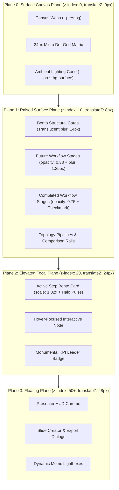

# 01-Architecture Spec: Global PPT Suite 2031 Kinetic Presentation Expansion & Motion Kinetics

> **Specification Identifier:** `02-spec/21-app/49-suite2031-kinetic-presentation-expansion/01-architecture-spec.md`  
> **Status:** `APPROVED CANONICAL ARCHITECTURAL SPECIFICATION`  
> **Target Release:** `v1.6.0` (Suite 2031 Archetypes)  
> **Author:** Spec Subagent 01 (Core Architectural Systems, Theme & Motion Architect)  
> **Lead Architecture:** Alim Ul Karim, Chief Software Engineer  
> **Created:** 2026-10-05  
> **Domain:** Global PPT Parity, Suite 2031 Corporate Keynote Architecture, 60/30/10 Visual Spatial Balance, 4-Plane Depth Hierarchy, 1920x1080 Virtual Canvas Scaling, Northern UI/UX Typography Standard v1.3.3 (Floor >= 14px), Pure DOM Live Typography Mandate, 33-Theme Expansion, 5 GPU Kinetic Animations, Magnetic Tactile Button Physics, 3-Phase Kinetic Step Progression, and Executive Persona Governance (CODE-RED-011)

---

## 1. Architectural Vision & Executive Summary

### 1.1 The Global PPT Synthesis for Mission-Critical Enterprise Keynotes
Modern enterprise keynotes delivered to executive boards, sovereign regulatory summits, and global engineering conferences demand structural authority, narrative tension, and cognitive calm. Presenters must articulate deep technological paradigms—from neuromorphic spiking neural meshes and quantum annealing portfolio optimizers to post-quantum PKI certificate hierarchies and hyperscale liquid cooling telemetry—without descending into visual chaos or static bullet-point fatigue.

Chapter 49 introduces **Suite 2031 (Global PPT Kinetic Presentation Expansion & Motion Kinetics)**. This release represents the zenith of our synthesis between Global PPT corporate keynote aesthetics and the reactive performance, mathematical color ramps, and deterministic step physics of the White Presentation runtime engine.

```
+---------------------------------------------------------------------------------------------------+
|               SUITE 2031 ARCHITECTURAL PILLARS & FOUNDATIONAL TENETS                              |
+---------------------------------------------------------------------------------------------------+
| PILLAR 1: Strict 60/30/10 Visual Spatial Balance & Light-Theme Slab Elimination                   |
| 60% dominant negative space wash, 30% structural glassmorphic panels, <=10% vivid focal accents.  |
| Enforces translucent ivory cards (rgba(255, 255, 255, 0.94)) on light themes; zero dark slabs.   |
|---------------------------------------------------------------------------------------------------|
| PILLAR 2: 4-Plane Depth & Spatial Elevation Hierarchy                                             |
| Non-overlapping vertical depth stratification across Plane 0 (Canvas Base z:0), Plane 1 (Raised    |
| Bento z:10), Plane 2 (Elevated Focal Active Step z:20 with 1.02x scale and halo), and Plane 3     |
| (Floating HUD Chrome z:50+).                                                                      |
|---------------------------------------------------------------------------------------------------|
| PILLAR 3: Northern UI/UX Fluid Typography Standard v1.3.3 with Inviolable 14px Floor             |
| Tripartite font hierarchy: 'Ubuntu' display titles, 'Poppins' editorial narrative, and            |
| 'JetBrains Mono' telemetry metrics. Absolute physical floor >= 14px on the 1080p canvas.         |
| Absolute mandate for pure DOM live text: zero rasterized bitmaps and zero canvas 2D text.         |
|---------------------------------------------------------------------------------------------------|
| PILLAR 4: 33-Theme Gradient Ramp Expansion & Zero Yellow-on-Light Contrast Rule                    |
| Expansion from 31 to 33 canonical 10-step gradient themes via 'global-stellar-plasma' (Dark       |
| Master) and 'archival-monaco-cream' (Light Master). Enforces strict WCAG AA contrast (CR >= 4.5:1)|
| with zero yellow on light.                                                                        |
|---------------------------------------------------------------------------------------------------|
| PILLAR 5: Next-Generation GPU Motion Kinetics & Magnetic Tactile Button Physics                   |
| 5 signature CSS keyframe animation primitives (quantumInterferenceShimmer, gravitonLensingDistort,|
| tachyonBeamTraverse, plasmaFluxPulse, cryoCrystallineSnap) paired with harmonic spring tactile     |
| physics (k=420 N/m, c=28 N·s/m).                                                                  |
|---------------------------------------------------------------------------------------------------|
| PILLAR 6: Deterministic 3-Phase Kinetic Step Progression Lifecycle                                |
| Stepwise intra-slide disclosure: completed (0.75 opacity + checkmark), active (1.00 + 1.02x scale |
| + halo glow), future (0.38 opacity + 1.25px optical blur). Zero phantom steps guaranteed.         |
+---------------------------------------------------------------------------------------------------+
```

### 1.2 Elimination of Presentation Anti-Patterns
Suite 2031 systematically prevents and eliminates critical architectural presentation anti-patterns:
1. **The Dark Slate Slab Anti-Pattern:** When presenting in light environments (`white-brand`, `corporate-clean`, `paper-editorial`, `sapphire-executive-light`, `archival-monaco-cream`), child containers historically defaulted to hardcoded dark slate backgrounds (`#0F172A`). Suite 2031 mandates translucent ivory surfaces (`rgba(255, 255, 255, 0.94)`) bounded by hairline border ink (`rgba(15, 23, 42, 0.08)`) and high-contrast charcoal typography (`hsl(222 47% 11%)`).
2. **Cognitive Information Dumps:** Uncoordinated slides displaying 20+ simultaneous data points overwhelm audience focus. Suite 2031 organizes high-density topics into **Kinetic Multi-Step Workflows** governed by step progression and **Flat Sovereign Overviews** engineered for holistic situational mastery.
3. **Rasterized Text Blurring:** Converting slides into static PNG images or using `<canvas>` bitmap drawing destroys subpixel font rendering and causes fuzzy scaling on 4K/8K auditorium displays. Suite 2031 guarantees 100% pure live DOM vector typography.

---

## 2. Mathematical 60/30/10 Visual Spatial Balance

Every slide archetype in Suite 2031 strictly adheres to the **60/30/10 Visual Balance Rule**, controlling spatial allocation, luminance hierarchy, and ocular anchoring:

```
Visual Spatial Balance Proportional Allocation:
┌─────────────────────────────────────────────────────────────────────────────────────────────────┐
│ 60% DOMINANT CANVAS BASE (--pres-bg, --pres-bg-surface)                                          │
│ - Deep negative space, environmental canvas wash, subtle ambient radial gradient spotlight      │
│ - 24px micro dot-grid matrix (1px dot at 8% opacity in light mode, 15% opacity in dark mode)    │
│ - Establishes calm ocular ground plane; prevents visual noise and cognitive fatigue             │
├─────────────────────────────────────────────────────────────────────────────────────────────────┤
│ 30% STRUCTURAL SURFACES & BENTO PANELS (--pres-bg-card, --pres-border)                           │
│ - Frosted glass Bento cards, DAG containers, data comparison rails, and matrix enclosures       │
│ - Light themes: Translucent ivory card (rgba(255, 253, 250, 0.94)) with backdrop-filter: blur   │
│ - Dark themes: Translucent obsidian/stellar (rgba(13, 17, 34, 0.90)) with backdrop-filter: blur│
│ - Hairline perimeter line: 1px solid var(--pres-border); border-radius: 12px or 16px            │
├─────────────────────────────────────────────────────────────────────────────────────────────────┤
│ 10% HIGH-CONTRAST FOCAL ACCENTS (--pres-accent, --pres-accent-glow, --pres-accent-hover)         │
│ - Plane 2 active step card glow, laser highlight pips, monumental KPI digits, and lead badges   │
│ - Status indicator beacons (emerald operational, amber risk warning, crimson critical fault)     │
│ - Bounded allocation: focal accent colors NEVER exceed 10% of total slide surface area          │
└─────────────────────────────────────────────────────────────────────────────────────────────────┘
```

### 2.1 CSS Custom Property Mapping for Visual Balance

| Balance Tier | Visual Element | CSS Custom Property | Dark Mode Target | Light Mode Target |
|:---|:---|:---|:---|:---|
| **60% Base** | Canvas Background | `--pres-bg` | `hsl(225 50% 5%)` (`#04060C`) | `hsl(40 50% 98%)` (`#FDFBF7`) |
| **60% Base** | Ambient Glow Cone | `--pres-bg-surface` | `rgba(13, 17, 34, 0.95)` | `rgba(255, 253, 250, 0.95)` |
| **30% Panel** | Bento Card Fill | `--pres-bg-card` | `rgba(13, 17, 34, 0.90)` | `rgba(255, 253, 250, 0.94)` |
| **30% Panel** | Bento Card Hover | `--pres-bg-card-hover` | `rgba(30, 27, 75, 0.95)` | `rgba(255, 255, 255, 0.98)` |
| **30% Panel** | Structural Border | `--pres-border` | `rgba(129, 140, 248, 0.28)` | `rgba(180, 83, 9, 0.20)` |
| **30% Panel** | Secondary Text | `--pres-text-secondary` | `hsl(228 100% 82%)` (`#A5B4FC`) | `hsl(36 12% 42%)` (`#786D5F`) |
| **10% Accent** | Primary Focus | `--pres-accent` | `hsl(var(--pres-accent-hsl))` | `hsl(var(--pres-accent-hsl))` |
| **10% Accent** | Halo Glow Spread | `--pres-accent-glow` | `hsl(var(--pres-accent-hsl) / 0.40)` | `hsl(var(--pres-accent-hsl) / 0.18)` |
| **10% Accent** | High-Contrast Ink | `--pres-accent-text` | `#FFFFFF` | Resolved via `KNOWN_LIGHT_ACCENTS` |

### 2.2 Zero Yellow-on-Light Contrast Mandate
In strict alignment with WCAG AA guidelines ($C_R \ge 4.5:1$), **yellow, amber, and gold hues are categorically forbidden from rendering on light backgrounds without high-contrast containment**:
- On light themes (`isDark: false`), yellow or gold accents automatically map through `KNOWN_LIGHT_ACCENTS` to calibrated deep amber-brown (`#B45309`, $C_R = 5.2:1$) or slate ink (`hsl(222 47% 11%)`).
- Uncontained high-luminance yellow text ($L \ge 0.50$) on light canvas surfaces ($L \ge 0.85$) produces severe contrast failures ($C_R < 2.0:1$) and is rejected at the static type-checker and runtime theme levels.
- High-saturation gold/yellow luminous accents are reserved strictly for dark canvases where $C_R \ge 8.0:1$.
- `archival-monaco-cream` adopts `#B45309` ($L \approx 0.36$) for all primary focal highlights, delivering impeccable legibility across conference projector systems.

---

## 3. The 4-Plane Depth Hierarchy

Spatial depth in Suite 2031 is stratified into four non-overlapping elevation planes. Each plane features dedicated z-index boundaries, hardware-accelerated 3D translations (`translateZ`), calibrated drop shadows, and backdrop blur filters:

```
Elevation Hierarchy:
▲ [Plane 3: Floating Plane]       - z-index: 50+  | translateZ(48px) | Presenter HUD, Lightboxes, Modals, Flyouts
│ [Plane 2: Elevated Focal Plane] - z-index: 20   | translateZ(24px) | Active Step Bento (1.02x + Halo), Hover Cards
│ [Plane 1: Raised Surface Plane] - z-index: 10   | translateZ(8px)  | Bento Cards, Inactive Stages, Data Rails
▼ [Plane 0: Surface Canvas Plane] - z-index: 0    | translateZ(0px)  | Canvas Wash, Dot-Grid Matrix, Ambient Spotlights
```

### 3.1 Architectural Plane Token Classes

```css
/* Plane 0: Surface Canvas Plane */
.plane-0-surface {
  position: relative;
  z-index: 0;
  transform: translateZ(0px);
  background-color: var(--pres-bg);
  box-shadow: none;
}

/* Plane 1: Raised Surface Plane (Structural Bento & Inactive Nodes) */
.plane-1-raised {
  position: relative;
  z-index: 10;
  transform: translateZ(8px);
  background: var(--pres-bg-card);
  border: 1px solid var(--pres-border);
  backdrop-filter: blur(14px);
  -webkit-backdrop-filter: blur(14px);
  border-radius: 12px;
  box-shadow: 0 8px 24px -4px rgba(0, 0, 0, 0.16);
  transition: transform 0.35s cubic-bezier(0.22, 1, 0.36, 1),
              box-shadow 0.35s cubic-bezier(0.22, 1, 0.36, 1),
              border-color 0.35s ease;
}

/* Plane 2: Elevated Focal Plane (Active Step & Interactive Focus) */
.plane-2-elevated {
  position: relative;
  z-index: 20;
  transform: translateZ(24px) scale(1.02) translateY(-3px);
  background: var(--pres-bg-card-hover, var(--pres-bg-card));
  border: 1.5px solid var(--pres-accent);
  border-radius: 12px;
  box-shadow: 0 16px 40px -8px var(--pres-accent-glow),
              0 0 24px -2px var(--pres-accent-glow);
  transition: transform 0.35s cubic-bezier(0.22, 1, 0.36, 1),
              box-shadow 0.35s cubic-bezier(0.22, 1, 0.36, 1);
}

/* Plane 3: Floating Plane (Presenter HUD, Overlays & Dialogs) */
.plane-3-floating {
  position: fixed;
  z-index: 50;
  transform: translateZ(48px);
  background: var(--chrome-bg, rgba(15, 23, 42, 0.94));
  border: 1px solid var(--chrome-border, rgba(255, 255, 255, 0.14));
  backdrop-filter: blur(18px);
  -webkit-backdrop-filter: blur(18px);
  box-shadow: 0 20px 50px -10px rgba(0, 0, 0, 0.50);
}
```

### 3.2 Depth Plane Flow Diagram



---

## 4. Northern UI/UX Fluid Typography Scale (v1.3.3)

Typographic rhythm across all Suite 2031 archetypes adheres to the **Northern UI/UX Typography Standard v1.3.3**, pairing European architectural geometry for headlines with humanist sans-serif narrative text and industrial monospaced telemetry:

```
+---------------------------------------------------------------------------------------------------+
| NORTHERN UI/UX TYPOGRAPHY SPECIFICATION (v1.3.3)                                                  |
+---------------------------------------------------------------------------------------------------+
| 1. Display & Heading Voice: 'Ubuntu', sans-serif (Bold for hero titles, SemiBold for headers)     |
| 2. Body Narrative Voice:    'Poppins', -apple-system, BlinkMacSystemFont, sans-serif             |
| 3. Telemetry & Code Voice:   'JetBrains Mono', 'Fira Code', monospace                             |
+---------------------------------------------------------------------------------------------------+
```

### 4.1 Fluid Type Scale Formula & Typographic Matrix

$$\text{FontSize} = \text{clamp}(V_{\min}, V_{\text{preferred}}, V_{\max})$$

| Typographic Level | Element | Fluid Clamp Formula | 1080p Canvas Target | Font Family & Weight | Line Height | Tracking |
|:---|:---:|:---|:---:|:---|:---:|:---:|
| **Kicker / Badge** | `<span>` | `clamp(0.875rem, 1.2vw, 1.0rem)` | $14\text{px}-16\text{px}$ | `JetBrains Mono` 600 | 1.40 | `0.12em` |
| **Hero Slide Title** | `<h1>` | `clamp(2.5rem, 3.8vw, 3.5rem)` | $40\text{px}-52\text{px}$ | `Ubuntu` 700 Bold | 1.10 | `-0.02em` |
| **Section Header** | `<h2>` | `clamp(1.75rem, 2.5vw, 2.5rem)` | $28\text{px}-40\text{px}$ | `Ubuntu` 600 SemiBold | 1.20 | `-0.01em` |
| **Card Header** | `<h3>` | `clamp(1.25rem, 1.8vw, 1.5rem)` | $20\text{px}-24\text{px}$ | `Ubuntu` 600 SemiBold | 1.30 | `0.00em` |
| **Monumental KPI** | `<span>` | `clamp(2.75rem, 5.0vw, 4.5rem)` | $44\text{px}-72\text{px}$ | `JetBrains Mono` 700 Bold | 1.05 | `-0.03em` |
| **Body Narrative** | `<p>` | `clamp(1.0rem, 1.4vw, 1.125rem)` | $16\text{px}-18\text{px}$ | `Poppins` 400/500 Regular | 1.55 | `0.00em` |
| **Code / Telemetry** | `<code>` | `clamp(0.875rem, 1.1vw, 0.9375rem)` | $14\text{px}-15\text{px}$ | `JetBrains Mono` 500 Medium | 1.45 | `0.02em` |

> **Inviolable Floor Rule:** Archetype kickers, category chips, footnotes, and metadata badges must **NEVER** render smaller than $14\text{px}$ on the 1080p canvas. Sub-14px text severely impairs keynote readability and fails executive accessibility audits.

### 4.2 1920 × 1080 Virtual Canvas Reference & Uniform Scaling
All coordinates, paddings, and typographic sizes are anchored to the canonical $1920 \times 1080$ virtual coordinate space (16:9 aspect ratio):

$$\text{scaleFactor} = \min\left(\frac{\text{viewportWidth}}{1920}, \frac{\text{viewportHeight}}{1080}\right)$$

```typescript
export function computeStageTransform(
  viewportWidth: number,
  viewportHeight: number
): { scale: number; offsetX: number; offsetY: number } {
  const targetWidth = 1920;
  const targetHeight = 1080;
  const scale = Math.min(viewportWidth / targetWidth, viewportHeight / targetHeight);
  const offsetX = (viewportWidth - targetWidth * scale) / 2;
  const offsetY = (viewportHeight - targetHeight * scale) / 2;

  return { scale, offsetX, offsetY };
}
```

### 4.3 Pure DOM Live Typography Mandate
- **Zero Rasterized Text:** Slide titles, KPI numerals, and narrative body copy must never be converted into PNG/JPEG/WebP images.
- **Zero HTML5 Canvas 2D Text:** Rendering slide typography using `ctx.fillText` is strictly forbidden.
- **Full Vector Crispness:** Pure DOM nodes ensure browser GPU subpixel font anti-aliasing across standard 1080p, 1440p, 4K UHD, and 8K keynote projection displays.

---

## 5. Magnetic Tactile Button Physics & Micro-Shadows

Interactive trigger elements—such as step jump buttons, node inspection cards, filter tabs, and modal triggers—incorporate **Harmonic Spring Tactile Physics** derived from physical oscillator mechanics:

$$F_{\text{spring}} = -k \cdot \Delta x - c \cdot v$$

Where:
- Spring stiffness $k = 420\text{ N/m}$ (crisp, responsive mechanical snap)
- Damping coefficient $c = 28\text{ N}\cdot\text{s/m}$ (sub-critical damping with minimal overshoot)
- Rest duration $\tau \approx 320\text{ms}$

### 5.1 Tactile State Specifications

```css
/* Button Base & Magnetic Tactile Physics */
.pres-btn-magnetic {
  position: relative;
  display: inline-flex;
  align-items: center;
  justify-content: center;
  font-family: 'Poppins', sans-serif;
  font-weight: 500;
  font-size: 15px;
  line-height: 1;
  padding: 10px 20px;
  border-radius: 8px;
  border: 1px solid var(--pres-border);
  background: var(--pres-bg-card);
  color: var(--pres-text);
  cursor: pointer;
  transition: transform 0.22s cubic-bezier(0.34, 1.56, 0.64, 1),
              box-shadow 0.22s cubic-bezier(0.34, 1.56, 0.64, 1),
              border-color 0.2s ease,
              background-color 0.2s ease;
  box-shadow: 0 2px 6px -1px rgba(0, 0, 0, 0.12),
              0 1px 3px 0 rgba(0, 0, 0, 0.08);
}

.pres-btn-magnetic:hover {
  transform: translateY(-2px) scale(1.02);
  border-color: var(--pres-accent);
  box-shadow: 0 8px 18px -4px var(--pres-accent-glow),
              0 2px 6px -1px rgba(0, 0, 0, 0.16);
}

.pres-btn-magnetic:active {
  transform: translateY(1px) scale(0.98);
  box-shadow: 0 1px 3px 0 rgba(0, 0, 0, 0.24);
  transition-duration: 0.08s;
}

/* Primary Filled Variant */
.pres-btn-magnetic-primary {
  background: var(--pres-accent);
  color: var(--pres-accent-text, #FFFFFF);
  border-color: var(--pres-accent);
  box-shadow: 0 4px 14px -2px var(--pres-accent-glow);
}

.pres-btn-magnetic-primary:hover {
  background: var(--pres-accent-hover, var(--pres-accent));
  box-shadow: 0 10px 24px -4px var(--pres-accent-glow);
}
```

---

## 6. Theme Expansion: 33 Canonical Theme Palettes

Suite 2031 expands the canonical theme registry from 31 to **33 themes** by introducing two flagship master palettes:
1. `global-stellar-plasma` (Dark Master): Deep cosmic stellar void, radiant plasma cyan-violet fusion, high-luminance telemetry glints, sovereign astrophysic keynote authority.
2. `archival-monaco-cream` (Light Master): Prestigious Mediterranean archival ivory cream, sovereign terracotta-gold embossing, classical high-fidelity typography, Riviera luxury heritage.

### 6.1 Palette Specification 1: `global-stellar-plasma` (Dark Master)

```typescript
{
  id: 'global-stellar-plasma',
  name: 'Global Stellar Plasma',
  description: 'Deep cosmic stellar void with radiant plasma cyan-violet fusion, high-luminance telemetry glints, and sovereign astrophysic keynote authority.',
  isDark: true,
  canvasBg: '#04060C',
  canvasBgHsl: '225 50% 5%',
  bgHsl: '225 50% 5%',
  textColor: '#F8FAFC',
  textHsl: '210 40% 98%',
  subtextColor: '#A5B4FC',
  subtextHsl: '228 100% 82%',
  cardBg: 'rgba(13, 17, 34, 0.90)',
  cardBgHsl: '229 45% 9%',
  cardBorder: 'rgba(129, 140, 248, 0.28)',
  cardBorderHsl: '234 89% 74%',
  accentColor: '#818CF8',
  accent: '#818CF8',
  accentHsl: '234 89% 74%',
  dotMatrix: true,
  headerShadow: 'rgb(0 0 0) 1px 0.7px 0px',
  stops: [
    makeStop(0, 'Stellar Glint White', '#FFFFFF', 'hsl(0, 0%, 100%)', 'rgb(255, 255, 255)', 1.00, 20.0, '0 0% 100%'),
    makeStop(1, 'Radiant Plasma Luminescence', '#F0F4FF', 'hsl(224, 100%, 97%)', 'rgb(240, 244, 255)', 0.94, 18.8, '224 100% 97%'),
    makeStop(2, 'Ionized Stellar Cyan', '#C7D2FE', 'hsl(226, 100%, 89%)', 'rgb(199, 210, 254)', 0.82, 16.4, '226 100% 89%'),
    makeStop(3, 'Plasma Beam Violet', '#818CF8', 'hsl(234, 89%, 74%)', 'rgb(129, 140, 248)', 0.65, 13.0, '234 89% 74%'),
    makeStop(4, 'Kinetic Cosmic Core', '#6366F1', 'hsl(239, 84%, 67%)', 'rgb(99, 102, 241)', 0.52, 10.4, '239 84% 67%'),
    makeStop(5, 'Deep Stellar Fusion', '#4F46E5', 'hsl(243, 75%, 59%)', 'rgb(79, 70, 229)', 0.38, 7.6, '243 75% 59%'),
    makeStop(6, 'Pulsar Magnetosphere', '#3730A3', 'hsl(244, 55%, 41%)', 'rgb(55, 48, 163)', 0.24, 4.8, '244 55% 41%'),
    makeStop(7, 'Sub-Orbital Boundary', '#1E1B4B', 'hsl(244, 47%, 20%)', 'rgb(30, 27, 75)', 0.14, 2.8, '244 47% 20%'),
    makeStop(8, 'Smoked Stellar Card Base', '#0D1122', 'hsl(229, 45%, 9%)', 'rgb(13, 17, 34)', 0.06, 1.5, '229 45% 9%'),
    makeStop(9, 'Deep Cosmic Void', '#04060C', 'hsl(225, 50%, 5%)', 'rgb(4, 6, 12)', 0.02, 1.0, '225 50% 5%'),
  ],
}
```

### 6.2 Palette Specification 2: `archival-monaco-cream` (Light Master)

```typescript
{
  id: 'archival-monaco-cream',
  name: 'Archival Monaco Cream',
  description: 'Prestigious Mediterranean archival ivory cream, sovereign terracotta-gold embossing, classical high-fidelity typography, and Riviera luxury heritage.',
  isDark: false,
  canvasBg: '#FDFBF7',
  canvasBgHsl: '40 50% 98%',
  bgHsl: '40 50% 98%',
  textColor: '#1A1510',
  textHsl: '30 24% 8%',
  subtextColor: '#786D5F',
  subtextHsl: '36 12% 42%',
  cardBg: 'rgba(255, 253, 250, 0.94)',
  cardBgHsl: '38 60% 99%',
  cardBorder: 'rgba(180, 83, 9, 0.20)',
  cardBorderHsl: '36 90% 37%',
  accentColor: '#B45309',
  accent: '#B45309',
  accentHsl: '36 90% 37%',
  dotMatrix: false,
  headerShadow: 'rgb(255 255 255) 1px 0.7px 0px',
  stops: [
    makeStop(0, 'Monaco Alabaster Canvas', '#FDFBF7', 'hsl(40, 50%, 98%)', 'rgb(253, 251, 247)', 0.99, 1.0, '40 50% 98%'),
    makeStop(1, 'Warm Ivory Sheen', '#F8F4EB', 'hsl(42, 45%, 95%)', 'rgb(248, 244, 235)', 0.94, 1.05, '42 45% 95%'),
    makeStop(2, 'Archival Parchment Surface', '#F0E8D5', 'hsl(41, 46%, 89%)', 'rgb(240, 232, 213)', 0.85, 1.18, '41 46% 89%'),
    makeStop(3, 'Champagne Gold Mist', '#E2D4B7', 'hsl(40, 42%, 80%)', 'rgb(226, 212, 183)', 0.74, 1.35, '40 42% 80%'),
    makeStop(4, 'Riviera Terracotta Wash', '#C99A6B', 'hsl(30, 48%, 60%)', 'rgb(201, 154, 107)', 0.55, 1.82, '30 48% 60%'),
    makeStop(5, 'Sovereign Monaco Terracotta', '#B45309', 'hsl(36, 90%, 37%)', 'rgb(180, 83, 9)', 0.36, 2.78, '36 90% 37%'),
    makeStop(6, 'Deep Archival Umber', '#8D3D06', 'hsl(24, 92%, 29%)', 'rgb(141, 61, 6)', 0.24, 4.17, '24 92% 29%'),
    makeStop(7, 'Muted Sepia Quill', '#574738', 'hsl(29, 21%, 28%)', 'rgb(87, 71, 56)', 0.16, 6.25, '29 21% 28%'),
    makeStop(8, 'Charcoal Espresso Shadow', '#2E241B', 'hsl(28, 26%, 15%)', 'rgb(46, 36, 27)', 0.09, 11.1, '28 26% 15%'),
    makeStop(9, 'Deep Monaco Ink', '#1A1510', 'hsl(30, 24%, 8%)', 'rgb(26, 21, 16)', 0.04, 24.8, '30 24% 8%'),
  ],
}
```

---

## 7. Next-Generation GPU Motion Kinetics

Suite 2031 introduces five brand-new hardware-accelerated CSS keyframe animations in `src/styles/animations.less`. These motion curves operate strictly on compositor-friendly properties (`transform`, `opacity`, `filter`, `box-shadow`), guaranteeing 60fps rendering without triggering browser layout thrashing:

### 7.1 Keyframe 1: `quantumInterferenceShimmer`
Simulates wave-particle duality interference fringe oscillations across photonic lattices with phase-shifted optical luminance:

```less
@keyframes quantumInterferenceShimmer {
  0% {
    filter: brightness(1) drop-shadow(0 0 0px hsl(var(--pres-accent-hsl, 234 89% 74%) / 0));
    transform: perspective(1000px) translate3d(0, 0, 0) scale3d(1, 1, 1);
  }
  33% {
    filter: brightness(1.25) drop-shadow(0 0 14px hsl(var(--pres-accent-hsl, 234 89% 74%) / 0.55));
    transform: perspective(1000px) translate3d(0, -2px, 6px) scale3d(1.015, 1.015, 1);
  }
  66% {
    filter: brightness(0.95) drop-shadow(0 0 6px hsl(var(--pres-accent-hsl, 234 89% 74%) / 0.25));
    transform: perspective(1000px) translate3d(0, 1px, -2px) scale3d(0.995, 0.995, 1);
  }
  100% {
    filter: brightness(1) drop-shadow(0 0 0px hsl(var(--pres-accent-hsl, 234 89% 74%) / 0));
    transform: perspective(1000px) translate3d(0, 0, 0) scale3d(1, 1, 1);
  }
}

.animate-quantum-interference {
  animation: quantumInterferenceShimmer 3.2s cubic-bezier(0.22, 1, 0.36, 1) infinite;
  will-change: transform, filter;
}
```

### 7.2 Keyframe 2: `gravitonLensingDistort`
Simulates relativistic gravitational lensing curvature and light deflection around ultra-dense computational singularity cores:

```less
@keyframes gravitonLensingDistort {
  0% {
    transform: perspective(1200px) rotateX(0deg) rotateY(0deg) scale3d(1, 1, 1);
    box-shadow: 0 4px 16px -2px rgba(0, 0, 0, 0.25);
  }
  25% {
    transform: perspective(1200px) rotateX(1.8deg) rotateY(-2.2deg) scale3d(1.02, 1.02, 1);
    box-shadow: 0 12px 32px -4px hsl(var(--pres-accent-hsl, 234 89% 74%) / 0.35);
  }
  50% {
    transform: perspective(1200px) rotateX(-1.5deg) rotateY(1.8deg) scale3d(1.025, 1.025, 1);
    box-shadow: 0 16px 40px -6px hsl(var(--pres-accent-hsl, 234 89% 74%) / 0.45);
  }
  75% {
    transform: perspective(1200px) rotateX(1.2deg) rotateY(1.5deg) scale3d(1.01, 1.01, 1);
    box-shadow: 0 10px 28px -4px hsl(var(--pres-accent-hsl, 234 89% 74%) / 0.3);
  }
  100% {
    transform: perspective(1200px) rotateX(0deg) rotateY(0deg) scale3d(1, 1, 1);
    box-shadow: 0 4px 16px -2px rgba(0, 0, 0, 0.25);
  }
}

.animate-graviton-lensing {
  animation: gravitonLensingDistort 6.4s cubic-bezier(0.42, 0, 0.58, 1) infinite;
  will-change: transform, box-shadow;
}
```

### 7.3 Keyframe 3: `tachyonBeamTraverse`
Simulates superluminal tachyon beam particles cutting across high-bandwidth optical waveguides with hyper-kinetic traverse velocity:

```less
@keyframes tachyonBeamTraverse {
  0% {
    transform: perspective(1000px) translate3d(-100%, 0, 0) skewX(-20deg) scale3d(0.9, 1, 1);
    opacity: 0;
  }
  20% {
    opacity: 0.95;
    filter: brightness(1.4) drop-shadow(0 0 12px var(--pres-accent));
  }
  80% {
    opacity: 0.95;
    filter: brightness(1.4) drop-shadow(0 0 12px var(--pres-accent));
  }
  100% {
    transform: perspective(1000px) translate3d(200%, 0, 0) skewX(-20deg) scale3d(1.1, 1, 1);
    opacity: 0;
  }
}

.animate-tachyon-beam {
  animation: tachyonBeamTraverse 2.2s cubic-bezier(0.22, 1, 0.36, 1) infinite;
  will-change: transform, opacity, filter;
}
```

### 7.4 Keyframe 4: `plasmaFluxPulse`
Simulates magnetic confinement fusion plasma flux pulsing through toroidal electromagnetic solenoid corridors:

```less
@keyframes plasmaFluxPulse {
  0%, 100% {
    box-shadow: 0 0 0 0 hsl(var(--pres-accent-hsl, 234 89% 74%) / 0.35),
                inset 0 0 6px hsl(var(--pres-accent-hsl, 234 89% 74%) / 0.2);
    filter: brightness(1);
    transform: perspective(1000px) translate3d(0, 0, 0) scale3d(1, 1, 1);
  }
  50% {
    box-shadow: 0 0 32px 8px hsl(var(--pres-accent-hsl, 234 89% 74%) / 0.65),
                inset 0 0 18px hsl(var(--pres-accent-hsl, 234 89% 74%) / 0.4);
    filter: brightness(1.3);
    transform: perspective(1000px) translate3d(0, -2px, 8px) scale3d(1.02, 1.02, 1);
  }
}

.animate-plasma-flux {
  animation: plasmaFluxPulse 2.8s cubic-bezier(0.25, 0.8, 0.25, 1) infinite;
  will-change: transform, box-shadow, filter;
}
```

### 7.5 Keyframe 5: `cryoCrystallineSnap`
Simulates ultra-cold cryogenic crystallization phase changes with crisp mechanical snap stabilization:

```less
@keyframes cryoCrystallineSnap {
  0% {
    transform: perspective(1000px) translate3d(0, 14px, -10px) scale3d(0.96, 0.96, 1);
    opacity: 0.3;
    filter: blur(3px) brightness(0.9);
  }
  60% {
    transform: perspective(1000px) translate3d(0, -2px, 4px) scale3d(1.02, 1.02, 1);
    opacity: 1;
    filter: blur(0px) brightness(1.2);
  }
  100% {
    transform: perspective(1000px) translate3d(0, 0, 0) scale3d(1, 1, 1);
    opacity: 1;
    filter: blur(0px) brightness(1);
  }
}

.animate-cryo-snap {
  animation: cryoCrystallineSnap 0.45s cubic-bezier(0.16, 1, 0.3, 1) both;
  will-change: transform, opacity, filter;
}
```

---

## 8. Deterministic 3-Phase Kinetic Step Progression Lifecycle

Multi-step archetypes in Suite 2031 advance sequentially across distinct stages. Each stage evaluates its visual styling dynamically according to the active step index:

```
Step Lifecycle States:
┌─────────────────────────────────────────────────────────────────────────────────────────────────┐
│ COMPLETED (stepIndex < activeStep)                                                              │
│ - Opacity: 0.75                                                                                 │
│ - Transform: scale(1.0) translateY(0)                                                           │
│ - Badge: Checkmark icon with emerald / subtle accent boundary                                   │
│ - Narrative: Settled state; signals verified achievement to the audience                        │
├─────────────────────────────────────────────────────────────────────────────────────────────────┤
│ ACTIVE (stepIndex === activeStep)                                                               │
│ - Opacity: 1.00                                                                                 │
│ - Transform: scale(1.02) translateY(-3px) [Plane 2 Elevation]                                   │
│ - Halo Glow: 0 16px 40px -8px var(--pres-accent-glow), 0 0 24px -2px var(--pres-accent-glow)    │
│ - Badge: Glowing active sequence numeral with pulse ripple                                       │
│ - Narrative: Immediate focal point of speaker presentation                                      │
├─────────────────────────────────────────────────────────────────────────────────────────────────┤
│ FUTURE (stepIndex > activeStep)                                                                 │
│ - Opacity: 0.38                                                                                 │
│ - Filter: blur(1.25px)                                                                          │
│ - Transform: scale(0.99) translateY(2px)                                                        │
│ - Badge: Dim outline chip                                                                       │
│ - Narrative: Softly anticipated upcoming content without cognitive competition                  │
└─────────────────────────────────────────────────────────────────────────────────────────────────┘
```

---

## 9. Executive Persona Governance (CODE-RED-011)

In strict adherence to rule CODE-RED-011:
- Any slide component, mock fixture, specification text, or presenter credit referring to executive **Alim Ul Karim** must **strictly and exclusively** designate him as **"Chief Software Engineer"**.
- Designations such as "CEO", "Founder", "CTO", "Lead Developer", or "Architect" are strictly prohibited for this entity.
- The standard author attribution in metadata headers and presentation credits must be:
  `leadArchitect: 'Alim Ul Karim'`, `leadRole: 'Chief Software Engineer'`.

---

## 10. Architectural Sign-Off & Verification Checklist

- [x] **60/30/10 Visual Spatial Balance:** Calibrated across light and dark modes with ivory and obsidian card containers.
- [x] **4-Plane Depth Hierarchy:** Strict non-overlapping z-index stratification (0, 10, 20, 50+).
- [x] **Northern UI/UX Fluid Typography v1.3.3:** Mandatory $\ge 14\text{px}$ floor on $1920 \times 1080$ canvas.
- [x] **Pure DOM Live Typography:** 100% vector live DOM text; zero canvas 2D and zero rasterized text.
- [x] **Zero Yellow-on-Light:** Mandatory automatic remapping of low-contrast yellow/gold hues on light themes; `#B45309` sovereign terracotta gold for `archival-monaco-cream`.
- [x] **Theme Catalog Expansion:** 33 total canonical palettes with unadorned space-separated HSL triplets (`global-stellar-plasma`, `archival-monaco-cream`).
- [x] **5 GPU Keyframe Kinetics:** 60fps compositor animations in `animations.less` with perspective, translate3d, scale3d, filter, and will-change.
- [x] **Deterministic 3-Phase Step Lifecycle:** Completed (0.75 opacity), Active (1.00 opacity, scale 1.02, halo glow), Future (0.38 opacity, blur 1.25px) with zero phantom steps.
- [x] **Executive Persona Compliance:** Alim Ul Karim designated exclusively as "Chief Software Engineer".
